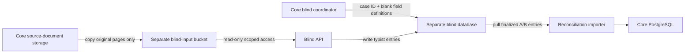

> **SUPERSEDED 2026-08-04 by [`BUILD-PLAN.md`](./BUILD-PLAN.md)** wherever the two
> conflict. This file is retained as evidence and history — its reasoning is the
> justification the build plan inherits, and its gate records are required
> artifacts. Do not delete it. Read `BUILD-PLAN.md` first.

---
title: TitlePipe Backend Architecture Review
date: 2026-07-21
status: decision-review
tags:
  - titlepipe
  - backend
  - architecture
  - security
  - rbac
aliases:
  - Backend Plan Review
  - Definitive Backend Corrections
related:
  - "[[PLAN]]"
  - "[[TOOLCHAIN]]"
  - "[[REPORT]]"
---

# TitlePipe Backend Architecture Review

> [!warning] Current decision
> Claude's architecture is mostly strong, but it is not ready to scaffold. The high-level plan is approximately 8/10; the accompanying toolchain is internally inconsistent and contains concrete technical errors. Reconcile the documents and recover the Flask prototype before implementation.

This review covers [[PLAN]], [[TOOLCHAIN]], [[REPORT]], the current contract package, and the governing HANDOFF, CONTEXT, and PRD documents.

## Executive verdict

Accept the general direction:

- Python 3.13 and FastAPI
- PostgreSQL as the source of truth
- SQLAlchemy 2 and psycopg 3
- PostgreSQL RLS with a non-owner application role
- Explicit server-owned domain state machines
- PostgreSQL-backed transactional jobs
- WorkOS for identity and TitlePipe PostgreSQL for authorization
- Direct-to-R2 uploads
- Separate workers for extraction and rendering
- Structurally isolated blind service
- REST and OpenAPI rather than GraphQL in P1

Do not accept the plan as definitive until the blocking findings below are resolved.

## Blocking findings

### 1. PLAN and TOOLCHAIN disagree

The documents choose different implementations:

| Area | PLAN | TOOLCHAIN |
|---|---|---|
| Queue | PgQueuer | Procrastinate |
| API contract | Ship a generated TypeScript client | Generate temporarily and do not ship |
| Storage SDK | boto3 | obstore |
| Retry library | Tenacity | stamina |
| API processes | One process per container | Worker count equal to CPU cores |
| Contract authority | Pydantic/OpenAPI | Existing Zod remains authoritative |

This means the current `pyproject.toml` example would not implement the architecture described in PLAN.

**Resolution:** Make PLAN the decision record, regenerate TOOLCHAIN from it, and ensure the dependency manifest contains exactly the selected packages. REPORT remains supporting research, not an implementation authority.

### 2. The hybrid-contract explanation is partly wrong

The plan says OpenAPI cannot express rules such as “a correction needs a reason.” It can express the current refusal request shapes because they are mostly:

- Required properties
- Non-empty strings through `minLength`
- Unions or discriminated unions
- Nested required objects

Examples already in the TypeScript contract include correction reasons, escalation questions, resolution rules, source citations, and signatures.

The correct architecture has three layers:

```text
Pydantic request/response models
    -> wire format and generated frontend client

Python domain policies + PostgreSQL constraints
    -> product law, transitions, refusals and authorization

Frontend Zod
    -> UI-only validation and immediate user feedback
```

Hand-written Zod must not own product law. It may mirror backend requirements for user experience, but the Python domain layer remains authoritative.

Cross-record and state-dependent rules may not fit completely in OpenAPI. Those belong in domain services and integration tests, not in a second authoritative frontend schema.

#### Contract migration decision

Do not perform a big-bang contract flip.

1. Keep the existing contract as a compatibility baseline.
2. Port one FastAPI endpoint to match it exactly.
3. Generate OpenAPI and a TypeScript client.
4. Diff behavior and shapes against the existing contract.
5. Once parity is proven, make the Pydantic model authoritative for that endpoint.
6. Delete duplicated Zod wire schemas endpoint by endpoint.
7. Retain only UI/form-specific Zod schemas.

#### Security correction: actor identity

The existing golden-set request schemas accept `signed_by` from the browser. The client must never decide who signed an action.

The backend must derive the actor from the authenticated WorkOS session and write the immutable audit identity itself. The request should contain the reason and source evidence, not a trusted signer identity.

### 3. The separate blind database is incomplete without a data-flow design

A separate database is stronger than relying only on table grants, but the plan does not explain:

- How original source pages reach the blind environment
- How case assignments and blank field definitions reach it
- How completed entries return for reconciliation
- How retention and deletion propagate
- How the blind service accesses object storage without accessing extraction output

The complete boundary should be:



Required isolation controls:

- Independent database credentials
- Prefer a separate managed database project or instance
- Separate object-storage credentials and bucket/prefix
- No access to core model-output objects
- No shared database pool
- No shared queue credentials
- No logical replication of core tables
- Network restrictions between blind and extraction services
- Blind API cannot read the other typist's entries
- Reconciliation begins only after both entries are finalized and locked
- Automated tests prove that forbidden data is unreachable

### 4. R2 does not provide the proposed SSE-KMS configuration

Cloudflare R2 automatically encrypts objects using AES-256-GCM and Cloudflare-managed keys. It does not expose the AWS-style bucket SSE-KMS configuration described in TOOLCHAIN.

Correct encryption design:

- R2 automatic encryption for stored objects
- TLS for transport
- Short-lived, narrowly scoped presigned URLs
- Application-layer envelope encryption where customer-controlled keys are required
- AWS KMS, Google Cloud KMS, or Azure Key Vault may wrap application data-encryption keys
- Never describe that external key management as “R2 bucket SSE-KMS”

Reference: [Cloudflare R2 data security](https://developers.cloudflare.com/r2/reference/data-security/)

### 5. `orjson` should not be the default

Do not configure `default_response_class=ORJSONResponse` initially.

Current FastAPI guidance recommends declared Pydantic response models for the fastest normal serialization path. Pydantic uses Rust-backed serialization and avoids intermediate conversion that may occur with a custom response class.

Decision:

- Use typed Pydantic response models by default.
- Use JSON Lines or SSE for genuinely large streaming feeds where appropriate.
- Add `orjson` only if an endpoint-level benchmark proves an improvement.
- Keep `msgspec` deferred until production-shaped load testing demonstrates a need.

Reference: [FastAPI JSON performance](https://fastapi.tiangolo.com/advanced/custom-response/#json-performance)

### 6. WorkOS authentication currently has two competing implementations

> 🔴 **CORRECTED 2026-08-07 — THIS FRAMING IS WRONG, AND IT MISLED A PLAN.**
> Sealed sessions and JWKS verification are **not** alternatives, so there is no
> "choose one" to make. VERIFIED against the installed `workos==10.1.1` wheel:
> `Session.authenticate()` Fernet-decrypts the cookie, takes `access_token`, then
> runs `PyJWKClient.get_signing_key_from_jwt()` + `jwt.decode(algorithms=["RS256"])`.
> **Sealing IS JWT verification, plus encrypted custody of the refresh token.**
> The only genuine choice is whether you hold the refresh token — and everything
> below already says yes.
>
> **The question this section should have asked** is the one the framing hid:
> `authenticate()` makes **zero network calls to WorkOS**, so a session revoked
> via `revoke_session()` or logout keeps passing until the access token's `exp`.
> Only `refresh()` observes revocation. The rules below neutralise the
> *authorization* half — Postgres is rechecked every request — but **not the
> identity half**: a revoked user survives until token expiry. Closing that costs
> a per-request `sid` lookup against our own table, and that trade is an open
> ruling, carried as gate 4 of
> [`03-identity.md`](../superpowers/plans/backend/03-identity.md).
>
> The recommended flow and the rules below are otherwise correct and stand.

The plan mentions both sealed WorkOS sessions and independent PyJWT/JWKS verification. Choose one browser-session architecture.

Recommended flow:

```text
Secure HttpOnly sealed-session cookie
    -> WorkOS Python session helper authenticates and refreshes
    -> TitlePipe resolves current database membership
    -> TitlePipe checks permission and object scope
    -> PostgreSQL RLS enforces the tenant boundary
```

Rules:

- WorkOS owns identity, password handling, email verification, MFA, invitations, session renewal, and logout.
- TitlePipe owns tenant membership, domain permissions, temporary grants, segregation of duties, and product audit history.
- Database permissions are rechecked on every request; do not trust stale role claims for domain authorization.
- Sidebar capability checks are UX only.
- Every API operation independently checks authorization.
- Use CSRF protection for cookie-authenticated state-changing operations.
- Do not store access or refresh tokens in localStorage.
- Do not add standalone PyJWT until a concrete bearer-token or service-to-service use case requires it.

Reference: [WorkOS Python session helpers](https://workos.com/docs/reference/authkit/session-helpers)

### 7. The Flask 155-test safety net is not currently available

> [!success] Resolved at Gate 0 (2026-07-22) — the prototype was recovered
> This finding was correct about the *checkout* and is now superseded by the recovery
> result. The prototype was located outside the repository in `~/Downloads/titlepipe.zip`.
> At recovery, 145 of 155 tests ran green; the other 10 asserted against client source
> material that must not be in VCS. Gate 0 subsequently closed with synthetic replacements
> and 22 v14 tests: 177/177 now pass from the pinned fresh-reproduction runner. The five
> bug fixes were never merged into the package and remain mandatory Gate 6 port inputs.
> See `docs/backend/GATE_0_RECOVERY.md`. The recovery procedure below was followed as
> written.

The repository documentation references a Flask prototype with approximately 2,700 lines and 155 passing tests. Those Python modules and tests are not present in the current checkout. The ZIP currently present contains design screens, not the backend prototype.

Therefore, the first gate is prototype recovery:

1. Locate the Flask prototype and all tests.
2. Run all 155 tests unchanged.
3. Inventory public functions, domain models, validators, state transitions, and render behavior.
4. Freeze representative golden outputs.
5. Confirm the two NA states, provenance envelope, v99 behavior, and judgment refusal rules.
6. Only then begin the module-by-module FastAPI port.

If the prototype cannot be recovered, call the work a reconstruction rather than a port and do not claim the 155-test safety net.

The 116 end-to-end test count is **confirmed** (116 `test()` calls across 23 spec files in `apps/web/e2e`, verified by test-runner). Note that not all 116 are contract-coupled — many exercise navigation, roles, and UI behaviour rather than the wire contract — so the incremental contract migration must keep the contract-coupled subset green, not literally all 116 by that mechanism.

## Final architecture decisions

### Runtime and API

- Python 3.13 initially
- FastAPI with Pydantic v2
- Uvicorn on Linux with standard native dependencies
- One API process per container; scale with replicas
- No reload or debug mode in production
- Protected or disabled production OpenAPI documentation
- Explicit trusted hosts, proxy trust, CORS, request limits, and multipart limits

### Dependency management

- `uv`
- Committed exact `uv.lock`
- Frozen installs in CI and production
- Separate deployable environments for core/blind, extraction, and rendering where native dependencies diverge
- Controlled automated upgrade PRs rather than automatically applied dependency changes

### Database

- PostgreSQL
- SQLAlchemy 2 typed models and repositories
- psycopg 3
- Alembic migrations
- Squawk migration checks
- Non-owner application roles
- Forced RLS where appropriate
- Transaction-local tenant context
- Tenant-leading indexes
- Real PostgreSQL integration tests; never SQLite for RLS or queue behavior

The SQLAlchemy `after_begin` pattern is acceptable, but it is not the only valid implementation. Document the full lifecycle:

- Request/job middleware sets the tenant context variable.
- Transaction start calls parameterized `set_config(..., true)`.
- An unset tenant fails closed.
- Context variables are always reset.
- Pool reuse and interleaved-tenant tests prove no leakage.

### Queue and workflow

- PgQueuer is the leading candidate.
- Keep it behind a small queue interface.
- Adoption is blocked on crash and recovery testing.
- The queue delivers work only; TitlePipe domain tables own state.
- Every job and external effect is idempotent.
- Queue payloads contain identifiers and idempotency keys, not NPI.

Required queue tests:

- Worker killed during execution
- Crash and retry
- Duplicate delivery
- Transactional enqueue rollback
- Cancellation
- Job reclaim after lease/worker loss
- Retry exhaustion
- RLS and tenant context
- Observability without sensitive payload capture

PgQueuer remains a reasonable current candidate because it supports PostgreSQL-backed transactional enqueue, psycopg, tracing, and Prometheus. The failure-recovery test—not the feature list—makes the final adoption decision.

Reference: [PgQueuer on PyPI](https://pypi.org/project/pgqueuer/)

### Contracts

- Pydantic/OpenAPI becomes authoritative endpoint by endpoint.
- Generate and ship a deterministic TypeScript client.
- Use `openapi-typescript` plus `openapi-fetch`, or one selected equivalent.
- Snapshot and diff OpenAPI in CI.
- Run Schemathesis against the live API schema.
- Keep Zod only for UI-specific form state and immediate validation after wire-schema migration.
- Server domain policies and integration tests remain the source of refusal behavior.

### Authentication and authorization

- WorkOS AuthKit for authentication
- WorkOS sealed-session helper for the browser flow
- PostgreSQL-backed TitlePipe memberships and permissions
- `/me/capabilities` drives sidebar visibility only
- Router dependencies enforce coarse permissions
- Service/domain methods enforce resource and state permissions
- RLS enforces tenant isolation
- Audit events derive actor identity from the authenticated session

### Storage and documents

- Cloudflare R2
- boto3 initially
- Direct browser upload using short-lived presigned PUTs
- API records and authorizes the upload but does not proxy large PDFs
- Quarantine before extraction
- Byte and page limits
- MIME and magic-byte verification
- SHA-256 content identity
- Malware scanning
- pikepdf/qpdf validation
- Password/encryption detection
- pypdfium2 process-isolated rendering
- docxtpl and python-docx for reports
- Internal, isolated Gotenberg for DOCX-to-PDF
- No public converter and no general outbound network access from Gotenberg

### External HTTP and retries

- One long-lived HTTPX AsyncClient per process
- Explicit connection, read, write, and pool timeouts
- Bounded Tenacity retry policies
- Retry only recognized transient failures
- Idempotency keys for paid or externally visible operations
- Per-provider concurrency and spend limits
- Thin official model-provider adapters
- No LangChain in v1

### Observability and audit

- structlog JSON output
- Redaction before records leave the process
- OpenTelemetry with explicit attribute allowlists
- No document text, names, addresses, model content, signed URLs, or secrets in telemetry
- Technical observability and product audit logs remain separate
- Queue depth and worker health are internal operational metrics only, never reviewer/product throughput dashboards
- Sentry is optional and may be deferred if OpenTelemetry plus logs provides sufficient incident visibility

### Testing and security

- pytest
- pytest-asyncio or AnyIO with one consistent async test mode
- pytest-cov
- Testcontainers PostgreSQL
- Hypothesis
- respx
- time-machine
- Schemathesis
- Ruff
- Pyright strict
- pip-audit
- Semgrep
- Trivy and SBOM generation

Mandatory product-invariant tests:

- Cross-tenant reads return zero rows.
- A pooled connection does not retain another tenant's context.
- Blind endpoints cannot access model output or the other seat's entry.
- Duplicate jobs and webhooks are harmless.
- Worker crashes are recoverable.
- `NOT_PRESENT` and `PRESENT_UNREADABLE` remain different.
- No emitted value lacks provenance.
- Judgments never auto-confirm in v1.
- v99 remains deliberately empty.
- Refusal rules are enforced server-side.
- Golden-set changes derive the signer from authentication.
- Generated clients remain synchronized with OpenAPI.
- DOCX/PDF rendering matches golden fixtures.

### Licensing

The LLMWhisperer Python client is currently identified as AGPL-3.0. Obtain legal approval, a commercial licence, or use an alternative integration before bundling it in proprietary deployed code.

Reference: [llmwhisperer-client on PyPI](https://pypi.org/project/llmwhisperer-client/)

## Rejected or deferred in P1

| Item | Decision |
|---|---|
| GraphQL | Reject for P1 |
| Kafka | Reject |
| Redis/Celery | Reject initially |
| Temporal/DBOS | Defer until workflow complexity demonstrates need |
| Kubernetes | Reject initially |
| Service mesh | Reject |
| LangChain | Reject |
| SQLModel | Avoid; use SQLAlchemy directly |
| Granian | Defer until production-shaped benchmarks |
| msgspec | Defer until production-shaped benchmarks |
| orjson default | Reject |
| obstore default | Defer until storage profiling |
| Frontend-only RBAC | Reject |
| Tokens in localStorage | Reject |
| Client-provided signer identity | Reject |
| One giant Python environment | Reject |
| Public document converter | Reject |
| Emailing NPI report attachments | Reject |
| Migrations at application startup | Reject |
| Automatically applied dependency upgrades | Reject |

## Correct implementation order

### Gate 0 — Recover the safety net

1. Recover the Flask prototype and tests.
2. Run the 155-test baseline.
3. Catalogue domain behavior and golden render outputs.

### Gate 1 — Reconcile decisions

1. Accept/update the FastAPI ADR.
2. Make PLAN, TOOLCHAIN, REPORT, HANDOFF, CONTEXT, and PRD non-contradictory.
3. Record WorkOS over Clerk, staged Pydantic contract authority, and the queue bake-off decision.
4. Remove `orjson` and incorrect R2 SSE-KMS claims.

### Gate 2 — Database correctness

1. Establish migrations and database roles.
2. Implement RLS and tenant transaction handling.
3. Pass tenant-isolation and pooled-connection leakage tests.
4. Nothing feature-level ships before this gate is green.

### Gate 3 — First vertical API slice

1. Port one read-only endpoint behind the existing contract.
2. Generate OpenAPI and the TypeScript client.
3. Prove client and runtime parity.
4. Move authority endpoint by endpoint.

### Gate 4 — Authentication and authorization

1. Implement WorkOS sealed sessions.
2. Implement memberships and capabilities.
3. Derive actor identity server-side.
4. Enforce router, service, object, state, and RLS checks.

### Gate 5 — Queue bake-off and upload

1. Run PgQueuer crash/recovery/idempotency tests.
2. Adopt it only after the gate passes.
3. Implement direct-to-R2 upload and quarantine.
4. Enqueue the first domain job transactionally.

### Gate 6 — Extraction, review, and reporting

1. Build extraction adapters with immutable provenance/version metadata.
2. Build review and decision workflows.
3. Enforce all refusal rules server-side.
4. Build docxtpl/Gotenberg rendering with golden fixtures.

### Gate 7 — Blind measurement system

1. Create the source-only projection.
2. Deploy the separate blind database and bucket access.
3. Implement typist seating and entry locks.
4. Implement one-way reconciliation import.
5. Prove blindness through security tests.

### Gate 8 — Operations

1. Add tracing and redacted logs.
2. Add product audit history.
3. Add supply-chain scans and SBOMs.
4. Test backups, restoration, retention, deletion, and recovery.
5. Load-test the real document workflow before optimizing serializers or servers.

## Final guiding architecture

> [!success] Final direction
> Python coordinates the workflow. PostgreSQL enforces durable correctness. Native libraries perform expensive PDF/OCR work. Workers isolate long-running and failure-prone operations. WorkOS owns identity, while TitlePipe owns authorization. Blindness is enforced through topology, credentials, storage, and tests. Optimization follows production-shaped measurements, never benchmark headlines.
