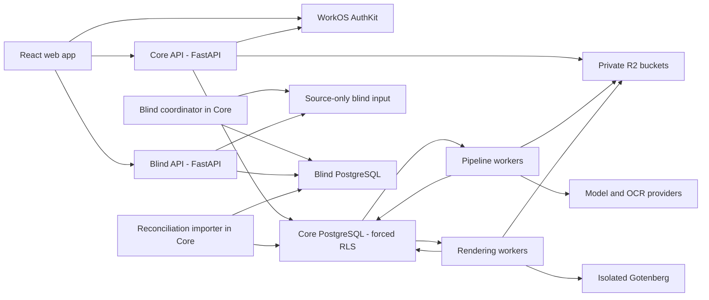

> **SUPERSEDED 2026-08-04 by [`BUILD-PLAN.md`](./BUILD-PLAN.md)** wherever the two
> conflict. This file is retained as evidence and history — its reasoning is the
> justification the build plan inherits, and its gate records are required
> artifacts. Do not delete it. Read `BUILD-PLAN.md` first.

---
title: TitlePipe Backend Implementation Plan
date: 2026-07-22
status: ready-for-execution
owner: rahuldr07
tags:
  - titlepipe
  - backend
  - fastapi
  - postgres
  - implementation
aliases:
  - Backend Execution Playbook
  - Backend Build Plan
---

# TitlePipe Backend Implementation Plan

> [!important] Purpose
> This is the standalone execution playbook for building the TitlePipe backend. It converts the settled architecture into ordered work, test gates, artifacts, and definitions of done. It does not authorize building through unresolved domain rules.

> [!warning] Document precedence
> When documents conflict, use this order:
> 1. `docs/HANDOFF.md` for current project state.
> 2. `docs/CONTEXT.md` §11 for domain truth and traps.
> 3. `docs/PRD.md` for product requirements and release gates.
> 4. `docs/backend/PLAN.md` for reconciled technology decisions.
> 5. This file for implementation sequencing.
> 6. `docs/backend/TOOLCHAIN.md` for library/version guidance.
>
> Older Clerk, Procrastinate, Hono/Bun, Zod-authoritative, `orjson`-default, and shared-blind-database references are historical. The current decisions are WorkOS, PgQueuer behind a tested interface, FastAPI/Python, Pydantic/OpenAPI authority, typed Pydantic responses, and a physically separate blind database.

## 1. Outcome

Build a compliance-sensitive, multi-tenant title-search automation backend that:

- Accepts and validates county search packages without placing them in the repository.
- Extracts every reportable field with source provenance.
- Uses independent readers, redundancy checks, validators, and human review to prevent defects from shipping.
- Preserves `NOT_PRESENT` and `PRESENT_UNREADABLE` as different states.
- Keeps every state machine, threshold, refusal, and queue decision server-owned.
- Enforces authentication, RBAC, object/state authorization, and PostgreSQL RLS independently.
- Keeps blind typists isolated from model output and from each other by topology and credentials.
- Produces versioned DOCX/PDF reports and authenticated delivery records.
- Records immutable business audit history without leaking NPI into logs, traces, metrics, URLs, jobs, or error payloads.
- Can replace extraction engines without rewriting the product core.

The first production outcome is not “full automation.” It is a safe draft-and-review pipeline whose auto-confirm scope expands only through measured evidence.

## 2. Non-negotiable product laws

These are release blockers, not style preferences.

1. Never generate backend rules from UI behavior or pixels.
2. Never emit a value without provenance: document, page, snippet/coordinates, engine, and applicable rule/version.
3. Never collapse `NOT_PRESENT` and `PRESENT_UNREADABLE`.
4. Never calculate `needs_review` in the browser.
5. Never auto-confirm judgments in v1.
6. Never use engine self-confidence as an auto-confirm gate.
7. Never let one engine see another engine's output.
8. Never let a blind typist read model output or the other seat's entry.
9. Never let a PENDING rule affect prompts, validation, routing, rendering, or delivery.
10. Never accept actor identity such as `signed_by` from a request body.
11. Never suppress a lien because a chain terminates; only a verified release can suppress it.
12. Never derive consideration from transfer/excise/documentary tax.
13. Never validate land plus building against total; v99 remains deliberately empty.
14. Never send report attachments containing NPI through email.
15. Never place county packages, seed databases, client documents, or uploads in VCS.
16. Never expose throughput counters, reviewer rankings, probe visibility, aggregate accuracy headlines, approve-all, auto-tuning, or queue cherry-picking.
17. Never build past an `OPEN` or unresolved `CONFLICT` rule that changes the affected output.

## 3. Settled architecture decisions

| Concern | Decision |
|---|---|
| API language | Python 3.13 |
| API framework | FastAPI + Pydantic v2 |
| API shape | Modular monolith; thin routers, services, repositories, schemas |
| Long work | Separate worker processes/containers |
| Blind capture | Separate FastAPI service, separate PostgreSQL database, separate object-store credentials |
| Database | PostgreSQL with forced RLS and non-owner runtime roles |
| ORM/driver | SQLAlchemy 2 async + psycopg 3 |
| Migrations | Alembic; Squawk lint; never migrate during API startup |
| Queue | PgQueuer candidate behind an interface; adopt only after recovery tests; Procrastinate fallback |
| Browser auth | WorkOS AuthKit sealed HttpOnly session cookies |
| Authorization | TitlePipe roles/permissions in PostgreSQL; enforced again at route, service, object/state, and RLS layers |
| Wire contract | Pydantic/OpenAPI authoritative endpoint by endpoint; deterministic generated TypeScript client |
| TypeScript client | `openapi-typescript` + `openapi-fetch`; optional thin TanStack Query hooks written around the generated client |
| Frontend Zod | UI-only validation after each endpoint migrates |
| Storage | Private Cloudflare R2 through boto3; short-lived presigned uploads |
| PDF validation/rendering | pikepdf/qpdf + process-isolated pypdfium2 |
| Report generation | docxtpl + python-docx; isolated Gotenberg for DOCX to PDF |
| HTTP/retries | Long-lived HTTPX client + bounded Tenacity policies |
| Observability | structlog, OpenTelemetry, Prometheus, optional Sentry; redaction before export |
| Deployment | One process per container; scale with replicas; no Kubernetes in P1 |
| Deferred | GraphQL, Kafka, Temporal/DBOS, Celery/Redis, service mesh, Granian, msgspec, `orjson` default |

## 4. Runtime topology



### Deployable units

1. `core-api`: synchronous HTTP orchestration, contracts, auth, RBAC, RLS, presigning, domain commands and queries.
2. `pipeline-worker`: document validation, segmentation, classification, extraction, assembly, validation and routing.
3. `render-worker`: DOCX generation, Gotenberg conversion, report versioning and delivery preparation.
4. `blind-api`: blind assignment and entry capture only.
5. `gotenberg`: internal DOCX-to-PDF converter with no public route and no general outbound network.
6. `inference-svc`: optional/self-hosted GPU inference boundary introduced only when the bake-off or compliance path selects it.

The first four Python units may share source packages, but they must have separate entry points, credentials and locks where native dependencies diverge.

## 5. Target repository layout

```text
TitleSearch/
├─ apps/
│  └─ web/                         # existing React app
├─ packages/
│  ├─ contract/                    # current Zod contract during migration
│  └─ mocks/                       # delete handlers route-by-route
├─ services/
│  ├─ core-api/
│  │  ├─ pyproject.toml
│  │  ├─ uv.lock
│  │  ├─ src/titlepipe_core/
│  │  │  ├─ api/                   # app factory, thin routers, dependencies and global error mapping
│  │  │  ├─ runtime/               # settings, lifespan, request context, logging and telemetry
│  │  │  ├─ errors/                # typed exceptions and stable machine-readable codes
│  │  │  ├─ schemas/               # Pydantic wire models
│  │  │  ├─ services/              # commands, policies, state machines
│  │  │  ├─ repositories/          # SQLAlchemy queries only
│  │  │  ├─ models/                # SQLAlchemy mappings
│  │  │  ├─ auth/                  # WorkOS sessions and principals
│  │  │  ├─ rbac/                  # capabilities and policy checks
│  │  │  ├─ db/                    # engine, RLS context and transaction helpers
│  │  │  ├─ queue/                 # QueuePort + PgQueuer implementation
│  │  │  ├─ storage/               # ObjectStore port + R2 implementation
│  │  │  ├─ audit/                 # product audit events
│  │  │  └─ telemetry/             # product-specific trace/metric instrumentation
│  │  ├─ migrations/
│  │  └─ tests/
│  ├─ extraction-svc/
│  │  ├─ pyproject.toml
│  │  ├─ uv.lock
│  │  ├─ src/titlepipe_extraction/
│  │  │  ├─ engines/
│  │  │  ├─ segmentation/
│  │  │  ├─ assembly/
│  │  │  ├─ validators/
│  │  │  ├─ routing/
│  │  │  ├─ rules/
│  │  │  └─ jobs/
│  │  └─ tests/
│  ├─ render-svc/
│  │  ├─ pyproject.toml
│  │  ├─ uv.lock
│  │  ├─ src/titlepipe_render/
│  │  │  ├─ shapes/
│  │  │  ├─ templates/
│  │  │  ├─ visibility/
│  │  │  └─ jobs/
│  │  └─ tests/
│  └─ blind-svc/
│     ├─ pyproject.toml
│     ├─ uv.lock
│     ├─ src/titlepipe_blind/
│     ├─ migrations/
│     └─ tests/
├─ libs/
│  ├─ domain/                      # framework-free domain types/policies
│  ├─ contracts-python/            # shared Pydantic primitives where safe
│  └─ test-support/                # factories; no production secrets/data
├─ generated/
│  └─ api-client/                  # deterministic TS client or CI artifact
├─ infra/
│  ├─ compose/
│  ├─ containers/
│  ├─ observability/
│  └─ sql/
└─ docs/backend/
```

### Boundary rules

- `libs/domain` cannot import FastAPI, SQLAlchemy, WorkOS, PgQueuer, boto3 or vendor SDKs.
- Routers may validate and translate but do not contain state-machine logic.
- Repositories contain persistence mechanics, not business decisions.
- Services receive an authenticated `Principal`; they never read identity from request bodies.
- Engine adapters are at most 300 lines and cannot access other engines' readings.
- Blind code cannot import core extraction models or use core database/storage credentials.
- Shared libraries must not create a hidden shared deployment or credential boundary.
- Domain/services raise typed application exceptions, never framework-specific `HTTPException`; the API boundary owns status/error-envelope translation.
- No mutable process-global clients. App factories, lifespan managers and worker bootstraps explicitly construct and close resources.
- Do not create generic `globals.py`, `common.py`, `helpers.py`, `utils.py` or `messages.py` dumping grounds; modules must have one named responsibility.

### Dependency sets

Pin exact resolved versions in each service's committed `uv.lock`; `docs/backend/TOOLCHAIN.md` supplies the starting version ranges.

**Core API:**

- `fastapi`, `uvicorn[standard]`, `pydantic`, `pydantic-settings`
- `sqlalchemy[asyncio]`, `psycopg[binary,pool]`, `alembic`
- `workos`
- `pgqueuer` behind `QueuePort`
- `httpx`, `tenacity`, `boto3`
- `cryptography` plus the selected KMS SDK for envelope encryption
- `structlog`, OpenTelemetry packages, `prometheus-client`
- `sentry-sdk[fastapi]` only if enabled after telemetry review

**Extraction worker:**

- Shared database, queue, storage, HTTP, retry and telemetry primitives
- `pikepdf`, `pypdfium2`, `pdfplumber`, `pillow`
- `google-genai`, `anthropic`, `openai` as thin provider SDKs
- `paddleocr` only in the extraction environment that needs its native stack
- LLMWhisperer integration only after the licence/commercial gate
- No LangChain and no PyMuPDF

**Render worker:**

- `docxtpl`, `python-docx`, `pikepdf`, `boto3`, `httpx`
- Gotenberg is an isolated pinned container, not a Python package

**Blind service:**

- Minimal `fastapi`, Pydantic, SQLAlchemy/psycopg, WorkOS session, storage and redacted telemetry dependencies
- No engine, extraction, rendering or Core database packages

**Development/test:**

- `ruff`, `pyright`, `pytest`, `pytest-asyncio`, `pytest-cov`, `pytest-xdist`
- `testcontainers[postgres]`, `hypothesis`, `schemathesis`, `respx`, `time-machine`
- `pre-commit`, `pip-audit`; Squawk, Semgrep, Trivy and SBOM tooling in CI

## 6. Environment and configuration model

### Environments

| Environment | Data | Purpose |
|---|---|---|
| Unit test | Synthetic only | Fast deterministic domain and schema tests |
| Integration test | Ephemeral real PostgreSQL | RLS, migrations, queue and repository behavior |
| Local development | Synthetic/redacted packages only | End-to-end development |
| Staging | Dedicated test tenant and non-client fixtures | WorkOS/R2/provider integration and release rehearsal |
| Production | Real NPI | Controlled operational workload |

### Configuration rules

- Use `pydantic-settings`; validate configuration at startup.
- Production startup fails if debug mode, mock auth, public docs, unsafe CORS, missing redaction or default secrets are enabled.
- Keep a checked-in `.env.example` containing names and safe examples only.
- Use different credentials for core API, app DB, worker DB, migration DB, blind DB and each object-store boundary.
- Never dump environment variables or settings objects to logs.
- Keep model-provider concurrency and spend limits in typed configuration.
- Use UTC in storage and APIs; render local/business time only at presentation boundaries.
- If a filesystem-backed local upload adapter is used, require an absolute configured path outside the working tree; `/data/` is the gitignored development default.

### Runtime foundation rules

- Use one typed settings schema per deployable and one application path across environments; configuration controls integrations, safety gates and log rendering, not domain behavior.
- Core and Blind expose explicit app factories and lifespan managers. Workers expose explicit bootstrap/command entry points. No network, database or SDK clients are constructed at import time.
- Bind a generated or trusted inbound request ID to structured-log context and return it in the response/error envelope.
- Redaction is the first logging processor. Local development uses readable console output; staging/production uses JSON with the same stable event names and fields.
- Application/domain exceptions carry a stable machine-readable code and safe context. Global API handlers alone map them to HTTP status and a safe error envelope. Unknown production errors return a generic message plus request ID and never a traceback.
- Use injectable UTC clocks and ID factories where deterministic domain tests need them.
- Keep OpenTelemetry/Sentry behind narrow telemetry integration points until their later gate; domain code never imports either SDK.

### Current machine prerequisites

- `uv` is installed.
- Python 3.14 is installed globally, but services must use a `uv`-managed Python 3.13 runtime.
- Node and pnpm are installed.
- Docker is not currently installed.
- Before database/container work: install WSL2, reboot if required, install Docker Desktop with WSL2 backend, then verify Docker and PostgreSQL Testcontainers.
- Enable BitLocker before real client NPI is stored locally.

## 7. Core data architecture

### Core database ownership groups

#### Identity and tenancy

- `tenants`
- `users`
- `memberships`
- `roles`
- `permissions`
- `role_permissions`
- `clients`
- `retention_policies`

Use memberships instead of one role column on the user so a person can hold different roles in different tenants without identity duplication.

#### Intake and source material

- `orders`
- `packages`
- `package_uploads`
- `pages`
- `documents`
- `document_links`

#### Extraction and review

- `fields`
- `field_readings`
- `field_transitions`
- `review_sessions`
- `review_actions`
- `order_passes`
- `bugs`
- `escalations`

#### Rules and engines

- `rules`
- `rule_versions`
- `prompt_builds`
- `engines`
- `engine_capabilities`
- `engine_routing`
- `engine_runs`
- `provider_calls`

#### Measurement

- `golden_fields`
- `reconciliations`
- `probes`
- `bench_runs`
- `bench_results`

#### Reporting and client loop

- `reports`
- `report_artifacts`
- `deliveries`
- `delivery_attempts`
- `complaints`

#### Reliability and compliance

- `idempotency_keys`
- `domain_events`
- `audit_events`
- queue-owned tables installed by the selected queue implementation

### Blind database

The blind database contains only:

- `blind_cases`
- `blind_assignments`
- `blind_field_definitions`
- `blind_entries`
- `blind_submission_locks`
- minimal blind audit events

It must not contain model results, engine identifiers, extraction states, golden values, reviewer actions, reconciliation rulings or core user names displayed to typists.

### Required column conventions

- UUID/ULID primary identifiers; never expose sequential IDs where enumeration matters.
- `tenant_id` on every core tenant-scoped row.
- `created_at` and `updated_at` as timezone-aware UTC timestamps.
- `version` or optimistic-lock column on mutable aggregate roots.
- Actor IDs are server-populated.
- Monetary values use decimal/integer minor units, never binary floating point.
- Raw field values and normalized comparison values are stored separately.
- Provenance fields are mandatory for emitted values.
- Soft deletion is not a replacement for retention deletion; define explicit lifecycle states.

### Database constraints

- CHECK constraints for enums and legal local invariants.
- Foreign keys for all links, including release/reference, modification/original, substitution/DOT and lis-pendens/resolution pairs.
- Unique `(tenant_id, external_ref)` where client semantics require it.
- Unique `(tenant_id, package_sha256)` or a documented duplicate policy.
- Unique active engine seat per `(tenant_id, jurisdiction, section, seat)`.
- Unique blind entry per `(blind_case_id, seat, field_path)`.
- PENDING rules cannot be selected by prompt/routing queries.
- Append-only transition and audit tables reject UPDATE/DELETE for runtime roles.
- Tenant-leading indexes on every tenant-scoped access path.
- Partial indexes for queue/review hot paths rather than global counters.

## 8. State machines

State transitions are domain commands plus database constraints. The UI only renders returned state.

### Order

```text
draft_upload -> uploaded -> validating -> ready_for_acceptance
ready_for_acceptance -> accepted -> processing -> needs_review
needs_review -> review_complete -> rendering -> ready_for_delivery
ready_for_delivery -> delivered
any processing state -> failed_recoverable | held
```

- Upload alone never accepts an order.
- A failed delivery does not change report quality state.
- Passes are recorded; the fourth pass escalates server-side.

### Field

```text
pending -> auto_confirmed
pending -> needs_review
needs_review -> confirmed | corrected | escalated
confirmed | auto_confirmed -> corrected | escalated
escalated -> needs_review after a cited resolution
```

- Idempotent confirm with the same value returns success.
- A different replay returns conflict.
- Terminal/illegal transitions return a stable refusal code and explanation.
- Judgment fields always enter `needs_review` in v1.

### Rule

```text
pending -> live -> retired
```

- Only engineers/admins confirm PENDING rules.
- Rule versions are immutable.
- Prompt builds record the exact rule-version set used.

### Golden field

```text
delivered_report -> ruled | suspect
agreed -> ruled | suspect
```

- Correction requires source citation and reason.
- Confirm/demote requires reason.
- Actor comes from the authenticated principal.
- Prior value survives permanently in audit history.

### Blind case

```text
assigned -> seat_a_finalized | seat_b_finalized
both_finalized -> locked -> imported_for_reconciliation
```

- A seat cannot edit after finalization.
- Reconciliation cannot begin until both seats are finalized and locked.
- Neither seat can query the other entry at any point.

### Delivery

```text
pending -> attempting -> delivered
attempting -> failed -> attempting
```

- Delivery retries are idempotent.
- Every attempt has evidence and timestamps.
- Report versions remain immutable.

## 9. PostgreSQL roles and RLS

### Database roles

1. `titlepipe_migration`: owns schema changes; never used by the application.
2. `titlepipe_app`: non-owner Core API role; no `BYPASSRLS`.
3. `titlepipe_worker`: non-owner worker role; minimum tables/actions required.
4. `titlepipe_readonly`: optional support/analytics role through safe views only.
5. `titlepipe_blind_app`: exists only in the separate blind database.
6. `titlepipe_blind_migration`: owns blind schema migrations only.

### Tenant-context lifecycle

1. WorkOS session resolves to a TitlePipe principal and tenant membership.
2. Request/job middleware sets a tenant `ContextVar`.
3. Transaction start calls parameterized `set_config('app.current_tenant', tenant_id, true)`.
4. Policies read `current_setting('app.current_tenant', true)` and fail closed when unset.
5. Transaction completes or rolls back.
6. Middleware resets the `ContextVar` in `finally`.

### Mandatory RLS tests

- Tenant A cannot read, update or delete Tenant B rows.
- Unset tenant context returns zero tenant rows and rejects mutations.
- A reused pooled connection does not retain the previous tenant.
- Two tenants interleaved across transactions do not leak.
- Worker transactions receive the same isolation guarantees.
- Migration and owner roles never appear in runtime connection strings.
- New tenant-scoped tables fail CI if an RLS policy is absent.

No feature gate may pass until this suite runs against real PostgreSQL.

## 10. Authentication, RBAC and admin-user architecture

### Authentication flow

1. Browser starts WorkOS AuthKit login.
2. Callback establishes a sealed, Secure, HttpOnly, SameSite cookie.
3. WorkOS session helper validates and refreshes the session.
4. Backend maps WorkOS `sub` and organization identity to TitlePipe user, tenant and active membership.
5. Backend constructs a `Principal(user_id, tenant_id, membership_id, roles, capabilities)`.
6. Every business action and audit event receives the principal explicitly.

WorkOS handles password storage, reset, verification email, invitation, MFA and session renewal. TitlePipe does not implement passwords or OTP storage.

### Authorization layers

1. **Session:** authenticated user exists.
2. **Tenant membership:** user belongs to the requested tenant and membership is active.
3. **Capability:** role permits the action.
4. **Object/state policy:** resource belongs to the tenant and is in an allowed state.
5. **Database RLS:** row isolation remains even if application checks fail.

Frontend sidebar visibility is only UX. `/api/me/capabilities` exposes the caller's own grants, not the full holder matrix. Every route re-enforces permissions.

### Role/action baseline

| Action group | Reviewer | Senior | Ops | Engineer | Typist | Admin |
|---|---:|---:|---:|---:|---:|---:|
| Review queue and field decisions | Yes | Contextual | Read-only contextual | Read-only contextual | No | Yes |
| Escalation resolution | No | Yes | No | No | No | Yes |
| Ingest/orders | No | No | Yes | No | No | Yes |
| Delivery/complaints | No | No | Yes | No | No | Yes |
| Rule confirmation | No | No | No | Yes | No | Yes |
| Golden correction/seed decisions | No | Yes | No | Yes | No | Yes |
| Bench/engine routing | No | No | No | Yes | No | Yes |
| Blind entry | No | No | No | No | Assigned seat only | Protocol-limited support only |
| Reconciliation | No | Yes | No | No | No | Yes |
| Tenant administration | No | No | No | No | No | Yes |

The backend permission catalogue must be versioned and testable. The existing TypeScript table is a migration input, not the future backend authority.

### Admin dashboard scope

Admin APIs must support:

- Organization profile and tenant settings.
- Users, invitations, membership status and role assignment.
- MFA/session status supplied by WorkOS without exposing secrets.
- Role/capability projections.
- Rulebook and PENDING confirmations.
- Audit event search with safe filters.
- Retention settings and deletion status.
- Client delivery configuration without exposing raw credentials.
- Billing/usage summaries that contain no reviewer throughput ranking.

Every admin mutation requires an audit event with server-derived actor, target, reason where required, and before/after safe metadata.

### Session security

- CSRF protection on cookie-authenticated mutations.
- Secure and HttpOnly cookies; SameSite policy documented.
- Session rotation after authentication and privilege changes.
- Short idle and absolute timeouts appropriate to NPI handling.
- MFA required for admin, engineer, senior and ops roles before production.
- Revoke sessions when membership is disabled or role changes materially.
- No access tokens or session payloads in localStorage.

## 11. API standards

### Conventions

- Base path `/api`; add versioning before external/public compatibility requires it.
- Pydantic request and response models on every route.
- Stable machine-readable error codes plus safe human-readable explanations.
- Request/correlation ID returned in headers, never containing tenant/order identifiers.
- Cursor pagination for potentially unbounded lists.
- Explicit sort order owned by the server.
- ETags or optimistic version checks on conflicting mutable resources where appropriate.
- `Idempotency-Key` on order creation, paid provider calls, render, delivery and other externally visible retries.
- Actor, tenant, state, derived counts and thresholds never come from the browser.
- NPI and presigned URLs never appear in URL query parameters or logs.

### Refusal response

```json
{
  "error": {
    "code": "RULE_REQUIRED",
    "message": "Resolution requires an existing or drafted rule.",
    "request_id": "opaque-id",
    "details": {}
  }
}
```

- `400`: malformed transport/request.
- `401`: unauthenticated.
- `403`: authenticated but not permitted.
- `404`: resource absent or deliberately hidden across tenant boundaries.
- `409`: legal-state or idempotency conflict.
- `422`: schema/domain refusal with actionable safe detail.
- `429`: bounded provider/ingress protection.
- `503`: dependency unavailable/retryable.

### Existing endpoint migration inventory

#### Intake and order work

- `POST /api/orders`
- `POST /api/orders/{id}/uploads/{upload_id}/finalize` (new explicit post-upload handshake)
- `POST /api/orders/{id}/accept`
- `GET /api/queue/next`
- `POST /api/orders/{id}/pass`
- `GET /api/orders/{id}/fields`
- `GET /api/orders/{id}/timeline`
- `GET /api/orders/{id}/report`
- `POST /api/orders/{id}/render`

#### Field decisions

- `POST /api/fields/{id}/confirm`
- `POST /api/fields/{id}/correct`
- `POST /api/fields/{id}/escalate`
- `POST /api/bugs`

#### Rules and escalations

- `GET /api/escalations`
- `POST /api/escalations/{id}/resolve`
- `GET /api/rules`
- `POST /api/rules/{id}/confirm`

#### Measurement and engines

- `GET /api/metrics`
- `GET /api/derived/{signal}`
- `GET /api/golden`
- `POST /api/golden/corrections`
- `POST /api/golden/{id}/confirm`
- `POST /api/golden/{id}/demote`
- `GET /api/bench/results`
- `GET /api/engines`
- `GET /api/engines/leaderboard`
- `GET /api/engines/routing`
- `POST /api/engines/routing`

#### Blind and reconciliation

- `POST /api/blind/{order}/entries` on the blind origin/service, not Core.
- Add explicit assignment/finalization endpoints without adding model-returning reads.
- `GET /api/reconciliation/{order}` on Core after both seats lock.
- `POST /api/reconciliation/{order}`.

#### Delivery and complaint loop

- `GET /api/deliveries`
- `POST /api/deliveries/{id}/retry`
- `GET /api/complaints`
- `POST /api/complaints`
- `POST /api/complaints/{id}/resolve`

#### Identity and audit

- `GET /api/me`
- `GET /api/me/capabilities` (replace/alias current `/api/me/permissions` deliberately)
- Admin membership/invitation routes.
- `GET /api/audit`

#### External and operational ingress

- `POST /api/webhooks/workos` with raw-body signature verification and idempotent event handling.
- Provider callback/webhook routes only where polling cannot serve the workflow; each has signature verification, replay protection and an idempotency record.
- `GET /health`, `GET /ready` and a protected/internal metrics endpoint.

### Endpoint migration procedure

For every endpoint:

1. Record the current Zod request/response and MSW behavior.
2. Resolve any `OPEN`/`CONFLICT` domain question before coding.
3. Write Pydantic models and domain-policy tests.
4. Implement repository and service method under RLS.
5. Implement router authorization and safe errors.
6. Add PostgreSQL integration tests and Schemathesis coverage.
7. Generate OpenAPI and the TypeScript client.
8. Replace the frontend call with the generated client.
9. Run the relevant Playwright behavior/refusal tests.
10. Delete only that MSW handler.
11. Commit the OpenAPI/client drift artifact.

Recommended first endpoint: `GET /api/rules`, using a dependency-injected test principal until WorkOS is wired. Do not enable an insecure production auth bypass.

## 12. Contract generation

- Pydantic/OpenAPI 3.1 is the wire authority.
- Generate the deterministic TypeScript client with `openapi-typescript` + `openapi-fetch`; do not operate Kubb, Hey API and openapi-typescript simultaneously.
- Pin the generator version.
- Normalize non-semantic OpenAPI ordering before snapshot comparison.
- CI fails when backend OpenAPI and committed/generated client differ.
- Zod remains for form UX only after an endpoint migrates.
- Python domain tests and PostgreSQL constraints own business refusals.
- Keep all 116 frontend Playwright tests green during migration.

## 13. Object storage and upload security

### Storage areas

- `quarantine/`: new uploads, not readable by extraction workers.
- `validated/`: accepted immutable source packages.
- `pages/`: rendered page images and text-layer artifacts.
- `reports/`: immutable versioned DOCX/PDF artifacts.
- `blind-input/`: source-only pages under separate blind credentials.
- `temporary/`: short-TTL processing artifacts with automatic deletion.

Use opaque storage keys. Store original names only as encrypted/safe metadata where required.

### Upload sequence

1. Authorized ops user creates an upload intent.
2. Core validates expected metadata and issues a short-lived, size-bound presigned PUT.
3. Browser uploads directly to quarantine.
4. Browser calls finalize with object identity, not raw file content.
5. Core verifies object existence, size and expected ownership.
6. Transaction creates package state and enqueues validation atomically.
7. Worker checks byte limits, magic bytes and MIME agreement.
8. Compute SHA-256 and apply duplicate policy.
9. Malware scan.
10. Detect password/encryption and reject/hold safely.
11. pikepdf/qpdf structural validation and repair where permitted.
12. Enforce page limits before expensive rendering.
13. Process-isolated pypdfium2 rasterization.
14. Promote immutable validated artifacts and delete/quarantine rejected objects per policy.
15. Only then allow segmentation/extraction.

Presigned URLs are secrets: short TTL, least privilege, never logged, never placed in traces and never returned to unauthorized roles.

## 14. Queue and job architecture

### Queue interface

```python
class QueuePort(Protocol):
    async def enqueue(
        self,
        job_name: str,
        payload: JobClaim,
        *,
        idempotency_key: str,
        connection: AsyncConnection,
    ) -> JobRef: ...
```

The payload contains identifiers and idempotency keys only. Workers load NPI under tenant-scoped credentials.

### Domain-owned workflow

- Domain tables own state and legal transitions.
- The queue only delivers attempts.
- Enqueue occurs on the caller's psycopg connection inside the business transaction.
- Every handler is safe under at-least-once delivery.
- External effects use their own idempotency keys and effect records.
- Retry exhaustion moves the domain object to a visible recoverable/held state; it does not silently disappear.

### Planned jobs

1. `validate_package`
2. `render_source_pages`
3. `detect_text_layers`
4. `segment_documents`
5. `classify_pages`
6. `run_reader_a`
7. `run_reader_b`
8. `run_second_opinion`
9. `assemble_domain_records`
10. `run_validators`
11. `route_fields`
12. `build_report_docx`
13. `convert_report_pdf`
14. `prepare_delivery`
15. `attempt_delivery`
16. `project_blind_case`
17. `import_blind_entries`
18. `run_bench_case`
19. `apply_retention_deletion`

Use fan-out only after the parent has persisted its plan; join using persisted completion state, not in-memory futures.

### PgQueuer adoption gate

The implementation is accepted only if tests prove:

- Enqueue rollback creates no orphan job.
- Business row and job commit atomically.
- Worker killed before acknowledgement is reclaimed.
- Worker killed after external effect does not duplicate the effect.
- Duplicate delivery is harmless.
- Cancellation behaves predictably.
- Retry exhaustion is visible.
- Graceful shutdown stops leasing and drains within the configured window.
- Tenant context is applied and reset for every attempt.
- Metrics/traces contain no payload NPI.

If the gate fails, implement the same interface using Procrastinate. Do not leak queue-specific APIs into domain services.

## 15. Extraction pipeline

### Engine protocol

Each engine declares:

- Stable engine ID and adapter version.
- Kind: `vlm_image`, `ocr_text` or `hybrid`.
- Actual capabilities: confidence, line coordinates, checkbox support and page limits.
- Provider/model version and prompt/rule build ID.
- Cost and latency measurement.

Every adapter:

- Is at most 300 lines excluding generated/provider types.
- Receives source pages, schema and RuleContext only.
- Cannot query another engine's reading.
- Uses bounded timeout, retry, concurrency and spend policy.
- Produces a typed result or typed failure; never invents missing capability data.

### Page triage

1. Detect born-digital text layer.
2. Run the cheap classifier on every page.
3. Require at least 98% recall on target-bearing pages before using triage to skip expensive extraction.
4. Keep classification evidence and engine/version.
5. Route uncertain classifier output to extraction rather than skip.

### Reader plan

- Born-digital: `pdftotext` path where valid.
- Classifier: Gemini Flash-Lite class.
- Reader A: Gemini Flash VLM image path.
- Reader B: LLMWhisperer high-quality initially, subject to legal/commercial approval; PaddleOCR challenger/self-host path.
- Second opinion: Claude for amounts, legal descriptions and judgment type/status.
- Tesseract: confidence oracle only.

### Per-field provenance envelope

Every candidate/emitted value stores:

- `value_raw`
- `value_normalized`
- `na_reason`
- source document ID
- source page
- source snippet
- line/box coordinates when available
- engine ID and adapter/model version
- prompt build and rule-version set
- raw engine confidence, never used alone as a gate
- provider call ID, latency and cost
- extraction timestamp

An emitted value missing required provenance is a hard validation failure.

## 16. Assembly, validation and routing

### Domain work recovered or reconstructed from the prototype

- Recording-stamp parsing with four independent checks.
- Document segmentation by structure, never page boundaries.
- Chain construction and arm's-length termination.
- Release/reference matching.
- MERS nominee handling.
- Re-recording identity and substantive-change veto.
- Modifications as linked entries.
- Substitution of trustee linked to the original DOT.
- Judgment status/enforceability screening.
- Normalized token-sort name comparison.
- Shape-specific rendering visibility.

### Mandatory invariants

- Undated documents are flagged and sorted last, never dropped.
- MERS is never a resolving instrument.
- Releases close only the referenced security instrument.
- Liens survive chain termination unless a verified release applies.
- Original judgment amount is retained; current balance requires official source and as-of date.
- No examiner-computed interest.
- Property/recording county wins over acknowledgment county.
- Lis pendens persists after dismissal; expungement is the removal event.
- Georgia security deeds delete TRUSTEE rather than render a blank line.
- `ORDER_SUPPLIED` fields never enter extraction or accuracy denominators.
- `LAND + BUILDING != TOTAL` is not an error.

### Routing decision

```text
if section == judgments:
    needs_review
elif high_stakes and not (A == B == second_opinion):
    needs_review
elif A == B and redundancy_pass and validators_pass:
    auto_confirmed
else:
    needs_review
```

Agreement uses field-specific canonicalization, not raw string equality. Every router decision records the input reading IDs, validator versions, rule build and decision reason.

## 17. Rulebook architecture

- One rulebook receives spec, escalation, reconciliation, complaint and senior-ruling entries.
- Each rule has immutable versions, origin, provenance tag, jurisdiction scope, status and evidence reference.
- PENDING rules are inert.
- `RuleContext` selects only live versions applicable to jurisdiction/section/date.
- Prompt builds are deterministic artifacts of schema + ordered rule versions + template version.
- Changing a rule produces a prompt diff for every affected engine.
- Engine-specific prompt surgery is prohibited; adapter formatting may vary, meaning may not.
- Retiring a rule does not rewrite historical runs.

Do not implement output for unresolved `EXCEPTIONS`, Anchorage estate/bankruptcy, leasehold, populated tax-lien or unknown-report-shape mechanics until an owner/senior ruling changes them from `OPEN`/`CONFLICT`.

## 18. Review, escalation, golden and complaint workflows

### Review

- Queue serves exactly one server-selected order; no cherry-picking.
- Review response includes server-authored state and both readings.
- Click-to-source uses stored coordinates.
- Correction requires a reason.
- Escalation requires a question.
- Confirm is idempotent under the bug-5 semantics.
- The fourth pass escalates server-side.
- Reviewers never receive dashboard/probe/throughput data.

### Escalation

- Cluster by safe field path and relevant jurisdiction context.
- Resolution requires a cited existing rule or a drafted PENDING rule.
- A ruling without a rule is refused.
- Actor and timestamp are server-derived.

### Golden set

- Corrections require source and reason.
- Confirm means the seed stands and becomes ruled.
- Demote marks the source ambiguous/suspect without inventing truth.
- `corrected_from` and immutable history are retained.
- `ORDER_SUPPLIED` is excluded from denominators.

### Complaint loop

- Capture is per field and report version.
- Preserve `auto_confirmed` versus `human_confirmed` cause.
- Resolution requires fix text plus an existing or drafted rule.
- Optional golden-case offer is recorded.
- A complaint against an auto-confirmed field is a routing/threshold investigation, not a reviewer failure.

### Probes

- Probe assignment and truth are hidden from reviewers.
- Catch rate is the operational quality headline.
- Probe data never becomes a throughput or employee ranking system.

## 19. Blind service and reconciliation

### Source-only projection

Core coordinator copies only:

- Original source page objects needed for the case.
- Blank field definitions.
- Opaque case/seat assignment metadata.

It never copies extracted values, engine identifiers, model output, reviewer decisions, golden truth or reconciliation results.

### Structural controls

- Separate deployment and DNS/origin.
- Separate PostgreSQL instance/database and credentials.
- Separate R2 credential limited to blind-input objects.
- Network rules deny Core DB and extraction bucket access.
- No shared queue credential.
- No shared logical replication.
- No endpoint returns the other seat's data.
- Typist UI receives seat labels, never pace/ranking data.

### Entry contract

Every entry requires:

- Value or one of the explicit NA states.
- Source citation.
- `certain`, `probable` or `unclear` confidence.
- Judgment type second-pass confirmation.

“Unclear with source” is valid. A confident unsupported guess is rejected.

### Reconciliation import

1. Both seats finalize.
2. Blind API locks both submissions.
3. Core importer authenticates through a one-way integration credential.
4. Importer pulls immutable A/B entries.
5. Core writes reconciliation rows.
6. Senior sees symmetric A/B values without model output.
7. Ruling requires citation.
8. General rule drafts are never preselected and land PENDING.

### Blindness tests

- Blind deployment has no route to Core DB/model storage.
- Blind credentials cannot access extraction objects.
- Seat A cannot read Seat B before or after finalization.
- Capture GET traffic returns no model-related payload.
- Submit response contains acknowledgement only.
- Reconciliation is unavailable until both locks exist.
- Core importer cannot mutate blind entries.

## 20. Rendering and delivery

### Rendering

- Recover and freeze Shape A golden outputs.
- Implement Shape B separately using the shared visibility/domain layer.
- Use docxtpl for client-maintained templates.
- Use python-docx for structural mutations such as deleting TRUSTEE and rewriting CONDO/PUD lines.
- R16 release visibility, R19 modifications, R22 lis-pendens pairs and R23 substitutions share one tested visibility layer.
- Gotenberg is internal, pinned by digest, resource-limited and denied general internet access.
- Retain source template version, render code version, rule build and report artifact hashes.

### Delivery

- Primary v1 delivery is authenticated portal download.
- Postmark is behind an interface for notifications/links only.
- Never email NPI attachments.
- Preserve every report version; v1 and corrected v2 form the defect record.
- Record each delivery attempt, response/evidence, failure classification and timestamp.
- Retry transient transit failure only; rendering/quality failure is a different state.

## 21. Observability and audit

### Technical telemetry

- structlog JSON to stdout.
- Redaction processor runs before all other processors/exporters.
- OpenTelemetry uses attribute allowlists.
- Exclude request bodies, SQL values, query strings, document text, names, addresses, model prompts/content, signed URLs and secrets.
- Prometheus labels are bounded; no tenant/order/user IDs.
- Queue depth and worker health remain internal operations metrics.
- Sentry, if enabled, uses `send_default_pii=False`, `before_send` scrubbing and domain deny lists.

### Product audit events

Separate append-only audit records include:

- Server-derived actor ID.
- Tenant ID.
- Action code.
- Entity type and opaque entity ID.
- Timestamp.
- Reason/evidence reference when required.
- Safe before/after metadata, not raw NPI.
- Request/job correlation ID.

Audit every NPI access, state transition, correction, rule confirmation, engine seat change, report render, download/delivery, membership change, retention action and privileged export.

## 22. Security and compliance implementation

### Application controls

- Trusted-host and proxy configuration.
- Exact CORS allowlist.
- Request body and multipart limits.
- CSRF protection.
- Rate limiting at ingress for public/auth endpoints.
- Safe security headers and CSP.
- No public OpenAPI docs in production; retain machine schema behind authorization or build artifact.
- Dependency and container pinning.
- Non-root containers and read-only filesystem where possible.
- No shell/network in converter containers unless required.

### NPI protection

- TLS everywhere.
- Provider zero-retention contracts and vendor due-diligence record.
- R2 managed encryption plus application envelope encryption for DOB/bankruptcy and any future SSN.
- Data encryption keys wrapped by an external KMS when customer-controlled keys are required.
- Short-lived signed access.
- Claim-check job payloads.
- No production data in tests, demos, screenshots or support logs.

### Supply-chain gates

- `uv lock --check`
- Ruff and Pyright strict
- `pip-audit`
- Semgrep
- Trivy filesystem and image scans
- SBOM generation for every released image
- Pinned container digests for Gotenberg and other sidecars
- Controlled dependency-update PRs
- Licence inventory; no AGPL component bundled without explicit legal/commercial approval

## 23. Testing strategy

### Test layers

1. **Domain unit tests:** pure policies, normalizers, state machines and validators.
2. **Property tests:** Hypothesis for names, dates, amounts, idempotency and state-machine invariants.
3. **Repository/RLS integration:** real Testcontainers PostgreSQL.
4. **Queue recovery integration:** real PostgreSQL and kill/restart scenarios.
5. **API contract:** Pydantic/OpenAPI snapshots and Schemathesis.
6. **Provider adapters:** respx/vendor fakes plus small explicit live smoke tests using synthetic pages.
7. **Render golden tests:** unzip/normalize DOCX and raster-diff PDF fixtures with approved tolerances.
8. **Frontend E2E:** existing 116 Playwright tests, migrated route-by-route.
9. **Security boundary tests:** authz, RLS, blind topology, upload abuse and telemetry redaction.
10. **Workflow tests:** synthetic package from upload through review/render/delivery.

### Mandatory invariants in CI

- Cross-tenant access returns no data.
- Pooled connections do not leak tenant context.
- No emitted value lacks provenance.
- NA states remain distinct.
- Judgments never auto-confirm.
- PENDING rules are inert.
- v14 lien rule and v99 empty rule remain enforced.
- Duplicate jobs/webhooks/delivery attempts are harmless.
- Actor identity is derived from auth.
- Blind seats and model outputs remain inaccessible.
- Generated client matches OpenAPI.
- Refusal semantics remain server-enforced.
- Golden DOCX/PDF fixtures remain stable.

### Coverage policy

Coverage is a signal, not the release target. Critical policies, state transitions and security boundaries require explicit branch/invariant tests even if overall percentage is high.

## 24. CI/CD pipeline

### Pull request pipeline

1. Repository hygiene and secret scan.
2. Python lock verification per service.
3. Ruff check and format verification.
4. Pyright strict.
5. Unit and property tests.
6. PostgreSQL migration/RLS/integration tests.
7. Queue recovery tests where queue code changed.
8. OpenAPI generation, Schemathesis and TS-client drift check.
9. Frontend typecheck, unit tests and affected Playwright suites; full 116 before merge.
10. Squawk migration lint.
11. pip-audit, Semgrep, Trivy and SBOM.
12. Build pinned non-root images.

### Deployment pipeline

1. Build once; promote the same image digest.
2. Apply migrations as an explicit one-off job with the migration role.
3. Run backward-compatible database smoke checks.
4. Deploy API, then workers; use readiness gates.
5. Run authenticated synthetic smoke tests.
6. Verify queue, redaction and error telemetry.
7. Roll back application images independently; migrations require documented forward/rollback handling.

No automatic production migration at process startup.

## 25. Backup, retention and recovery

- Managed PostgreSQL point-in-time recovery for Core and Blind databases independently.
- Scheduled logical backup/restore drills to isolated environments.
- R2 object versioning/lifecycle policy where required.
- Report artifacts retained according to tenant/client policy.
- Temporary/raster artifacts get short lifecycle expiry.
- Retention deletion is a job with preview, authorization, audit and completion evidence.
- Legal hold overrides automated deletion through an explicit audited state.
- Account/tenant deletion removes database rows, object-store artifacts, encryption keys where applicable and provider-side retained data per contract.
- Define RPO/RTO before shadow mode; prove restore before production cutover.

## 26. Performance and cost controls

- Optimize workflow latency, not router microbenchmarks.
- One Uvicorn process per container; scale replicas.
- Bound database pool sizes against managed PostgreSQL limits.
- Bound per-provider concurrency and request size.
- Hard monthly/daily spend caps and per-job cost budgets.
- Batch APIs and prompt caching where they preserve behavior.
- Page triage reduces expensive extraction only after ≥98% recall is proven.
- Record cost per provider call, page, order, section and engine seat.
- Do not add `orjson`, msgspec, Granian, Redis, Kafka or Kubernetes without production-shaped evidence.
- Load test the real document workflow, including R2, DB, queue, provider latency and render conversion.

## 27. Gate-by-gate implementation

> [!danger] Gate rule
> A gate is complete only when its exit tests and artifacts exist in the repository. Passing code without the evidence artifact does not complete the gate.

### Gate 0 — Recover and freeze the safety net

Work:

- Search all known locations/backups for the Flask prototype, seed database, specs, rulings and 155 tests.
- Hash and archive the recovered source safely without county/client packages entering VCS.
- Run all 155 tests unchanged.
- Inventory models, public functions, state machines, validators and render behavior.
- Freeze synthetic/approved golden outputs.
- Complete the R15 suppression audit and v14 assertion.
- Record all missing artifacts and unresolved rules.

Exit:

- Prototype and 155 tests recovered and green, **or** a signed statement declares reconstruction and removes every “port with 155-test safety net” claim.
- R15 audit evidence exists.
- No implementation proceeds through unresolved affected rules.

### Gate 1 — Backend foundation

Work:

- Create `services/`, `libs/` and `infra/` layout.
- Install Python 3.13 through `uv`.
- Create service-specific `pyproject.toml` and exact locks.
- Configure Ruff, Pyright strict, pytest and pre-commit.
- Create CI skeleton including security scans and SBOM.
- Add typed settings and startup safety checks.
- Add app factories/lifespans, worker bootstraps, typed errors, global error mapping, request IDs and redacted structured logging.
- Add `/health` and `/ready`.

Exit:

- Frozen install succeeds from a clean checkout.
- All service shells build and run in containers.
- CI is green without application features.
- Foundation tests prove resource cleanup, error-envelope safety, request-ID propagation and redaction behavior.

### Gate 2 — PostgreSQL correctness

Work:

- Create initial schema and naming convention.
- Create migration/runtime roles.
- Implement tenant context lifecycle and forced RLS.
- Add append-only transition/audit primitives.
- Add tenant-leading indexes and Squawk.
- Add Testcontainers fixtures.

Exit:

- Full RLS isolation and pooled-connection tests pass.
- Runtime never connects as owner/migration/BYPASSRLS.
- New-table RLS guard is active in CI.

### Gate 3 — First vertical contract slice

Work:

- Implement `GET /api/rules` end to end.
- Use Pydantic response models, repository, service and injected principal.
- Generate OpenAPI and one deterministic TS client slice.
- Wire the frontend behind a development feature switch.
- Run contract and current UI tests.

Exit:

- Real API and mock return equivalent contract behavior.
- Generated-client drift check is green.
- No insecure production auth bypass exists.

### Gate 4 — WorkOS, RBAC and admin identity

Work:

- Implement WorkOS login/callback/logout/session refresh.
- Create users, tenants, memberships, roles and capability projections.
- Add CSRF and session security.
- Port permission catalogue to backend authority.
- Enforce route/service/object/state policies.
- Implement `/api/me` and `/api/me/capabilities`.
- Wire server-derived audit actor.
- Add admin invitation/membership/role workflows.
- Verify WorkOS webhook signatures against the raw body and make event processing idempotent.
- Remove `x-mock-role` and `x-mock-actor` from migrated production calls; the production backend never trusts those headers.

Exit:

- Role matrix and forbidden-object tests pass.
- Disabled membership/session revocation tests pass.
- Client-supplied actor is ignored/rejected everywhere.
- Sidebar remains only a projection of backend grants.

### Gate 5 — Secure upload and queue selection

Work:

- Implement QueuePort and PgQueuer candidate.
- Run all crash/recovery/idempotency tests.
- Implement presigned R2 quarantine flow.
- Implement upload validation pipeline.
- Atomically accept order and enqueue first job.

Exit:

- Queue candidate passes or is replaced behind the same interface.
- Malicious/oversized/encrypted/corrupt/duplicate packages behave predictably.
- Upload alone never accepts an order.
- No package bytes enter API memory unnecessarily or repository storage.

### Gate 6 — Recover/reconstruct domain core

Work:

- Port/rebuild segmentation, canonicalization, assembly and validators module by module.
- Fold R13-R24 into schema and rules.
- Preserve fixed bugs and v1-v14/v99 behavior.
- Add Hypothesis invariants.
- Freeze domain output fixtures.

Exit:

- Recovered tests remain green or reconstruction parity evidence is accepted.
- All domain-trap tests pass.
- R15 and provenance gates block unsafe output.

### Gate 7 — Extraction and routing

Work:

- Implement registry and adapter protocol.
- Add pdftotext and Tesseract foundations.
- Add classifier and prove recall.
- Add Reader A, Reader B and second-opinion adapters.
- Add RuleContext and prompt-build versioning.
- Implement ensemble router and cost ledger.
- Implement bench/leaderboard persistence.

Exit:

- Adapter conformance tests pass.
- Classifier recall gate passes before page skipping.
- No engine can observe another reading.
- Every emitted value has provenance.
- Judgments are always reviewed.

### Gate 8 — Review, reporting and client loop

Work:

- Port queue, field decisions, passes, escalations, rules, golden, complaints and probes endpoints.
- Build render Shape A parity and Shape B.
- Add Gotenberg conversion and golden fixtures.
- Add authenticated downloads, delivery attempts and notification interface.
- Remove migrated MSW handlers.
- Make MSW startup explicit to development/test; production builds must not start the mock worker or ship mock authorization as a security control.

Exit:

- Refusal and idempotency tests pass.
- Render visibility rules pass.
- v1/v2 report history is immutable.
- No NPI attachments are emailed.
- All 116 frontend tests remain green against the intended backend/mixed mode.

### Gate 9 — Blind measurement system

Work:

- Deploy separate blind database/service/storage credentials.
- Implement source-only projection.
- Implement assignments, seat locks and entry contract.
- Implement one-way reconciliation import.
- Implement continuous reconciliation and PENDING rule generation.

Exit:

- Network/credential/seat-isolation tests prove blindness.
- Reconciliation cannot start early.
- Rulings require citations.
- No blind endpoint returns model or other-seat data.

### Gate 10 — Operational readiness and shadow mode

Work:

- Add redacted logs/traces/metrics and product audit views.
- Add backups, restore drills, retention and deletion.
- Finish threat model, WISP and vendor due diligence.
- Run realistic load, failure and spend tests.
- Execute blind fifty and engine bake-off.
- Run shadow mode alongside typists.

Exit:

- Restore, retention and incident drills pass.
- No sensitive telemetry leaks in automated scans.
- Section-by-jurisdiction seats and thresholds are human-approved with evidence.
- Cutover is explicitly approved jurisdiction by jurisdiction.

## 28. P0 product work that remains parallel

Backend engineering does not erase these dependencies:

- Reviewer session protocol document.
- Five usability sessions using real reviewers and representative safe documents.
- Selection of 50 stratified blind orders.
- Twenty-worst-page engine bake-off and first leaderboard dataset.
- WSL/Docker/GPU development setup.
- BitLocker before real NPI.
- R15 lien suppression audit.
- Owner/senior rulings for open `EXCEPTIONS`, estate/bankruptcy, leasehold, populated tax lien and report-shape questions.

Typist blind sessions do not start without the reviewer/session protocol.

## 29. Risks and explicit stop conditions

| Risk | Control | Stop condition |
|---|---|---|
| Prototype unavailable | Reconstruction declaration and fixture recovery | Do not claim port parity |
| RLS tenant leak | Forced RLS and pool-interleave tests | No feature work beyond Gate 2 |
| R15 regression | Audit plus v14 | No affected report output |
| Thin judgment truth | Blind oversampling | No judgment auto-confirm |
| All engines fail a page | Human route + unreadable state | Never guess |
| Provider retry spend | Hard caps, idempotency, bounded retries | Hold job when budget exhausted |
| LLMWhisperer AGPL | Legal/commercial decision or alternate HTTP integration | Do not bundle unapproved client |
| Blind boundary drift | Separate credentials/topology/security tests | Do not run blind fifty |
| Open domain rule | Provenance tag and owner ruling | Do not implement affected output |
| Render drift | Golden DOCX/PDF fixtures | Do not release report shape |
| Team overload | Gate sequencing and modular monolith | Do not split more services |

### Decisions intentionally left until their gate

- Flask prototype outcome: port versus declared reconstruction at Gate 0.
- Managed container host and managed PostgreSQL provider: choose before staging provisioning; keep images and migrations provider-neutral.
- External KMS vendor: choose before customer-controlled envelope keys are required.
- PgQueuer adoption: decided only by Gate 5 recovery evidence.
- LLMWhisperer integration/licence: legal approval, commercial licence or alternate provider integration before deployment.
- RPO/RTO and tenant retention defaults: owner/compliance decision before shadow mode.
- Provider spend ceilings and concurrency: owner-approved values before live provider calls.
- Domain `OPEN`/`CONFLICT` items and final report-shape count: senior/owner rulings before affected implementation.

## 30. Definition of backend done

The backend is ready for controlled production cutover only when:

- All gates 0-10 have evidence.
- RLS, RBAC and blind security tests pass.
- Every field state and refusal is server-owned.
- Every emitted value has provenance.
- Both NA states survive extraction, review, reporting and analytics.
- Judgments never auto-confirm.
- PENDING rules remain inert.
- Queue crash/retry/idempotency behavior is proven.
- Shape A and B golden render fixtures pass.
- Authenticated portal delivery works; email contains links/notifications only.
- Product audit and technical telemetry are separate and NPI-safe.
- Backup restore, retention deletion and incident procedures are tested.
- Full frontend suite is green against the production-shaped backend.
- Shadow-mode evidence supports the jurisdiction/section cutover decision.

## 31. First implementation session

Do this next, in order:

1. Preserve and commit the current frontend cleanup separately.
2. Create branch `rahuldr07/backend-foundation`.
3. Run Gate 0 recovery search before scaffolding.
4. Record port-versus-reconstruction outcome.
5. Install/verify WSL2 and Docker Desktop.
6. Use `uv` to install Python 3.13.
7. Scaffold only Gate 1 structure and CI.
8. Do not implement a feature endpoint until Gate 2 RLS tests are green.

## 32. Implementation checklist index

- [x] Gate 0: prototype/test recovery — **COMPLETE**. **PORT**; archive frozen and hash-verified; **177/177 green** from the pinned fresh-reproduction runner, including synthetic fixtures for the 10 client-dependent tests and 22 v14 tests. `docs/backend/GATE_0_RECOVERY.md` §11a
- [x] Gate 0: R15 audit and v14 — R15 audit **PASS** (single release-verified suppression path, termination-independent); **`v14` written**, in `HARD_VALIDATORS`, fails closed, mutation-tested
- [~] Gate 1: Python/service foundation — **LOCAL FOUNDATION COMPLETE**; 6 projects, 229 tests, Pyright strict clean. Official gate **PARTIAL** pending container evidence. `docs/backend/GATE_1_FOUNDATION.md`
- [~] Gate 1: CI/security/SBOM — workflow written with real steps, hygiene job enforcing pre-commit and the client-data guard, local equivalents green; **container build/run/scan and remote CI deferred until before staging** (both blocked on the Docker install, which Gate 2 also needs)
- [ ] Gate 2: schema, roles, RLS and pool tests
- [ ] Gate 3: first Pydantic/OpenAPI/client slice
- [ ] Gate 4: WorkOS sessions
- [ ] Gate 4: PostgreSQL RBAC/admin membership
- [ ] Gate 4: server-derived actors
- [ ] Gate 5: queue bake-off
- [ ] Gate 5: R2 quarantine upload
- [ ] Gate 6: domain port/reconstruction
- [ ] Gate 6: R13-R24 and validator parity
- [ ] Gate 7: engines, RuleContext, routing and cost ledger
- [ ] Gate 8: review/escalation/golden/complaint workflows
- [ ] Gate 8: rendering and authenticated delivery
- [ ] Gate 9: blind service, locks and reconciliation importer
- [ ] Gate 10: telemetry, audit, backup, retention and recovery
- [ ] P0 parallel: protocol, usability, blind selection and bake-off
- [ ] Shadow mode
- [ ] Human-approved jurisdiction-by-jurisdiction cutover

> [!success] Guiding architecture
> Python coordinates the workflow. PostgreSQL enforces durable correctness. Native libraries perform expensive PDF/OCR work. Workers isolate long-running and failure-prone operations. WorkOS owns identity while TitlePipe owns authorization. Blindness is enforced through topology, credentials, storage and tests. Optimization follows production-shaped measurements, never benchmark headlines.
