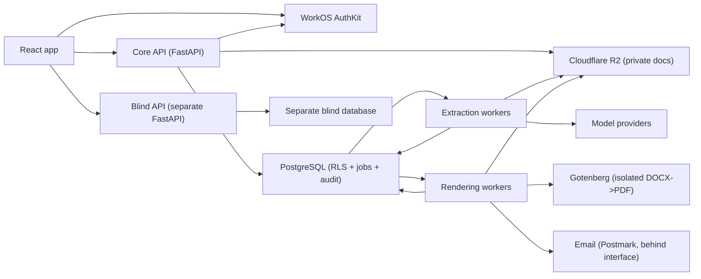

# TitlePipe Backend — The Plan (mid-2026)

*The definitive build plan: a small, typed Python stack where PostgreSQL owns correctness, workers do slow processing, native libraries do CPU-heavy work, and security boundaries are structural. Synthesis of the 32-candidate study (`REPORT.md`), the toolchain manifest (`TOOLCHAIN.md`), and two adversarial reviews — best of all, decisions resolved.*

> **This document is CANONICAL for decisions.** `TOOLCHAIN.md` is the version-detail companion and defers to this file wherever they differ. `REPORT.md` is the evidence study. (Reconciled 2026-07-21 after a review found PLAN/TOOLCHAIN disagreements — corrected below.)

**Guiding line:** Python coordinates the workflow · PostgreSQL enforces correctness · native libs do expensive PDF/OCR work · external-model latency runs async · isolation is structural, not conventional. Reliability over benchmark charts.

---

## 0. Decisions resolved (the deltas that were open)

| Decision | Resolution | Why |
|---|---|---|
| API-tier language | **Python 3.13 + FastAPI** (`>=3.13,<3.14`) | Correctness surface stays one language with the Python workers; 3.13 is the safe native-wheel baseline (move to 3.14 per-service after testing) |
| **Contract source of truth** | **Pydantic/OpenAPI authoritative for the wire + generated TS client, migrated endpoint-by-endpoint. Refusals live in Python domain policy + Postgres constraints (server-authoritative). Zod is UI-only.** | *(Correction:* OpenAPI **can** express the refusals — they're required fields / `minLength` / unions, verified in `endpoints.ts`. So Pydantic generates them; the server enforces them; Zod does not "own" them, it only mirrors for UX. Migrate incrementally so the 116 e2e tests never break) |
| **Queue** | **PgQueuer** (primary), behind a swappable interface, failure-recovery tested before full adoption; **Procrastinate** = documented fallback | Both do transactional enqueue on psycopg 3; PgQueuer adds built-in OpenTelemetry + Prometheus + dashboard — observability-first wins for a compliance system |
| Driver | **psycopg 3 (async)** | Transactional enqueue with no second connection; PgBouncer-friendly; asyncpg's speed edge is invisible at this volume |
| Serialization | **Typed Pydantic response models (Rust-backed) — no custom response class. orjson + msgspec deferred until a real endpoint benchmark proves a win** | *(Correction:* current FastAPI guidance is that a declared response model is the fastest normal path; `default_response_class=ORJSONResponse` can add an intermediate conversion. Large streaming results → JSON Lines / SSE) |
| Blind isolation | **Physically separate service AND separate database** | Stronger than a restricted role + views on the shared instance; a structural guarantee shouldn't depend on a grant staying correct |
| Auth | **WorkOS AuthKit sealed-session cookies (HttpOnly) + Python session helpers; PostgreSQL RBAC** | *One* session architecture — WorkOS helper authenticates/refreshes, then TitlePipe resolves membership + permission + object scope, then RLS. No standalone PyJWT/JWKS unless a concrete service-to-service/bearer case appears |
| Storage | **Cloudflare R2 via boto3** (presigned direct upload) | *(Correction:* R2 auto-encrypts at rest (AES-256-GCM, CF-managed keys); its customer-controlled option is **SSE-C, not AWS-style bucket SSE-KMS**. For customer-controlled keys use **app-layer envelope encryption** with an external KMS wrapping the data keys). obstore deferred until profiling |

---

## 1. Architecture



**Modular monolith** (Core API + workers as separate processes/containers) + **two mandated splits**: the **blind service** (separate FastAPI + separate DB — no shared queue, pool, or model-output table) and the **worker fleets**. Nothing else is a microservice in P1.

---

## 2. The stack (key picks; full version table in `TOOLCHAIN.md`)

**Runtime/web:** Python 3.13 · FastAPI + Pydantic v2 · uvicorn[standard] (one process/container, platform-supervised, no reload, no public docs in prod) · **typed Pydantic response models** (Rust-backed serialization — no custom response class; orjson/msgspec deferred until a benchmark) · **response_model on every route** (validates + strips undeclared fields + feeds OpenAPI).

**Data:** SQLAlchemy 2 async (typed `Mapped[]`) · psycopg 3 · Alembic + **Squawk** (migration linter), **never run migrations at API startup** · PostgreSQL RLS.

**Queue/state:** PgQueuer behind an interface · **domain tables are authoritative, the queue only delivers work** · every worker idempotent.

**Auth:** WorkOS AuthKit **sealed-session cookies + Python session helpers** (one session architecture; no standalone PyJWT/JWKS unless a concrete service-to-service/bearer case appears) · Postgres RBAC · HTTP-only cookies (never localStorage) + CSRF on cookie-auth mutations · `/me/capabilities` is UX-only, every route re-enforces.

**Documents:** pikepdf/qpdf (validate + repair + password detect) · pypdfium2 (render, **process-isolated** — PDFium isn't thread-safe) · docxtpl + python-docx (reports) · **Gotenberg** isolated container (DOCX→PDF, no internet, pinned digest, resource limits) · Pillow (not pillow-simd). **Avoid PyMuPDF (AGPL); LLMWhisperer client is AGPL — legal sign-off before bundling.**

**Integrations:** httpx (one long-lived AsyncClient/process, all four timeouts explicit) + tenacity (bounded: max attempts, backoff, jitter, deadline, transient-only) · vendor SDKs `google-genai`/`anthropic`/`openai` · **no LangChain**, engine adapters small + isolated + blind to each other.

**Dev:** uv (**separate lock per service**: core/blind/extraction/rendering) · Ruff · Pyright **strict** · pre-commit.

**Testing:** pytest + pytest-asyncio + testcontainers[postgres] (real PG, never SQLite) + Hypothesis (state-machine + canonicalization invariants) + Schemathesis (OpenAPI property tests) + respx (httpx mocks) + time-machine + golden DOCX/PDF fixtures.

**Security:** pip-audit + Semgrep + Trivy in CI.

**Observability:** structlog JSON (**redaction processor first**) + OpenTelemetry (scrub NPI at collector — auto-instrumentation captures SQL/paths/URLs) + Prometheus (queue depth; **no IDs in labels**) + Sentry (`send_default_pii=False`). **Product audit log is separate from technical logs.**

**Email:** Postmark behind an interface; **authenticated portal downloads, never email NPI attachments.**

---

## 3. Security & compliance posture (structural, not conventional)

**Separate database identities** — distinct roles for migration / application / worker / blind. App role is **non-owner** with **forced RLS** on tenant tables; owner/BYPASSRLS never used by the app.

**RLS lifecycle — the one property that must hold: transaction-scoped tenant context.** Set `set_config('app.current_tenant', <val>, true)` **per transaction** (an `after_begin` event hook is the reference implementation, not the only valid one), contextvars-fed, **parameterized** (never f-string), **deny-by-default** when unset, tenant-leading composite index. The full lifecycle: request/job middleware sets the contextvar → transaction start applies the setting → unset fails closed → the contextvar is always reset → pool-reuse/interleaved-tenant tests prove no leak. Every online RLS tutorial shows the leaky session-`SET` form; the mandated test is two tenants interleaved on one pooled connection asserting zero cross-read.

**Upload pipeline** — browser requests a short-lived R2 presigned PUT → uploads direct to R2 (API never relays the 100 MB doc) → then: quarantine → byte/page limits → MIME + magic-byte check → SHA-256 → malware scan → pikepdf structural validation → password/encryption detection → sandboxed rasterization. Only then does extraction see it.

**NPI never in** logs, traces, metrics labels, error payloads, queue/workflow payloads (claim-check: IDs + idempotency key only; workers fetch under tenant auth), or signed URLs in logs.

**Encryption at rest** — R2 auto-encrypts stored objects (AES-256-GCM, Cloudflare-managed keys) + TLS in transit. Where *customer-controlled* keys are required, use **application-layer envelope encryption** on the sensitive documents/fields, with an external KMS (AWS/GCP/Azure) wrapping the app data keys. **Do not** describe this as "R2 bucket SSE-KMS" — R2's customer option is SSE-C, not AWS-style bucket SSE-KMS.

**Actor identity is server-derived, never client-declared** — the actor comes from the authenticated session and is recorded server-side; no `signed_by`/actor field is accepted in a request body (already enforced in the contract — see §4).

### Blind-service data flow (the boundary made explicit)

A separate blind database is only meaningful with a defined one-way projection and isolated credentials:

```
Core blind COORDINATOR (in Core API, senior/ops-triggered)
   → copies ONLY original source pages + blank field definitions
   → into a separate blind-input bucket/prefix (its own R2 credentials)
   → and case assignments into the separate blind database
   (never copies model output, extraction results, or the reconciliation view)

Blind API (separate service, separate DB, own network rules)
   → CAN read blind-input objects + write typist entries
   → CANNOT reach the core DB, model results, or the extraction bucket

Reconciliation IMPORTER (in Core, runs after BOTH seats lock)
   → pulls the finalized A/B entries
   → writes them into core reconciliation tables
```

Independent credentials, network rules, database instance, and object-storage access at every arrow. No shared logical replication, no shared queue credentials. **The guarantee is structural (no grant/route/path), proven by tests — not asserted.**

---

## 4. Contract architecture (three layers, corrected)

```
Layer 1 — Pydantic request/response models  →  FastAPI OpenAPI 3.1  →  generated TS client
          (openapi-typescript + openapi-fetch [+ openapi-react-query])
          = the WIRE format and the frontend client. Authoritative for shapes.

Layer 2 — Python domain policies + PostgreSQL constraints
          = PRODUCT LAW: refusals, state transitions, authorization. SERVER-AUTHORITATIVE.
          The refusals (reason min-length, question required, ruling+rule union,
          golden source+reason+signature) are ordinary schema — Pydantic generates them
          INTO the OpenAPI, and the server enforces them regardless of the client.

Layer 3 — Frontend Zod  →  UI-only form validation + immediate user feedback.
          At most MIRRORS the refusals for UX. Never the authority.
```

**Correction to the earlier "hybrid" framing:** I previously said OpenAPI can't express the refusals so hand-authored Zod must own them. That's wrong — verified in `endpoints.ts`, the refusals are required fields / `minLength` / unions, all expressible in Pydantic→OpenAPI. So the server owns refusals (as it must — you can't trust the client anyway), the wire schema carries the shape constraints, and Zod drops to UI-only.

**Migration is endpoint-by-endpoint, not a big-bang flip:** port one endpoint's Pydantic model → generate its client slice → prove frontend parity → move contract ownership for that endpoint → repeat. This keeps the 116 e2e tests green throughout. The generated TS client is **committed (or deterministically generated in the build)**; CI diffs it as a drift alarm.

**Server-derived actor identity — DONE (contract corrected).** `signed_by` has been removed from `GoldenCorrectionRequest` and `GoldenAffirmRequest`; the signer is stamped server-side from the authenticated session (mock: `x-mock-actor`; real backend: the WorkOS session), never a request-body field — a browser cannot declare who signed a change to ground truth. The same rule holds for every actor/identity field on correction, review, rule-confirm, and release actions: the client never declares who acted. (Backend work remaining is only wiring the real WorkOS session as the identity source; the contract and mocks already enforce the shape.)

---

## 5. Implementation order (correctness-gated)

**Gate 0 — before any scaffolding:**
1. **Recover the Flask prototype + run its 155 tests unchanged.** Inventory its public functions, domain models, invariants; freeze representative golden outputs. If it can't be recovered, this is a **reconstruction, not a port** — say so and drop the 155-test-net claim. (The 116 frontend e2e tests **are** in the repo and stay green throughout.)
2. **Accept/update the FastAPI ADR** (sign ADR-0001).
3. **This reconciliation** — PLAN (canonical) + TOOLCHAIN + REPORT now one consistent set. ✔ done.

**Then build:**
4. **Foundation** — Python 3.13, per-service `uv` locks, Ruff, Pyright strict, pre-commit, CI wired with pip-audit + Semgrep + Trivy.
5. **Postgres correctness gate (before any feature)** — schema, Alembic + Squawk, the four DB roles (migration/app/worker/blind, non-owner + forced RLS), RLS policies, and the **RLS test suite green** (tenant isolation + pooled-connection leak). Nothing ships until this passes.
6. **Contract, endpoint-by-endpoint** — port **one read-only endpoint** behind the existing contract → generate its TS client slice → prove frontend parity → move ownership → repeat. Schemathesis + client-drift check in CI.
7. **Auth** — WorkOS sealed-session cookies + Python session helpers, Postgres memberships + capabilities, `/me/capabilities` (UX-only), **wire the real WorkOS session as the server-derived actor identity** (the contract already forbids client-declared signers).
8. **Upload + first job** — direct-to-R2 presigned + the full quarantine/validation pipeline + the first **idempotent** job. **Adoption gate:** PgQueuer only after crash/duplicate/rollback/reclaim/cancellation tests pass (behind the queue interface so it's swappable).
9. **Extraction worker** — provenance on every value, immutable rulebook/prompt version metadata, `NOT_PRESENT` vs `PRESENT_UNREADABLE` preserved, engine isolation; Hypothesis invariants on the normalizer.
10. **Review + decision workflow** — refusals enforced server-side; judgments never auto-confirm.
11. **Blind projection + service + reconciliation importer** — the §3 data flow; separate service, DB, and R2 credentials; prove the restrictions in tests.
12. **Rendering + delivery** — docxtpl → Gotenberg → PDF, golden fixtures; authenticated portal download (no NPI email).
13. **Ops + load-test the real workflow** — tracing, product audit log, backups, recovery drills; benchmark before ever adding orjson/msgspec or swapping to Granian.

---

## 6. Rejected / deferred for P1

| Item | Decision |
|---|---|
| GraphQL, Kafka, service mesh, K8s-first | Reject |
| Celery + Redis | Reject (unnecessary infra; PgQueuer is Postgres-native) |
| Temporal / DBOS | Defer until measured workflow complexity justifies (DBOS is the durable-execution upgrade path) |
| Granian, msgspec | Defer until load-testing proves a need |
| LangChain, SQLModel | Reject (LangChain: no orchestration framework in v1; SQLModel: less control for complex RLS) |
| Frontend-only RBAC, tokens in localStorage | Reject |
| One giant Python environment | Reject (per-service locks) |
| Public document converter, emailing NPI attachments | Reject |
| Migrations at API startup, auto-applied dependency upgrades | Reject |

---

**Still genuinely the owner's call** (recommended, not decided): whether the Flask prototype + 155 tests are recoverable (tested **port** vs. **reconstruction** — FastAPI either way; this is Gate 0). The contract direction is now resolved as an *incremental, endpoint-by-endpoint* migration that keeps the 116 e2e tests green, so it no longer needs a big-bang decision.

**Verified facts (2026-07-21):** 116 frontend e2e tests exist in `apps/web/e2e` (23 spec files). The Flask backend + its 155 tests are **not** in this checkout (only design HTML in the zip) — Gate 0 must recover them or the work is a reconstruction.

**Gate 0 outcome (closed 2026-07-23): PORT — the prototype was recovered and the safety net is reproducible.** Found in `~/Downloads/titlepipe.zip` (+ `titlepipe_bugfixes.zip`), retained outside VCS pending the owner ruling on client-derived names in its tests. The recovered baseline is 131 package tests plus 24 standalone patch tests. Synthetic replacements cover the 10 client-dependent inputs, and 22 v14 tests guard R15 across mortgages, judgments, liens and UCCs. **177/177 pass from the 33-file hash-verified archive under the committed Python 3.13.14 dependency lock.** The five fixes were never merged into the package, so Gate 6 must port patch semantics, not the raw package. Full evidence and command: `docs/backend/GATE_0_RECOVERY.md`.
