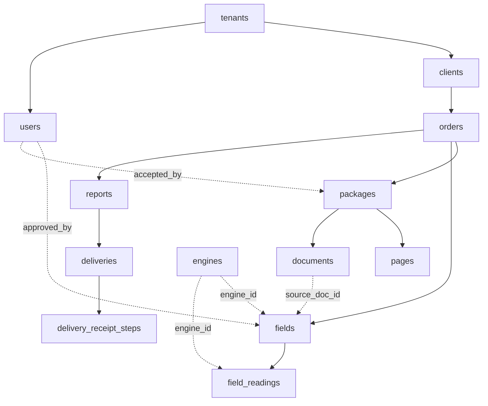

# Proposal A — the minimal vertical slice

> Data model for backend Plan 04. **Thesis: build the smallest schema that lets
> ONE order flow ingest → extract → review → render → deliver, and defer every
> table no live frontend endpoint reads.** Ships in days, not weeks.

Written against: `docs/superpowers/plans/backend/SCHEMA-GAP-2026-09-01.md`,
`BACKEND-MASTER-PLAN.md` §1 (Plan 04), `LIVE-DB-VERIFICATION-2026-09-01.md`,
`docs/CONTEXT.md:97-152`, `packages/contract/src/entities.ts`.

---

## 0. The argument

`BACKEND-MASTER-PLAN.md:146-149` lists Plan 04 as shipping sixteen tables at
once: `orders +10`, `fields +17`, `field_readings +6`, plus `documents`,
`escalations`, `reports`, `deliveries`, `engines`, `engine_routing`,
`engine_runs`, `blind_entries`, `bugs`, `probes`, `users`, `clients`. That is
the whole model in one migration, and it is a bad first migration for three
measured reasons:

1. **The migration hazard is per-migration, not per-table.**
   `0001_skeleton.py:21-40` and `0002_forced_rls_and_grants.py:28-70` record
   that a data migration under forced RLS *does nothing and reports success*.
   The cheapest way to learn that a data migration is silent is to write a
   small one and prove it fails when the guard is removed. A sixteen-table
   migration makes the first exercise of that proof also the largest.
2. **Most of those tables have no live reader.** `SCHEMA-GAP-2026-09-01.md:41-44`
   already flags `golden_fields`, `reconciliations`, `complaints`,
   `leaderboard` as backing screens deleted in `7f04340`. `probes` is
   explicitly *table and no UI surface* (`BACKEND-MASTER-PLAN.md:158-159`) and
   probe visibility is a named anti-pattern (`AGENTS.md`). `engine_routing`,
   `blind_entries`, `bugs` all sit behind screens or gates that are not on the
   ingest→deliver path.
3. **G1 is open and reaches the schema.** `BACKEND-MASTER-PLAN.md:65` — the
   queue-vs-workspace ruling reaches Plan 03's authz table. Anything shaped by
   how orders are *selected* should not be frozen into a first migration.

So: **one migration, `0004_vertical_slice`, six tables touched and four created.**
Everything else is deferred with a written cost, §4.

### What "the slice" means precisely

The one path is: an order arrives with a package → pages are enumerated →
documents are segmented → fields are extracted with per-engine readings →
fields carry provenance and a state → a reviewer confirms/corrects → a report
is rendered → a delivery is attempted. The entities the contract requires along
that path are exactly `Order`, `Field`, `FieldReading`, `Report`, `Delivery`
(`entities.ts:56-77`, `102-152`, `81-94`, `242-255`, `263-284`). `Engine` is
required only as a *referent* for `field.engine_id` / `reading.engine_id`, so it
gets a table with four columns and no routing.

---

## 1. DDL

All of it is one Alembic revision, `0004_vertical_slice`, `down_revision = "0003"`.
Spelled as SQL here for reviewability; the revision writes the same statements
with `op.*`, one object per call, following `0001_skeleton.py:41-44`'s rule that
each object gets one reviewable line rather than a loop.

### 1.0 Enums created and dropped explicitly

`0001_skeleton.py:48-52` and `0003_rules.py:52-58`: `DROP TABLE` does not drop a
type, so a `downgrade()` that only drops tables leaves the type behind and the
*next* `upgrade` dies on `type ... already exists`. Only a round trip finds it.

```sql
CREATE TYPE field_state AS ENUM (
  'pending', 'auto_confirmed', 'needs_review', 'confirmed', 'corrected', 'escalated'
);
-- exactly packages/contract/src/enums.ts:8-15, in that order.

CREATE TYPE delivery_status AS ENUM (
  'draft', 'signed', 'digest_recorded', 'transmitted', 'acknowledged', 'failed_transit'
);
-- exactly packages/contract/src/enums.ts:107-114.

CREATE TYPE engine_kind AS ENUM ('vlm_image', 'ocr_text', 'hybrid');
-- packages/contract/src/enums.ts:73.

CREATE TYPE segmentation_state AS ENUM ('pending', 'segmented', 'ambiguous', 'failed');
-- ⚠ NOT from the contract. See §6 OPEN-1; this enum is the one invention here
--   and it should be ruled before the revision lands, or shipped as `text`.
```

**`order_status` gets NO enum.** `enums.ts:95-98` says the vocabulary is OPEN
until the Flask models are ported and *"do not invent a closed enum here."*
`orders.status` is `text NOT NULL`. Inventing it would be building past an
`OPEN` (`AGENTS.md`).

**`na_reason` is untouched.** Four labels, owner-ratified D3, confirmed live in
`LIVE-DB-VERIFICATION-2026-09-01.md:64-72`. `SCHEMA-GAP:92-99` frames the window
as still open; it is not reopened here.

### 1.1 `orders` — +10 columns

Contract shape `entities.ts:56-77`.

```sql
ALTER TABLE orders
  ADD COLUMN client_id     uuid        NOT NULL,
  ADD COLUMN external_ref  text        NOT NULL,
  ADD COLUMN jurisdiction  text        NOT NULL,
  ADD COLUMN state         text        NOT NULL,
  ADD COLUMN county        text        NOT NULL,
  ADD COLUMN product       text        NULL,
  ADD COLUMN period_label  text        NULL,
  ADD COLUMN page_count    integer     NULL,
  ADD COLUMN status        text        NOT NULL,
  ADD COLUMN arrived_at    timestamptz NOT NULL DEFAULT now(),
  ADD COLUMN accepted_at   timestamptz NULL,
  ADD COLUMN delivered_at  timestamptz NULL;
```

Nullability is the contract's, not a convenience: `product`, `period_label`,
`pages` are nullable because *"an order that failed validation has no resolved
product, an unreadable package has no page count; `0` would assert somebody
counted"* (`entities.ts:63-72`). The column is `page_count` rather than `pages`
because `pages` is a table name; the API layer renames on serialize.

`accepted_at` nullable is INVARIANT 47's storage side — acceptance is explicit,
an upload alone never queues an order (`BACKEND-MASTER-PLAN.md:168-169`).

Two of these are `NOT NULL` additions to a table that currently holds rows only
transiently (`LIVE-DB-VERIFICATION:92-94` — the two `orders` rows were pytest
fixture residue). **On a live database they would need a backfill, and a
backfill is exactly the silent-no-op hazard.** §5 handles it.

### 1.2 `packages` — +4

`CONTEXT.md:106`.

```sql
ALTER TABLE packages
  ADD COLUMN order_id    uuid    NOT NULL,
  ADD COLUMN storage_key text    NOT NULL,
  ADD COLUMN page_count  integer NULL,
  ADD COLUMN sha256      text    NOT NULL,
  ADD COLUMN accepted_by uuid    NULL;
```

`storage_key` is a key into the object store at a configured absolute path
outside the working tree (`BACKEND-MASTER-PLAN.md:166-168`; `AGENTS.md` — the
644 MB incident). No bytes in the database, no path in the repo.

`sha256 NOT NULL` is what INVARIANT 48's duplicate notice is computed from
(`BACKEND-MASTER-PLAN.md:168-170`); see §3 for its index.

### 1.3 `pages` — +6

`CONTEXT.md:107`.

```sql
ALTER TABLE pages
  ADD COLUMN package_id       uuid    NOT NULL,
  ADD COLUMN page_no          integer NOT NULL,
  ADD COLUMN has_text_layer   boolean NULL,
  ADD COLUMN page_class       text    NULL,
  ADD COLUMN class_engine     uuid    NULL,
  ADD COLUMN class_confidence real    NULL;
```

`class` is a reserved-ish word and a Python builtin; `page_class` in the column,
renamed at the serializer. `class_confidence` is nullable and is **never a
gate** — same rule as `confidence_raw` (`entities.ts:88`).

⚠ `page_no` is a natural key and `_tenant_primary_key`'s docstring
(`0001_skeleton.py:174-179`) says the cross-tenant existence oracle *"stops
being bounded the moment a natural key lands, and PRD §7 gives `orders` an order
number and `pages` a page index."* This proposal lands both. The mitigation is
that every uniqueness constraint added here is **tenant-prefixed** — see §3.
That is not optional and it is the reason no `UNIQUE (package_id, page_no)`
appears without `tenant_id` in front of it.

### 1.4 `documents` — NEW

`CONTEXT.md:108-109`. `BACKEND-MASTER-PLAN.md:147-148`: *"`documents` (with
`segmentation_state` — **assemble cannot run without it**)"*. This is the one
new table on the critical path that the contract does not describe, because the
frontend consumes `source_doc_id` as an opaque string (`entities.ts:109`) and
never reads a document row directly.

```sql
CREATE TABLE documents (
  id                 uuid        NOT NULL DEFAULT gen_random_uuid(),
  created_at         timestamptz NOT NULL DEFAULT now(),
  tenant_id          uuid        NOT NULL,
  package_id         uuid        NOT NULL,
  doc_type           text        NOT NULL,
  page_start         integer     NOT NULL,
  page_end           integer     NOT NULL,
  recording_no       text        NULL,
  book_page          text        NULL,
  recorded_date      date        NULL,
  dated_date         date        NULL,
  segmentation_state segmentation_state NOT NULL DEFAULT 'pending',
  PRIMARY KEY (tenant_id, id)
);
```

`recorded_date` and `dated_date` are separate and both nullable — CONTEXT §11's
domain traps treat the recorded/dated distinction as load-bearing, and a schema
that collapses them cannot represent the trap.

### 1.5 `fields` — +17

The worst gap and the table the product turns on (`SCHEMA-GAP:74-87`).

```sql
ALTER TABLE fields
  ADD COLUMN order_id              uuid        NOT NULL,
  ADD COLUMN path                  text        NOT NULL,
  ADD COLUMN value                 text        NULL,
  ADD COLUMN state                 field_state NOT NULL DEFAULT 'pending',
  ADD COLUMN source_doc_id         uuid        NULL,
  ADD COLUMN source_page           integer     NULL,
  ADD COLUMN source_snippet        text        NULL,
  ADD COLUMN source_line_coords    jsonb       NULL,
  ADD COLUMN source_excerpt        jsonb       NULL,
  ADD COLUMN engine_id             uuid        NULL,
  ADD COLUMN engine_confidence_raw real        NULL,
  ADD COLUMN rule_refs             text[]      NOT NULL DEFAULT '{}',
  ADD COLUMN approved_by           uuid        NULL,
  ADD COLUMN approved_at           timestamptz NULL,
  ADD COLUMN excluded_reason       text        NULL,
  ADD COLUMN asking                 text       NULL,
  ADD COLUMN why                    text       NULL,
  ADD COLUMN consequence            text       NULL;
```

Notes that are rulings rather than taste:

- **`state` is a column, never a derivation.** `enums.ts:3-7`: the server owns
  every transition; the UI never computes it from confidence or `value === null`.
  A generated column would make it derivable and is refused.
- **`na_reason` already exists** (`0001_skeleton.py:283-289`) and is NOT
  touched. `value NULL` + `na_reason NULL` means "not yet extracted", a pipeline
  state and not an NA member (`enums.ts:30-32`). **No CHECK constraint couples
  them**, deliberately: a constraint like
  `CHECK (value IS NULL OR na_reason IS NULL)` reads correct and is, but a
  constraint requiring one of the two to be set would forbid the legitimate
  "not yet extracted" row. Only the first, harmless half is proposed:

```sql
ALTER TABLE fields
  ADD CONSTRAINT ck_fields_value_xor_na
  CHECK (value IS NULL OR na_reason IS NULL);
```

- **`excluded_reason` is orthogonal to `state`, not a member of it**
  (`entities.ts:120-127`) — hence a separate nullable column, and hence no
  `'excluded'` label in `field_state`. Its non-null-ness is the only auditable
  trace of an R13/R15 suppression.
- **`asking` / `why` / `consequence` are nullable columns, not a jsonb blob.**
  Three-way meaning in the contract (absent / null / authored,
  `entities.ts:128-143`); three columns preserve it, and a blob would let the
  browser be handed a shape it could compose into.
- **`source_excerpt jsonb`** rather than four columns: `SourceExcerpt`
  (`entities.ts:46-53`) is `pre+hit+post` that must concatenate to
  `source_snippet` character for character. Storing it whole keeps that
  invariant checkable in one place. The CHECK that enforces the concatenation is
  **deferred** — see §4, DEF-9.

The `rule_refs text[] NOT NULL DEFAULT '{}'` matches `entities.ts:115`, which is
a non-nullable array. `'{}'` is "no rules cited", distinct from nothing, and it
is what makes "never emit a value you can't cite" checkable: a `RULED` field
with an empty `rule_refs` is a detectable defect.

### 1.6 `field_readings` — +8

```sql
ALTER TABLE field_readings
  ADD COLUMN field_id       uuid NOT NULL,
  ADD COLUMN engine_id      uuid NOT NULL,
  ADD COLUMN value          text NULL,
  ADD COLUMN page           integer NULL,
  ADD COLUMN snippet        text NULL,
  ADD COLUMN confidence_raw real NULL,
  ADD COLUMN cost_usd       numeric(12,6) NOT NULL,
  ADD COLUMN latency_ms     integer       NOT NULL;
```

`cost_usd` and `latency_ms` are `NOT NULL` because the adapter rules require
cost and latency *per call* (`AGENTS.md`; `SCHEMA-GAP:88-90`) — an adapter that
cannot say what a call cost has not met the rule, and nullable columns would let
it ship. `numeric`, never `float`: money.

`line_coords` already exists, nullable, and the nullability is the point
(`0001_skeleton.py:231-237`) — an engine with no coordinate support declares
`null` and never fabricates a box.

### 1.7 `engines` — NEW, four columns

`entities.ts:299-305`. Config is deferred (§4 DEF-2).

```sql
CREATE TABLE engines (
  id              uuid        NOT NULL DEFAULT gen_random_uuid(),
  created_at      timestamptz NOT NULL DEFAULT now(),
  tenant_id       uuid        NOT NULL,
  kind            engine_kind NOT NULL,
  enabled         boolean     NOT NULL DEFAULT true,
  adapter_version text        NOT NULL,
  PRIMARY KEY (tenant_id, id)
);
```

⚠ **`engines` tenant-scoped is a judgement call, flagged as OPEN-2 (§6).** The
argument for tenant-scoping: it is the default in this schema and the
conservative direction (a global table can be derived from a tenant one later;
the reverse is a rewrite of every FK). The argument against: engines are shop
infrastructure like `rules`, which `0003_rules.py:6-16` ruled global for exactly
that reason. If the owner rules it global, `EXPECTED_GLOBAL_TABLES` in
`tests/test_forced_rls_and_grants.py` must gain a second member — and
`0003_rules.py:19-30` records that a table with no `tenant_id` drops SILENTLY
out of every derivation that would otherwise assert on it. **Do not add a global
table without editing that list in the same commit.**

### 1.8 `reports` — NEW

`entities.ts:242-255` + `CONTEXT.md:138`.

```sql
CREATE TABLE reports (
  id          uuid        NOT NULL DEFAULT gen_random_uuid(),
  created_at  timestamptz NOT NULL DEFAULT now(),
  tenant_id   uuid        NOT NULL,
  order_id    uuid        NOT NULL,
  version     integer     NOT NULL,
  shape       text        NOT NULL,
  storage_key text        NOT NULL,
  rendered_at timestamptz NOT NULL,
  supersedes  integer     NULL,
  reason      text        NULL,
  PRIMARY KEY (tenant_id, id)
);
```

`supersedes` is a *version number*, not an id (`entities.ts:248-253`), and both
it and `reason` are null on a v1. `storage_key` is in CONTEXT and not in the
contract — correct: the browser never gets a storage key.

### 1.9 `deliveries` — NEW

`entities.ts:263-284`.

```sql
CREATE TABLE deliveries (
  id           uuid            NOT NULL DEFAULT gen_random_uuid(),
  created_at   timestamptz     NOT NULL DEFAULT now(),
  tenant_id    uuid            NOT NULL,
  report_id    uuid            NOT NULL,
  method       text            NOT NULL,
  status       delivery_status NOT NULL DEFAULT 'draft',
  attempted_at timestamptz     NULL,
  delivered_at timestamptz     NULL,
  evidence     text            NULL,
  PRIMARY KEY (tenant_id, id)
);
```

**`receipt` gets its own table, and that is the one place this proposal spends a
table it could have saved.** `ReceiptStep` (`entities.ts:263-270`) is a list the
client renders *verbatim* and *"never derives a step from `status`"*. A jsonb
column would work; a table is chosen because the four canonical steps carry
`who` and `at` and are the delivery audit trail, and an audit trail inside a
jsonb blob cannot be constrained, indexed, or joined to a principal.

```sql
CREATE TABLE delivery_receipt_steps (
  id          uuid        NOT NULL DEFAULT gen_random_uuid(),
  created_at  timestamptz NOT NULL DEFAULT now(),
  tenant_id   uuid        NOT NULL,
  delivery_id uuid        NOT NULL,
  step_no     integer     NOT NULL,
  what        text        NOT NULL,
  who         text        NOT NULL,
  at          timestamptz NULL,
  done        boolean     NOT NULL DEFAULT false,
  PRIMARY KEY (tenant_id, id)
);
```

`step_no` gives *"the server's order"* (`entities.ts:281`) an explicit column
rather than an implicit `created_at` sort. `done` is stored, never derived from
`at IS NOT NULL` — the contract states both members independently.

### 1.10 `clients` and `users` — minimal

`orders.client_id` and `fields.approved_by` need referents. Both get the
narrowest table that makes the FK real.

```sql
CREATE TABLE clients (
  id              uuid        NOT NULL DEFAULT gen_random_uuid(),
  created_at      timestamptz NOT NULL DEFAULT now(),
  tenant_id       uuid        NOT NULL,
  name            text        NOT NULL,
  delivery_method text        NOT NULL,
  delivery_config jsonb       NOT NULL DEFAULT '{}'::jsonb,
  report_shape    text        NOT NULL,
  template_ref    text        NULL,
  PRIMARY KEY (tenant_id, id)
);

CREATE TABLE users (
  id             uuid        NOT NULL DEFAULT gen_random_uuid(),
  created_at     timestamptz NOT NULL DEFAULT now(),
  tenant_id      uuid        NOT NULL,
  email          text        NOT NULL,
  role           text        NOT NULL,
  workos_user_id text        NULL,
  PRIMARY KEY (tenant_id, id)
);
```

**`workos_user_id`, never `clerk_id`.** ADR-0001 signed Clerk → WorkOS;
`BACKEND-MASTER-PLAN.md:97-98` records `CONTEXT §15` as stale on exactly this,
and `CONTEXT.md:101` still carries `clerk_id` with its own inline ⚠.

⚠ **`users.role text` is where G1/G3 touch this migration.**
`BACKEND-MASTER-PLAN.md:65` — 9 of `authz.ts`'s 19 screen doors belong to
deleted screens, and INVARIANT 41 forbids the table drifting from the server. A
`role` **enum** here would freeze a role vocabulary that Plan 03's gates have not
ruled. `text` now, enum when G1 and G3 close. If Plan 03 lands first and defines
`Principal`, this table is its shape and this proposal defers to it.

### 1.11 `audit_log` — +4, and the trigger is not disturbed

```sql
ALTER TABLE audit_log
  ADD COLUMN actor_id  uuid NULL,
  ADD COLUMN action    text NOT NULL,
  ADD COLUMN entity    text NOT NULL,
  ADD COLUMN entity_id uuid NOT NULL;
```

`CONTEXT.md:144` also lists `at`; `created_at` already is it, and adding a second
timestamp would create two answers to "when". `actor_id` is **nullable**: a
system-authored audit row has no human actor, and `MSW-BEHAVIOUR-HARVEST §3` via
`BACKEND-MASTER-PLAN.md:126-128` records `audit.ts:93` attributing an
unattributed action to a *name* — the exact defect a NOT NULL here would push
the server into repeating.

`ADD COLUMN` is DDL and does not fire the `FOR EACH STATEMENT` append-only
trigger (`0001_skeleton.py:54-59`), which refuses `UPDATE`/`DELETE`. **But a
backfill of the two `NOT NULL` columns would be a mutation and the trigger would
refuse it with SQLSTATE `0A000`.** The revision therefore adds these three as
nullable-then-set-not-null only if the table is empty, and asserts emptiness
first. On a non-empty `audit_log` this migration must fail loudly rather than
find a way around its own append-only guarantee. That is a feature; see §5.

---

## 2. The FK graph

`0001_skeleton.py:7-10` records **no foreign keys** as the skeleton's owner
ruling — for a schema whose only purpose was to have something to prove RLS
against. This proposal adds them, because a slice with no FKs cannot tell an
orphaned field from a deleted order, and *"never emit a value you can't cite"*
is unenforceable when the citation target may not exist.

**Every FK is composite, `(tenant_id, <col>)` → `(tenant_id, id)`.** This is
forced by `PRIMARY KEY (tenant_id, id)` (`0001_skeleton.py:153-196`): there is
no single-column unique key to point at, and adding one would restore the
cross-tenant existence oracle that key exists to close. It also makes every
reference *tenant-local by construction* — a row cannot reference another
tenant's row because the tenant column is shared by the constraint.



Solid = `NOT NULL` FK, dotted = nullable FK.

```sql
ALTER TABLE clients   ADD CONSTRAINT fk_clients_tenant   FOREIGN KEY (tenant_id) REFERENCES tenants (id);
ALTER TABLE users     ADD CONSTRAINT fk_users_tenant     FOREIGN KEY (tenant_id) REFERENCES tenants (id);
ALTER TABLE orders    ADD CONSTRAINT fk_orders_tenant    FOREIGN KEY (tenant_id) REFERENCES tenants (id);

ALTER TABLE orders    ADD CONSTRAINT fk_orders_client
  FOREIGN KEY (tenant_id, client_id)  REFERENCES clients   (tenant_id, id);
ALTER TABLE packages  ADD CONSTRAINT fk_packages_order
  FOREIGN KEY (tenant_id, order_id)   REFERENCES orders    (tenant_id, id) ON DELETE CASCADE;
ALTER TABLE packages  ADD CONSTRAINT fk_packages_accepted_by
  FOREIGN KEY (tenant_id, accepted_by) REFERENCES users    (tenant_id, id);
ALTER TABLE pages     ADD CONSTRAINT fk_pages_package
  FOREIGN KEY (tenant_id, package_id) REFERENCES packages  (tenant_id, id) ON DELETE CASCADE;
ALTER TABLE documents ADD CONSTRAINT fk_documents_package
  FOREIGN KEY (tenant_id, package_id) REFERENCES packages  (tenant_id, id) ON DELETE CASCADE;

ALTER TABLE fields    ADD CONSTRAINT fk_fields_order
  FOREIGN KEY (tenant_id, order_id)      REFERENCES orders    (tenant_id, id) ON DELETE CASCADE;
ALTER TABLE fields    ADD CONSTRAINT fk_fields_source_doc
  FOREIGN KEY (tenant_id, source_doc_id) REFERENCES documents (tenant_id, id);
ALTER TABLE fields    ADD CONSTRAINT fk_fields_engine
  FOREIGN KEY (tenant_id, engine_id)     REFERENCES engines   (tenant_id, id);
ALTER TABLE fields    ADD CONSTRAINT fk_fields_approved_by
  FOREIGN KEY (tenant_id, approved_by)   REFERENCES users     (tenant_id, id);

ALTER TABLE field_readings ADD CONSTRAINT fk_readings_field
  FOREIGN KEY (tenant_id, field_id)  REFERENCES fields  (tenant_id, id) ON DELETE CASCADE;
ALTER TABLE field_readings ADD CONSTRAINT fk_readings_engine
  FOREIGN KEY (tenant_id, engine_id) REFERENCES engines (tenant_id, id);

ALTER TABLE reports    ADD CONSTRAINT fk_reports_order
  FOREIGN KEY (tenant_id, order_id)  REFERENCES orders  (tenant_id, id);
ALTER TABLE deliveries ADD CONSTRAINT fk_deliveries_report
  FOREIGN KEY (tenant_id, report_id) REFERENCES reports (tenant_id, id);
ALTER TABLE delivery_receipt_steps ADD CONSTRAINT fk_steps_delivery
  FOREIGN KEY (tenant_id, delivery_id) REFERENCES deliveries (tenant_id, id) ON DELETE CASCADE;
```

**`ON DELETE CASCADE` only down the containment spine** (order → package → page
/ document, order → field → reading). Nowhere on `reports`, `deliveries` or
`delivery_receipt_steps`: a delivered report is a record of what was sent to a
client and must not evaporate because an order row was removed. Nowhere on
`approved_by` / `accepted_by`: deleting a user must not delete the approval.
`RESTRICT` (the default) there is intentional — it makes user deletion fail
loudly rather than erase an audit trail.

### The one thing FKs do NOT buy under RLS

⚠ **Foreign key checks run as an internal system operation and are not filtered
by the referencing role's policy.** A composite FK on `(tenant_id, ...)` makes a
cross-tenant reference structurally impossible, so this is closed by the *shape*
of the constraint and not by RLS. This is the reason the composite form is
mandatory rather than merely tidy: a single-column `FOREIGN KEY (order_id)`
against a hypothetical unique `orders(id)` would let tenant B's field reference
tenant A's order and would answer existence questions while doing it — the same
oracle `0001_skeleton.py:154-173` measured.

---

## 3. Indexes, and why each one exists

The PK `(tenant_id, id)` already tenant-prefixes each table's backing index,
*"which is what an RLS-filtered scan wants"* (`0001_skeleton.py:181-182`). Every
index below is tenant-prefixed for the same reason: the policy predicate is
`tenant_id = current_setting(...)`, so an index that does not lead with
`tenant_id` cannot serve the filtered scan.

**Uniqueness (4).** Each one is a correctness constraint, not a speed one.

```sql
CREATE UNIQUE INDEX uq_orders_external_ref  ON orders    (tenant_id, client_id, external_ref);
CREATE UNIQUE INDEX uq_pages_package_page   ON pages     (tenant_id, package_id, page_no);
CREATE UNIQUE INDEX uq_fields_order_path    ON fields    (tenant_id, order_id, path);
CREATE UNIQUE INDEX uq_reports_order_ver    ON reports   (tenant_id, order_id, version);
```

- `uq_orders_external_ref` — a client's own reference is unique *to that client*,
  not globally; two clients may use the same string.
- `uq_pages_package_page` — a package cannot have two page 7s.
- `uq_fields_order_path` — **this is the important one.** One field per path per
  order is what makes an extraction idempotent and what makes "the field for
  `tax.delinquent_years`" a well-defined thing for review and assembly. Without
  it a re-run silently doubles the sheet.
- `uq_reports_order_ver` — versions are the reissue chain (`supersedes`), and a
  duplicate version makes the chain ambiguous.

⚠ Each of these is a **natural key**, and `0001_skeleton.py:174-179` says the
existence oracle *"stops being bounded the moment a natural key lands."* All four
lead with `tenant_id`, so a cross-tenant duplicate is not a conflict and the
oracle does not open. **An index here that omits `tenant_id` is a security
defect, not a performance note.** That is worth a test of its own: §5, INJ-3.

**Foreign key support (5).** Postgres indexes the *referenced* side
automatically and the *referencing* side never. Each of these backs a cascade
delete and the hot read path at once.

```sql
CREATE INDEX ix_packages_order   ON packages       (tenant_id, order_id);
CREATE INDEX ix_documents_pkg    ON documents      (tenant_id, package_id);
CREATE INDEX ix_readings_field   ON field_readings (tenant_id, field_id);
CREATE INDEX ix_deliveries_rpt   ON deliveries     (tenant_id, report_id);
CREATE INDEX ix_steps_delivery   ON delivery_receipt_steps (tenant_id, delivery_id);
```

`fields (tenant_id, order_id)` is **not** listed: `uq_fields_order_path` leads
with exactly that prefix and serves it. `pages (tenant_id, package_id)` likewise
from `uq_pages_package_page`. Adding either would be a duplicate index and a
write cost for nothing.

**Query support (3), and only where a query is named.**

```sql
CREATE INDEX ix_fields_review ON fields (tenant_id, state)
  WHERE state IN ('needs_review', 'escalated');
CREATE INDEX ix_orders_status ON orders (tenant_id, status);
CREATE UNIQUE INDEX uq_packages_sha ON packages (tenant_id, sha256);
```

- `ix_fields_review` is **partial**, and the partiality is the design. The review
  queue asks for exactly the two states; a full index on `state` is mostly
  `confirmed` and `auto_confirmed` rows that nothing scans by state.
- `ix_orders_status` — status is the only order filter on the live path.
  ⚠ **This one is provisional on G1** (`BACKEND-MASTER-PLAN.md:65`): if the queue
  is a single server-chosen next order rather than a browse table, the query is
  a different one and this index is the wrong shape. It is one line either way.
- `uq_packages_sha` — INVARIANT 48, the sha256 duplicate notice
  (`BACKEND-MASTER-PLAN.md:168-170`). **Unique per tenant, not globally**: one
  tenant uploading a county package must not be told another tenant already has
  it. A global unique index here would be a cross-tenant information leak wearing
  a duplicate check's clothes.

**No index on `rule_refs`.** A GIN index on the array is the obvious add and it
is deferred: nothing in the slice queries fields *by* cited rule. §4, DEF-8.

**Twelve indexes total.** Every one names a query or a constraint. An index
whose justification is "it might be slow" is not in this list.

---

## 4. What is deliberately deferred, and what deferring costs

| # | deferred | why it is safe now | the cost, stated |
|---|---|---|---|
| DEF-1 | `escalations` | On the review path but **behind D1** — escalation resolution is refused without a rule (`BACKEND-MASTER-PLAN.md:96`). A field can reach `state='escalated'` with no `escalations` row; the state is in the enum today. | The escalation *inbox* cannot be served. Field state is still recordable, so nothing in the slice is blocked, and the resolution flow was never in the slice. Cheap to add: one table, all FKs point *into* existing rows. |
| DEF-2 | `engines.config` | Adapter config is adapter-local and the contract's `Engine` has four members (`entities.ts:299-305`). | Engine configuration lives in deployment config, not the database, until routing needs it. Reversible with one `ADD COLUMN`. |
| DEF-3 | `engine_routing` | Per-cell assignments approved with evidence (`CONTEXT.md:120-121`). The slice runs one order through whatever engines are enabled; it does not need per-jurisdiction routing. | **The six-engine bake-off cannot be recorded**, and that is gated on G2 anyway (`BACKEND-MASTER-PLAN.md:66`). Routing becomes a config constant meanwhile — and a config constant that outlives its welcome is how "capabilities declared, not faked" gets violated. Add it the day a second engine is routed differently. |
| DEF-4 | `engine_runs` | Per-call cost and latency are already `NOT NULL` on `field_readings` (§1.6), which is where the adapter rule actually binds. `engine_runs` is the per-*order* roll-up. | Per-order engine cost must be summed from readings rather than read. That sum is correct but slower, and it cannot record a run that produced **no** readings — i.e. a failed engine call is invisible. **This is the most expensive deferral on the list** and the first thing to add back if the ensemble is being tuned. |
| DEF-5 | `blind_entries`, `probes` | Blind-fifty and planted probes are the QA apparatus, not the delivery path. `probes` has no UI by ruling (`BACKEND-MASTER-PLAN.md:158-159`). | No accuracy measurement. Acceptable only because the slice's exit criterion is *one order flows*, not *the pipeline is accurate*. It does mean **the slice cannot tell a working extractor from a broken one** on domain grounds — §5's injection is about the migration, not about extraction quality. Say that out loud rather than let the green suite imply otherwise. |
| DEF-6 | `bugs` | Broken inputs routed to developers, a separate audience from corrections (`CONTEXT.md:151`). Nothing on the ingest→deliver path reads it. | A broken input has nowhere to go but an operator's judgement. One table, no dependents. |
| DEF-7 | `golden_fields`, `reconciliations`, `complaints`, `leaderboard` | Back screens **deleted in `7f04340`** (`SCHEMA-GAP-2026-09-01.md:41-44`). Building tables for deleted screens is building for a boundary question that is still open. | Zero today. If those screens return, these tables return with them, and their shapes are already in the contract (`entities.ts:214-240, 286-297, 325-335`) so nothing is lost by waiting. |
| DEF-8 | GIN index on `fields.rule_refs` | Nothing in the slice queries fields by cited rule. | "Which fields cite R13?" is a sequential scan. Fine at one order, wrong at a million. One statement, addable online with `CONCURRENTLY` outside a migration. |
| DEF-9 | CHECK that `source_excerpt.pre‖hit‖post = source_snippet` | The invariant lives in `entities.ts:39-45` and is enforced at the serializer today. | A row can be written whose excerpt does not reconstruct its snippet, and the browser is forbidden from recomputing the split (`entities.ts:39-45`), so the defect surfaces as a wrong highlight with no error. **Worth a service-layer assertion in the same PR even though the constraint is deferred.** |
| DEF-10 | `updated_at` on every table | `CONTEXT.md:97` claims it; `0001_skeleton.py:102-138` did not build it and 249 tests pass without it. | Nothing can answer "when did this row last change" except `audit_log`. That is arguably the *right* answer for an audited system. Listed so the CONTEXT/schema divergence is a decision rather than a drift. |

**Ten deferrals, and the honest summary of them: the slice can deliver an order
and cannot yet measure whether it delivered it well.** DEF-4 and DEF-5 are where
that bites. Neither blocks the slice; both should be scheduled immediately
after.

---

## 5. The anti-vacuity injections

`00-HOW-TO-EXECUTE.md:29-56`: for every proof, ask what a broken-in-the-obvious-way
system scores. Three of Plan 01's nine assertions passed with the tenant
mechanism *torn out*, because every one was satisfied by a database that denies
everybody everything. So each proof below is paired with the injection that must
make it **fail**.

### The forced-RLS trap, addressed directly

`0001_skeleton.py:21-40` and `0002_forced_rls_and_grants.py:28-70`, measured
2026-08-05 against postgres:18.4:

```
UPDATE orders SET tenant_id = tenant_id;   ->  UPDATE 0
SELECT count(*) FROM orders;               ->  0
```

No error, no warning, exit 0. `migrations/env.py` runs as `titlepipe_owner`, and
`0002`'s `FORCE ROW LEVEL SECURITY` is precisely the statement that removes the
owner's exemption.

**This migration contains data migrations.** Every `ADD COLUMN ... NOT NULL`
against a table that may hold rows is a backfill, and a backfill is exactly the
silent no-op. The remedy is **two** statements, not one
(`0002_forced_rls_and_grants.py:41-56`):

```sql
BEGIN;
SET LOCAL row_security = off;                       -- the GUARD: turns silence into 42501
ALTER TABLE fields NO FORCE ROW LEVEL SECURITY;     -- the PERMISSION
UPDATE fields SET state = 'pending' WHERE state IS NULL;
ALTER TABLE fields FORCE ROW LEVEL SECURITY;
COMMIT;
```

`SET LOCAL row_security = off` is the half that must never be omitted: with
`FORCE` still in place it does not permit the write, it **refuses** it with
`42501 query would be affected by row-level security policy` and names its own
fix in the HINT. Without it, the same migration writes nothing and exits 0.

The revision therefore wraps every data statement in a single helper —
`_with_row_security_off(table, *statements)` — and **the helper emits the guard
first, unconditionally.** One helper, one place to inject.

**REJECTED alternatives**, both already ruled out in
`0002_forced_rls_and_grants.py:75-82`: a migration-only policy keyed on a custom
GUC is a bypass switch any role can flip (`titlepipe_app` sets
`app.current_tenant` freely, measured); and `SET` rather than `SET LOCAL` leaks
past the statement on a connection `env.py` reuses for the whole `upgrade`.

### INJ-1 — the silent-no-op control (the required one)

**Injection:** delete the `SET LOCAL row_security = off` line from
`_with_row_security_off`.

**Must fail:**
`test_0004_backfill_is_observable_from_a_tenant_session`.

**Shape, and why it is not a denial test.** Seed two tenants, each with a row
in `fields` that predates the migration. Run `alembic upgrade 0004`. Then, from
a `titlepipe_app` session with `app.current_tenant` set to **tenant A**, assert:

```
tenant A sees its own row, and state = 'pending'      <- POSITIVE control
tenant B's row is not visible from tenant A's session <- denial
tenant B, from B's session, sees its own row          <- POSITIVE control
```

A broken migration that wrote nothing produces `state IS NULL` (or the `ALTER`
fails on the NOT NULL) and **the first and third assertions fail.** A
denial-only version — "tenant A cannot see B's row" — passes against a database
that wrote nothing at all, and would have been the vacuous test.

⚠ **The trap inside the trap.** The verifying query must run as
`titlepipe_app` with a tenant set, *not* as the owner. A verification `SELECT`
run on the migration's own owner connection returns **0 rows whether the write
worked or not** — that is the same measurement, on the read side. A test that
checks its own work from the migration connection is unfalsifiable.

### INJ-2 — the FK graph is real

**Injection:** drop `fk_fields_order`.

**Must fail:** `test_a_field_cannot_reference_a_missing_order` **and**
`test_a_field_can_reference_its_own_tenants_order` — the second is the positive
control. Insert-a-valid-child must *succeed*, or a schema that rejects every
insert scores full marks on the first.

**And the cross-tenant half:** with tenant A's order id, from tenant B's
session, inserting a field referencing it must fail. Under a *single-column* FK
it would succeed, which is what makes the composite form testable rather than
merely asserted.

### INJ-3 — the natural keys did not open the existence oracle

`0001_skeleton.py:154-179` measured the oracle: `PRIMARY KEY (id)` answers
"does this id exist in another tenant?" to a caller who cannot read the row,
because unique enforcement runs before the policy's `WITH CHECK`. §1.3 and §3
land four natural keys, which is the condition that docstring names as making
the oracle unbounded.

**Injection:** drop `tenant_id` from `uq_fields_order_path`, making it
`(order_id, path)`.

**Must fail:** `test_a_natural_key_collision_across_tenants_is_not_observable`.
From tenant B, insert `(order_id, path)` that tenant A already holds:

```
with tenant_id in the index     -> INSERT succeeds   (POSITIVE control)
without it                      -> ERROR duplicate key ... uq_fields_order_path
```

Two distinguishable answers for a row tenant B cannot see. Same measurement
shape as the PK one, one level up.

Generalized so a *future* index cannot reopen it: a catalog assertion that
**every unique index on a table carrying `tenant_id` has `tenant_id` as its
first key column.** That is the version that survives someone adding a
thirteenth index in six months. `0003_rules.py:19-30` is the precedent — the
derivations that ask the catalog are the ones that keep catching things, and
the ones that hardcode a list are the ones a new table drops out of silently.

### INJ-4 — new tables are actually isolated

`0002_forced_rls_and_grants.py`'s `upgrade()` is **seven hardcoded `_isolate`
calls** (`0003_rules.py:19-24`), so `documents`, `engines`, `reports`,
`deliveries`, `delivery_receipt_steps`, `clients` and `users` are simply not in
them. Left at that they ship with **no RLS, no policy and no grants** and
nothing in the existing suite notices — `tests/test_forced_rls_and_grants.py::_tenant_tables`
derives from the presence of a `tenant_id` column, so these *would* be picked up
by the derivation, but `EXPECTED_GLOBAL_TABLES` is the mechanism that catches a
table with **no** `tenant_id`, and a new global table is the silent case.

**Injection:** remove the `_isolate("documents")` call from `0004`.

**Must fail:** the existing derived isolation suite, which enumerates
`tenant_id`-bearing tables from the catalog. If it does not fail, the derivation
is not actually driving the suite and that is a finding about `0002`'s tests,
not about `0004`.

**Positive control, per `00-HOW-TO-EXECUTE.md:48-50`:** each new table needs a
`1b`-shaped assertion — *each tenant sees its own rows* — and a `2b` — *an
own-tenant write succeeds*. Denial-only coverage on seven new tables would be
seven more assertions that a totally broken database passes.

### INJ-5 — `audit_log` is still append-only

**Injection:** none needed on the trigger; the injection is on the *migration*.
Attempt `0004` against an `audit_log` holding one row. The `NOT NULL` backfill
must fail with SQLSTATE `0A000` (`0001_skeleton.py:61-65` — the named SQLSTATE,
asserted rather than "something raised", because "something raised" is also what
a misspelled column produces).

**Must fail loudly, and the migration must not have a workaround.** A revision
that finds a way to mutate `audit_log` has broken the one guarantee that table
exists for. The correct behaviour is to refuse and require an operator decision.

### INJ-6 — the round trip

`test_upgrade_downgrade_upgrade_is_clean` already exists
(`0001_skeleton.py:48-52`). `0004` adds four types. **Injection:** delete one
`DROP TYPE` from `downgrade()`. The round trip must die on
`type "field_state" already exists`. A fresh database migrates fine, so only the
round trip finds it — which is why this injection is listed even though it looks
like a repeat of a solved problem.

---

## 6. Open questions this proposal does not close

- **OPEN-1 — `segmentation_state`'s labels.** `CONTEXT.md:109` names the column
  and no source on this host names its members. The four proposed
  (`pending|segmented|ambiguous|failed`) are **invented**, and inventing an enum
  is what `SCHEMA-GAP:92-99` records as having already gone wrong once with
  `na_reason`. **Ship it as `text` unless the owner rules the set**, because a
  wrong `text` is an `ALTER`, and a wrong live ENUM is a migration on a type.
- **OPEN-2 — is `engines` tenant-scoped or global?** §1.7. `rules` is global by
  ruling (`0003_rules.py:6-16`) and engines have the same shop-infrastructure
  smell. Getting it wrong toward tenant-scoped is recoverable; toward global is
  not.
- **OPEN-3 — `users.role` vocabulary** is G1/G3-shaped
  (`BACKEND-MASTER-PLAN.md:65,67`) and is left as `text` on purpose. If Plan 03
  lands first, its `Principal` owns this table and this proposal yields.
- **OPEN-4 — `order_status`.** Deliberately `text`, per `enums.ts:95-98`. Not a
  gap; a refusal to build past an `OPEN`.
- **OPEN-5 — `ix_orders_status`** is provisional on G1 (§3).

---

## 7. Summary

| | count |
|---|---:|
| tables altered | 6 (`orders`, `packages`, `pages`, `fields`, `field_readings`, `audit_log`) |
| tables created | 7 (`documents`, `engines`, `reports`, `deliveries`, `delivery_receipt_steps`, `clients`, `users`) |
| columns added | ~78 |
| enums added | 3 ruled + 1 open (`segmentation_state`) |
| foreign keys | 17, every one composite on `(tenant_id, ...)` |
| indexes | 12, each naming a query or a constraint |
| tables deferred | 10 |
| injections | 6, each with a named failing test and a positive control |

Against `SCHEMA-GAP`'s ≥141-column target this lands roughly 110 of them and
**all of the ones on the ingest→deliver path.** The remainder are QA apparatus,
engine tuning, and screens that were deleted.

**One migration. Six injections. Days, not weeks.**
