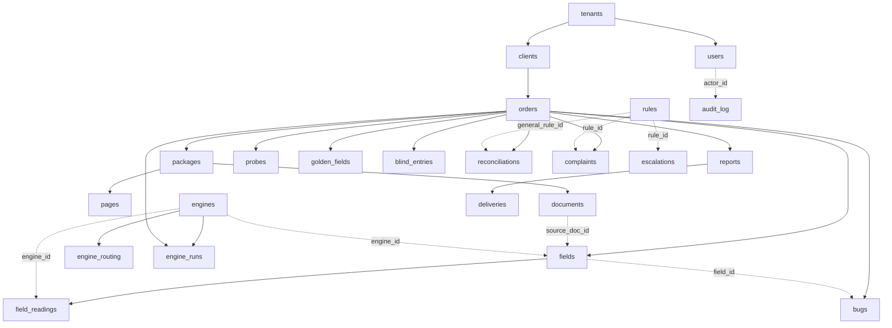

# Proposal B — build the complete domain model in Plan 04

> Position paper for backend Plan 04's data model. **Thesis: land every table in
> `CONTEXT §6` now**, including the five with no screen behind them
> (`documents`, `engine_runs`, `probes`, `users`, `clients`), and including the
> four whose screens were deleted in `7f04340`. Written against the measured
> state: 8 tables, 32 columns, `PRIMARY KEY (tenant_id, id)`, forced RLS, **no
> foreign keys**.

---

## 0. The argument, in four claims

**Claim 1 — this is not an increment, it is the first writing of the model.**
`0001_skeleton.py:6-11` says so in the file: the skeleton is `id`, `tenant_id`,
`created_at` plus exactly two typed columns, and the shortness "is the decision
rather than an omission". `SCHEMA-GAP-2026-09-01.md:46-51` counts it: seven
tables built from four helpers, `fields.na_reason` and
`field_readings.line_coords` the only real columns
(`0001_skeleton.py:283-297`). There is no partial model to extend gracefully.
Whatever Plan 04 writes *is* the model, and a half-written one is a second
first-writing later.

**Claim 2 — adding columns later is priced by forced RLS, not by `ALTER TABLE`.**
Pure DDL is cheap under RLS. **Backfill is not.** `0002_forced_rls_and_grants.py`
(module docstring, and `0001_skeleton.py:22-40`) records the measurement:

```
UPDATE orders SET tenant_id = tenant_id;   ->  UPDATE 0
SELECT count(*) FROM orders;               ->  0
```

No error, exit 0. Every column added *after* rows exist needs a backfill, and
every backfill is a migration that can silently do nothing. Adding
`documents.segmentation_state` on an empty table is one DDL statement. Adding it
after Plan 07 has populated `fields` is a three-statement RLS dance
(`SET LOCAL row_security = off` → `NO FORCE` → write → `FORCE`) per table, plus
the proof that it actually wrote. **The cost of a column is a step function
across the first row.** Right now `fields` holds zero rows
(`LIVE-DB-VERIFICATION-2026-09-01.md:77-83`) and the `orders`/`tenants` rows
seen were transient pytest fixtures (ibid. :92-94). That is the whole window.

**Claim 3 — there is no discovery risk, because the domain is already
specified.** `CONTEXT §6` gives 23 tables with their columns. `entities.ts`
(347 lines) gives the wire shapes the frontend already consumes, and
`enums.ts` gives seven closed enums, three of which are *already in the
database and already agree with the contract member-for-member*
(`LIVE-DB-VERIFICATION-2026-09-01.md:63-75`). `packages/mocks/src/` is 5,453
lines of behavioural specification (`BACKEND-MASTER-PLAN.md:13-18`). A staged
schema buys optionality nobody needs: we are not going to *learn* that
`field_readings` needs `cost_usd`; the adapter rules already require it
(`SCHEMA-GAP:88-90`).

**Claim 4 — the FK graph is worth more than any single table.** Today there are
zero foreign keys, by explicit ruling in the skeleton
(`0001_skeleton.py:6-8`). Referential integrity added later is not a `ALTER
TABLE ADD CONSTRAINT`; it is that plus a validation scan over existing rows
under forced RLS, plus a remediation plan for whatever the scan finds. Building
the graph while every table is empty makes `NOT VALID` unnecessary and makes
every constraint a one-liner.

### What this proposal does NOT claim

It does not claim the tables should be *served*. Plan 04 ships schema. Endpoints
are Plans 05+. A table with no endpoint is inert; a missing column is a
migration.

---

## 1. Conventions every statement below obeys

1. **`PRIMARY KEY (tenant_id, id)`** on every tenant table. Not style: a
   single-column `id` key is a cross-tenant existence oracle under forced RLS,
   measured at `0001_skeleton.py:151-179` (unique enforcement runs before the
   policy's `WITH CHECK`, so a duplicate-key error leaks the existence of an
   invisible row). `tenants` keeps `PRIMARY KEY (id)` because its id *is* a
   tenant id (ibid.).
2. **Therefore every FK is composite**: `(tenant_id, <parent>_id)` →
   `parent(tenant_id, id)`. A single-column FK cannot reference a composite PK,
   and — more importantly — a composite FK makes a cross-tenant parent
   reference structurally impossible rather than merely invisible.
3. **`created_at` = `now()`** (transaction start, `0001_skeleton.py:120-124`).
   `CONTEXT §6` requires `updated_at` on every table; the skeleton has none, so
   Plan 04 adds it everywhere with a `set_updated_at` `BEFORE UPDATE` trigger.
4. **Enums are created and dropped explicitly**, `create_type=False` on the
   column, per `0001_skeleton.py:96-100` — `DROP TABLE` does not drop a type,
   and the round-trip test is what catches it.
5. **New tenant tables are not isolated by creating them.** RLS lives in a
   separate revision by design (`0001_skeleton.py:13-17`). Every table created
   here gets its `ENABLE`/`FORCE`/policy/grants in the *final* revision of this
   plan (§4, revision `0016`), so "the tables exist" and "the tables are
   isolated" stay separately reversible.
6. **`rules` stays un-RLS'd.** Not an omission: the rulebook is
   tenant-independent and `GET /api/rules` returns every row to everyone by
   ruling (`LIVE-DB-VERIFICATION-2026-09-01.md:42-46`). `engines` and
   `engine_routing` are the same shape of thing — see §2.9 for why they are
   argued, not assumed.

---

## 2. The DDL

Written as SQL for reviewability. The Alembic form is the mechanical
transcription; each `op.create_table` gets its own call, no loops, per
`0001_skeleton.py:42-46`.

### 2.0 New enum types (revision `0004`)

```sql
CREATE TYPE field_state AS ENUM (
  'pending','auto_confirmed','needs_review','confirmed','corrected','escalated');
CREATE TYPE golden_tag AS ENUM ('delivered_report','ruled','suspect','agreed');
CREATE TYPE engine_kind AS ENUM ('vlm_image','ocr_text','hybrid');
CREATE TYPE blind_confidence AS ENUM ('certain','probable','unclear');
CREATE TYPE typist_seat AS ENUM ('A','B');
CREATE TYPE how_it_got_through AS ENUM ('auto_confirmed','human_confirmed');
CREATE TYPE delivery_status AS ENUM (
  'draft','signed','digest_recorded','transmitted','acknowledged','failed_transit');
CREATE TYPE segmentation_state AS ENUM (
  'unsegmented','proposed','confirmed','conflict');   -- ⚠ SEE §6, UNRULED
```

Every label above is copied from `packages/contract/src/enums.ts` — `FieldState`
at :7-15, `GoldenTag` :69, `EngineKind` :72, `BlindConfidence` :46,
`TypistSeat` :50, `HowItGotThrough` :80, `DeliveryStatus` :104-111. Labels are
repeated as literals in the migration rather than imported, for the reason
`0001_skeleton.py:88-95` gives: a migration is a frozen snapshot, and an import
lets a later model edit rewrite what the revision claims to have created.

**`OrderStatus` gets NO enum.** `enums.ts:93-96`: *"Order status vocabulary is
OPEN until the Flask models (the source of truth) are ported. Do not invent a
closed enum here."* It is `text` + a `NOT NULL`. This is the one place the
proposal deliberately under-specifies, because `OPEN` means do not build past it
(AGENTS.md; `enums.ts:64-66`).

**`segmentation_state` is the second such place and it is worse**, because
unlike `order.status` it has no upstream source named. See §6.

### 2.1 `tenants`, `users`, `clients` (revision `0005`)

```sql
ALTER TABLE tenants
  ADD COLUMN name       text  NOT NULL DEFAULT '',
  ADD COLUMN settings   jsonb NOT NULL DEFAULT '{}'::jsonb,
  ADD COLUMN updated_at timestamptz NOT NULL DEFAULT now();
ALTER TABLE tenants ALTER COLUMN name DROP DEFAULT;   -- the default exists only
                                                      -- to make the ADD legal on
                                                      -- a non-empty table; it is
                                                      -- not a domain value.

CREATE TABLE users (
  tenant_id      uuid NOT NULL,
  id             uuid NOT NULL DEFAULT gen_random_uuid(),
  email          text NOT NULL,
  role           text NOT NULL,
  workos_user_id text,                    -- NOT clerk_id: ADR-0001
  created_at     timestamptz NOT NULL DEFAULT now(),
  updated_at     timestamptz NOT NULL DEFAULT now(),
  PRIMARY KEY (tenant_id, id)
);
CREATE UNIQUE INDEX uq_users_tenant_email ON users (tenant_id, lower(email));
CREATE UNIQUE INDEX uq_users_workos ON users (workos_user_id)
  WHERE workos_user_id IS NOT NULL;

CREATE TABLE clients (
  tenant_id       uuid NOT NULL,
  id              uuid NOT NULL DEFAULT gen_random_uuid(),
  name            text NOT NULL,
  delivery_method text NOT NULL,
  delivery_config jsonb NOT NULL DEFAULT '{}'::jsonb,
  report_shape    text NOT NULL,
  template_ref    text,
  created_at      timestamptz NOT NULL DEFAULT now(),
  updated_at      timestamptz NOT NULL DEFAULT now(),
  PRIMARY KEY (tenant_id, id)
);
```

`CONTEXT §6` line 2 spells `users(... clerk_id)` and flags itself:
*"⚠ workos_user_id at the port; ADR-0001 signed Clerk → WorkOS"*.
`BACKEND-MASTER-PLAN.md:97-98` confirms `CONTEXT §15` is stale on this. So the
column is `workos_user_id`, and `users.role` is `text` and **not** an enum
because the role vocabulary is exactly what `authz.ts` disagrees with the server
about (G1, `BACKEND-MASTER-PLAN.md:65`) — an enum here would freeze a set that
is under an open human gate.

`uq_users_workos` is **not** tenant-prefixed on purpose: a WorkOS user id is
globally unique upstream, and two tenants claiming one is a defect we want the
database to refuse. It is the one deliberate cross-tenant constraint in the
model, and it is safe only because the value is opaque and externally assigned —
it is not an existence oracle over anything a caller can guess.

### 2.2 `orders` +10 (revision `0006`)

```sql
ALTER TABLE orders
  ADD COLUMN client_id     uuid,
  ADD COLUMN external_ref  text,
  ADD COLUMN jurisdiction  text,
  ADD COLUMN state         text,
  ADD COLUMN county        text,
  ADD COLUMN status        text NOT NULL DEFAULT 'received',
  ADD COLUMN product       text,
  ADD COLUMN period_label  text,
  ADD COLUMN pages         integer,
  ADD COLUMN arrived_at    timestamptz NOT NULL DEFAULT now(),
  ADD COLUMN accepted_at   timestamptz,
  ADD COLUMN delivered_at  timestamptz,
  ADD COLUMN updated_at    timestamptz NOT NULL DEFAULT now();
```

That is 13 columns for a "+10" gap because `SCHEMA-GAP:19` counted the contract
`Order`, and `product`/`period_label`/`pages` are contract members
(`entities.ts:66-71`) that `CONTEXT §6` omits. **`pages` is nullable and must
stay nullable**: `entities.ts:63-66` — *"`0` would assert somebody counted"*.
Same reasoning for `product` and `period_label`.

`client_id` is nullable at creation and constrained in `0014` (§2.12); an order
can arrive before its client record is resolved.

### 2.3 `packages`, `pages`, `documents` (revision `0007`)

```sql
ALTER TABLE packages
  ADD COLUMN order_id    uuid,
  ADD COLUMN storage_key text,
  ADD COLUMN page_count  integer,
  ADD COLUMN sha256      char(64),
  ADD COLUMN accepted_by uuid,
  ADD COLUMN updated_at  timestamptz NOT NULL DEFAULT now();
CREATE UNIQUE INDEX uq_packages_tenant_sha ON packages (tenant_id, sha256)
  WHERE sha256 IS NOT NULL;

ALTER TABLE pages
  ADD COLUMN package_id       uuid,
  ADD COLUMN page_no          integer,
  ADD COLUMN has_text_layer   boolean,
  ADD COLUMN class            text,
  ADD COLUMN class_engine     uuid,
  ADD COLUMN class_confidence double precision,
  ADD COLUMN updated_at       timestamptz NOT NULL DEFAULT now();
CREATE UNIQUE INDEX uq_pages_pkg_no ON pages (tenant_id, package_id, page_no);

CREATE TABLE documents (
  tenant_id          uuid NOT NULL,
  id                 uuid NOT NULL DEFAULT gen_random_uuid(),
  package_id         uuid NOT NULL,
  doc_type           text,
  page_start         integer NOT NULL,
  page_end           integer NOT NULL,
  recording_no       text,
  book_page          text,
  recorded_date      date,
  dated_date         date,
  segmentation_state segmentation_state NOT NULL DEFAULT 'unsegmented',
  created_at         timestamptz NOT NULL DEFAULT now(),
  updated_at         timestamptz NOT NULL DEFAULT now(),
  PRIMARY KEY (tenant_id, id),
  CONSTRAINT ck_documents_span CHECK (page_end >= page_start)
);
```

`class` is a reserved-ish word in some tooling but legal in Postgres and it is
what `CONTEXT §6` names; quoting it is cheaper than a rename that makes the
model stop matching its own spec.

**`documents` is the table with no screen and the strongest case.**
`BACKEND-MASTER-PLAN.md:145-149` lists it first among Plan 04's new tables with
the parenthetical *"(with `segmentation_state` — **assemble cannot run without
it**)"*. `CONTEXT §6` ties it to R24 boundaries. Every field's provenance
envelope points at `source_doc_id` (`entities.ts:110`), and a `doc_id` with no
`documents` row is a dangling citation — which violates principle 6 (never emit
a value you can't cite) at the storage layer rather than the API layer. If one
table survives the cut, it is this one.

`uq_packages_tenant_sha` is the storage-level half of INVARIANT 48 (duplicate
detection, `BACKEND-MASTER-PLAN.md:165-169`). Partial, because a package whose
hash has not been computed yet is a legitimate transient state.

### 2.4 `fields` +17 (revision `0008`)

```sql
ALTER TABLE fields
  ADD COLUMN order_id              uuid,
  ADD COLUMN path                  text,
  ADD COLUMN value                 text,
  ADD COLUMN state                 field_state NOT NULL DEFAULT 'pending',
  ADD COLUMN source_doc_id         uuid,
  ADD COLUMN source_page           integer,
  ADD COLUMN source_snippet        text,
  ADD COLUMN source_line_coords    jsonb,
  ADD COLUMN source_excerpt        jsonb,
  ADD COLUMN engine_id             uuid,
  ADD COLUMN engine_confidence_raw double precision,
  ADD COLUMN rule_refs             text[] NOT NULL DEFAULT '{}',
  ADD COLUMN approved_by           uuid,
  ADD COLUMN approved_at           timestamptz,
  ADD COLUMN excluded_reason       text,
  ADD COLUMN asking                text,
  ADD COLUMN why                   text,
  ADD COLUMN consequence           text,
  ADD COLUMN updated_at            timestamptz NOT NULL DEFAULT now();

CREATE UNIQUE INDEX uq_fields_order_path ON fields (tenant_id, order_id, path);

ALTER TABLE fields ADD CONSTRAINT ck_fields_line_coords_is_object
  CHECK (source_line_coords IS NULL OR jsonb_typeof(source_line_coords) = 'object');
ALTER TABLE fields ADD CONSTRAINT ck_fields_approved_pair
  CHECK ((approved_by IS NULL) = (approved_at IS NULL));
```

Four things here are load-bearing and each has a citation:

- **`state` is a column, never derived.** `enums.ts:3-6`: the server owns every
  transition; the UI never computes it from `engine_confidence_raw` or
  `value === null`. A schema without this column forces derivation.
- **`na_reason` already exists and is NOT touched.** Four labels, owner-ratified
  D3 2026-07-26, confirmed live (`LIVE-DB-VERIFICATION-2026-09-01.md:63-72`).
  `SCHEMA-GAP:92-99` calls it an open conflict; that document's own addendum and
  `BACKEND-MASTER-PLAN.md:92-95` supersede it. **Do not reopen.**
- **`excluded_reason` is required-when-present** (R13/R15 suppression audit,
  `SCHEMA-GAP:78-82`, `entities.ts:126-133`) — an excluded row is gone from the
  delivered sheet, so the reason is the only auditable trace. Enforced at the
  application layer against `state`, not by a CHECK, because it is *orthogonal
  to* `state` (`entities.ts:128-130`) and a CHECK would fuse them.
- **`asking`/`why`/`consequence` are server-authored** (`entities.ts:134-152`).
  They are columns precisely so the browser cannot compose them.

`ck_fields_line_coords_is_object` closes the hole
`0001_skeleton.py:290-297` names explicitly: *"`jsonb` with no CHECK accepts
arrays, strings, numbers and `null` as readily as objects... the real model,
with the real coordinate shape, is where it belongs."* This proposal is that
real model, so the CHECK lands here. Same constraint on
`field_readings.line_coords` in `0009`.

Deliberately **not** enforced by CHECK: "a non-null value must have non-null
`source_*`". `entities.ts:96-101` says that shape is *"the exact failure shape
the architecture exists to catch — the server routes it to review"*. Catching it
means observing it, and a CHECK would make it unstoreable and therefore
unobservable.

### 2.5 `field_readings` +6 (revision `0009`)

```sql
ALTER TABLE field_readings
  ADD COLUMN field_id       uuid,
  ADD COLUMN engine_id      uuid,
  ADD COLUMN value          text,
  ADD COLUMN page           integer,
  ADD COLUMN snippet        text,
  ADD COLUMN confidence_raw double precision,
  ADD COLUMN cost_usd       numeric(12,6) NOT NULL DEFAULT 0,
  ADD COLUMN latency_ms     integer NOT NULL DEFAULT 0,
  ADD COLUMN updated_at     timestamptz NOT NULL DEFAULT now();
ALTER TABLE field_readings ADD CONSTRAINT ck_readings_line_coords_is_object
  CHECK (line_coords IS NULL OR jsonb_typeof(line_coords) = 'object');
```

`numeric`, not `double precision`, for money. `cost_usd` and `latency_ms` are
`NOT NULL` because `entities.ts:85-86` types them non-nullable, and the adapter
rule is that cost and latency are *recorded per call* (AGENTS.md) — a null would
be an adapter that declined to record.

**Rows are never deleted.** `CONTEXT §6`: *"keeps per-engine values before
merge, permanently. Disagreements stay inspectable forever."* This is why every
FK *into* `field_readings` is `ON DELETE RESTRICT` (§3).

### 2.6 `engines`, `engine_routing`, `engine_runs` (revision `0010`)

```sql
CREATE TABLE engines (
  tenant_id       uuid NOT NULL,
  id              uuid NOT NULL DEFAULT gen_random_uuid(),
  kind            engine_kind NOT NULL,
  enabled         boolean NOT NULL DEFAULT false,
  config          jsonb NOT NULL DEFAULT '{}'::jsonb,
  adapter_version text NOT NULL,
  created_at      timestamptz NOT NULL DEFAULT now(),
  updated_at      timestamptz NOT NULL DEFAULT now(),
  PRIMARY KEY (tenant_id, id)
);

CREATE TABLE engine_routing (
  tenant_id    uuid NOT NULL,
  id           uuid NOT NULL DEFAULT gen_random_uuid(),
  jurisdiction text NOT NULL,
  section      text NOT NULL,
  seat         text NOT NULL,
  engine_id    uuid NOT NULL,
  approved_by  uuid NOT NULL,
  approved_at  timestamptz NOT NULL,
  evidence_url text NOT NULL,
  created_at   timestamptz NOT NULL DEFAULT now(),
  updated_at   timestamptz NOT NULL DEFAULT now(),
  PRIMARY KEY (tenant_id, id)
);
CREATE UNIQUE INDEX uq_routing_cell
  ON engine_routing (tenant_id, jurisdiction, section, seat);

CREATE TABLE engine_runs (
  tenant_id  uuid NOT NULL,
  id         uuid NOT NULL DEFAULT gen_random_uuid(),
  engine_id  uuid NOT NULL,
  order_id   uuid NOT NULL,
  pages      integer NOT NULL,
  cost_usd   numeric(12,6) NOT NULL,
  latency_ms integer NOT NULL,
  error      text,
  created_at timestamptz NOT NULL DEFAULT now(),
  updated_at timestamptz NOT NULL DEFAULT now(),
  PRIMARY KEY (tenant_id, id)
);
CREATE INDEX ix_engine_runs_engine_created ON engine_runs (tenant_id, engine_id, created_at DESC);
```

**`engine_routing`'s four `NOT NULL`s on `approved_by`/`approved_at`/
`evidence_url` are the enforcement of "every change is human-approved with
evidence"** (`entities.ts:305`). The contract types all three non-nullable
(`entities.ts:308-311`); making them nullable in the database would let an
auto-tuner write a row — and auto-tuning is a named anti-pattern (AGENTS.md).
This is a case where the column's nullability *is* the product rule.

**`engine_runs` has no screen and no contract entity, and it should still be
built.** `BACKEND-MASTER-PLAN.md:145-149` lists it in Plan 04's ship list. It is
the per-run cost ledger, and cost-per-call is the input to
`LeaderboardCell.cost_per_1k_pages_usd` (`entities.ts:322`). `field_readings`
records cost per *field*, which is a different denominator — a run that produced
no fields (an error, a page with no text layer) costs money and has nowhere else
to be recorded. Without `engine_runs` the cost side of "accuracy first, cost
second" is unmeasurable, and the owner mandate presumes it is measured.

`uq_routing_cell` enforces "per jurisdiction × section cell" literally — one
engine per seat per cell — which is a rule stated in prose at `CONTEXT §6` and
otherwise enforceable nowhere.

### 2.7 `escalations`, `bugs` (revision `0011`)

```sql
CREATE TABLE escalations (
  tenant_id          uuid NOT NULL,
  id                 uuid NOT NULL DEFAULT gen_random_uuid(),
  field_path_cluster text NOT NULL,
  order_ids          uuid[] NOT NULL DEFAULT '{}',
  question           text NOT NULL,
  resolution         text,
  rule_id            uuid,
  resolved_by        uuid,
  raised_by          uuid,
  age                text,
  context            text,
  excerpt            jsonb,
  identity           jsonb,
  qc_owner           text,
  created_at         timestamptz NOT NULL DEFAULT now(),
  updated_at         timestamptz NOT NULL DEFAULT now(),
  PRIMARY KEY (tenant_id, id),
  CONSTRAINT ck_escalation_resolution_needs_rule
    CHECK (resolution IS NULL OR rule_id IS NOT NULL)
);

CREATE TABLE bugs (
  tenant_id       uuid NOT NULL,
  id              uuid NOT NULL DEFAULT gen_random_uuid(),
  order_id        uuid NOT NULL,
  field_id        uuid,
  description     text NOT NULL,
  upstream_source text,
  status          text NOT NULL,
  created_at      timestamptz NOT NULL DEFAULT now(),
  updated_at      timestamptz NOT NULL DEFAULT now(),
  PRIMARY KEY (tenant_id, id)
);
```

**`ck_escalation_resolution_needs_rule` is decision D1 in the schema.**
AGENTS.md: *"Escalation resolution is refused without a rule."*
`BACKEND-MASTER-PLAN.md:96` confirms D1 unchanged. This is the one product rule
in this proposal that is expressible as a CHECK without fusing two orthogonal
concepts, so it gets one — the application layer will also refuse it, and two
independent refusals is the correct number for a rule the repo calls
non-negotiable.

Note the CHECK does **not** require the rule be `live`. A PENDING rule cannot
affect the pipeline (AGENTS.md), but that is a pipeline-time predicate over
`rules.status`, not a storage-time one, and a CHECK cannot read another table.

`escalations.order_ids` is a `uuid[]` because `CONTEXT §6` and
`entities.ts:161` both say array. It is deliberately *not* a junction table: an
escalation clusters field paths across orders and the cluster is the unit, not
the pair. The cost is that no FK can constrain the array members — recorded as
an accepted defect, not an oversight.

`age` is `text` and stays `text`: `entities.ts:167-169` — *"a label, never a
timestamp — the client must not tick."*

`identity` and `excerpt` are `jsonb` matching `entities.ts:174-183` and
`SourceExcerpt` (`entities.ts:45-52`). A CHECK constrains each to `'object'`,
same form as §2.4.

### 2.8 `reports`, `deliveries` (revision `0012`)

```sql
CREATE TABLE reports (
  tenant_id   uuid NOT NULL,
  id          uuid NOT NULL DEFAULT gen_random_uuid(),
  order_id    uuid NOT NULL,
  version     integer NOT NULL,
  shape       text NOT NULL,
  storage_key text NOT NULL,
  rendered_at timestamptz NOT NULL,
  supersedes  integer,
  reason      text,
  created_at  timestamptz NOT NULL DEFAULT now(),
  updated_at  timestamptz NOT NULL DEFAULT now(),
  PRIMARY KEY (tenant_id, id),
  CONSTRAINT ck_reports_reissue_has_reason
    CHECK ((supersedes IS NULL) = (reason IS NULL))
);
CREATE UNIQUE INDEX uq_reports_order_version ON reports (tenant_id, order_id, version);

CREATE TABLE deliveries (
  tenant_id    uuid NOT NULL,
  id           uuid NOT NULL DEFAULT gen_random_uuid(),
  report_id    uuid NOT NULL,
  method       text NOT NULL,
  status       delivery_status NOT NULL DEFAULT 'draft',
  attempted_at timestamptz,
  delivered_at timestamptz,
  evidence     text,
  receipt      jsonb NOT NULL DEFAULT '[]'::jsonb,
  created_at   timestamptz NOT NULL DEFAULT now(),
  updated_at   timestamptz NOT NULL DEFAULT now(),
  PRIMARY KEY (tenant_id, id)
);
```

`storage_key` is `NOT NULL` and, like `packages.storage_key`, names an object
**outside the working tree** at a configured absolute path — the 644 MB incident
(`CONTEXT §19`, AGENTS.md, `BACKEND-MASTER-PLAN.md:165-169`). The schema cannot
enforce that; the ingest layer does. Recorded here so the reviewer of Plan 05
knows what the column means.

`deliveries.receipt` is a `jsonb` array of `ReceiptStep` (`entities.ts:262-273`)
rather than a table, because *"the client renders the list verbatim — it never
derives a step from `status`"*: the receipt is an authored document, not a
queryable relation. `NOT NULL DEFAULT '[]'` with a CHECK on
`jsonb_typeof(receipt) = 'array'`.

`ck_reports_reissue_has_reason` mirrors `entities.ts:249-252` — both null on a
v1, both set on a reissue.

### 2.9 `probes` (revision `0013`) — a table with no UI, on purpose

```sql
CREATE TABLE probes (
  tenant_id       uuid NOT NULL,
  id              uuid NOT NULL DEFAULT gen_random_uuid(),
  order_id        uuid NOT NULL,
  field_path      text NOT NULL,
  planted_value   text NOT NULL,
  caught          boolean,
  reviewer_action text,
  created_at      timestamptz NOT NULL DEFAULT now(),
  updated_at      timestamptz NOT NULL DEFAULT now(),
  PRIMARY KEY (tenant_id, id)
);
```

`entities.ts:18-21` states the omission is deliberate: *"no Probe schema (probes
are never visible in any client)"*. `BACKEND-MASTER-PLAN.md:158-159`:
*"`probes` gets a table and no UI surface — probe visibility is a named
anti-pattern."* So the table exists and **no endpoint may ever project it**.
`caught` is nullable: an unresolved probe is neither caught nor missed, and a
`NOT NULL DEFAULT false` would silently score every open probe as a miss.

This is the cleanest possible refutation of "build only what a screen reads".
The probe mechanism is worthless if the UI can see it; it is also worthless if
the storage does not exist. Screen-driven schema design cannot produce this
table, which is a general argument, not a special case.

### 2.10 `golden_fields`, `reconciliations`, `blind_entries`, `complaints` (revision `0014`)

```sql
CREATE TABLE golden_fields (
  tenant_id         uuid NOT NULL,
  id                uuid NOT NULL DEFAULT gen_random_uuid(),
  order_id          uuid NOT NULL,
  path              text NOT NULL,
  value             text,
  tag               golden_tag NOT NULL,
  source_citation   text,
  corrected_from    text,
  corrected_by      uuid,
  corrected_at      timestamptz,
  correction_reason text,
  created_at        timestamptz NOT NULL DEFAULT now(),
  updated_at        timestamptz NOT NULL DEFAULT now(),
  PRIMARY KEY (tenant_id, id),
  CONSTRAINT ck_golden_correction_triple
    CHECK (num_nonnulls(corrected_by, corrected_at, correction_reason) IN (0, 3))
);
CREATE UNIQUE INDEX uq_golden_order_path ON golden_fields (tenant_id, order_id, path);

CREATE TABLE blind_entries (
  tenant_id       uuid NOT NULL,
  id              uuid NOT NULL DEFAULT gen_random_uuid(),
  order_id        uuid NOT NULL,
  typist_seat     typist_seat NOT NULL,
  path            text NOT NULL,
  value           text,
  na_reason       na_reason,
  source_citation text NOT NULL,
  confidence      blind_confidence NOT NULL,
  created_at      timestamptz NOT NULL DEFAULT now(),
  updated_at      timestamptz NOT NULL DEFAULT now(),
  PRIMARY KEY (tenant_id, id),
  CONSTRAINT ck_blind_citation_nonempty CHECK (length(source_citation) > 0)
);
CREATE UNIQUE INDEX uq_blind_seat_path ON blind_entries (tenant_id, order_id, typist_seat, path);

CREATE TABLE reconciliations (
  tenant_id       uuid NOT NULL,
  id              uuid NOT NULL DEFAULT gen_random_uuid(),
  order_id        uuid NOT NULL,
  path            text NOT NULL,
  value_a         text,
  value_b         text,
  ruling_value    text,
  citation        text,
  reason          text,
  ruled_by        uuid,
  general_rule_id uuid,
  created_at      timestamptz NOT NULL DEFAULT now(),
  updated_at      timestamptz NOT NULL DEFAULT now(),
  PRIMARY KEY (tenant_id, id)
);
CREATE UNIQUE INDEX uq_recon_order_path ON reconciliations (tenant_id, order_id, path);

CREATE TABLE complaints (
  tenant_id             uuid NOT NULL,
  id                    uuid NOT NULL DEFAULT gen_random_uuid(),
  order_id              uuid NOT NULL,
  field_path            text NOT NULL,
  shipped_value         text,
  client_value          text,
  how_it_got_through    how_it_got_through NOT NULL,
  resolution            text,
  rule_id               uuid,
  golden_offer_accepted boolean,
  created_at            timestamptz NOT NULL DEFAULT now(),
  updated_at            timestamptz NOT NULL DEFAULT now(),
  PRIMARY KEY (tenant_id, id)
);
```

`blind_entries.typist_seat` is an enum of `A`/`B` and **there is no user
reference on this table at all**. `CONTEXT §6`: *"never a user name in the UI"*;
`enums.ts:49` goes further — *"a typist's name never appears in blind-fifty data
or UI"*. Omitting the FK to `users` is the enforcement. `source_citation` is
`NOT NULL` with a length CHECK because `entities.ts:334` types it
`z.string().min(1)`: *"a confident guess is the poison"* (`enums.ts:41-44`).

`ck_golden_correction_triple` uses `num_nonnulls` so a correction is all-or-
nothing: `entities.ts:220-224` types the three together, and a correction with
no reason is exactly the unauditable state `excluded_reason` exists to prevent
elsewhere.

**No `leaderboard` table.** `LeaderboardCell` (`entities.ts:314-325`) has no
`id` and is a *computed projection* over `engine_runs`, `field_readings` and
`golden_fields`. Materializing it would be a stored aggregate that can drift
from its inputs, and `no_truth_yet` — the "below golden coverage threshold,
show no number" rule — is a **server-owned threshold** (AGENTS.md: server owns
all thresholds), so it must be evaluated at read time against the current
threshold, not frozen at write time. `SCHEMA-GAP:35` lists `leaderboard` as a
missing table with 8 columns; **this proposal argues that entry is wrong**, and
that the 8 columns are a response shape rather than a relation. That is the one
place this proposal contradicts the gap document, and it does so on the
evidence of the entity's own missing `id`.

### 2.11 `audit_log` (revision `0015`)

```sql
ALTER TABLE audit_log
  ADD COLUMN actor_id  uuid,
  ADD COLUMN action    text NOT NULL DEFAULT '',
  ADD COLUMN entity    text NOT NULL DEFAULT '',
  ADD COLUMN entity_id uuid,
  ADD COLUMN at        timestamptz NOT NULL DEFAULT now();
CREATE INDEX ix_audit_entity ON audit_log (tenant_id, entity, entity_id, at DESC);
CREATE INDEX ix_audit_actor  ON audit_log (tenant_id, actor_id, at DESC);
```

**`audit_log` gets NO `updated_at`.** It is append-only, enforced by a
`FOR EACH STATEMENT` trigger raising `0A000`
(`0001_skeleton.py:47-62`, `:305-320`). An `updated_at` column would assert that
a row can be updated, which the trigger exists to deny. This is the single place
where the "every table has `updated_at`" convention from `CONTEXT §6` is
correctly violated, and saying so is cheaper than a reviewer rediscovering it.

`actor_id` is nullable: an unattributed action must be storable as
unattributed. `audit.ts:93` attributing an unattributed action to `"L. Vance"`
is the mock's bug (`BACKEND-MASTER-PLAN.md:124-127`) and the schema must not
make it necessary.

**The `ALTER TABLE` on `audit_log` must be checked against the trigger.** The
trigger is `FOR EACH STATEMENT` on UPDATE/DELETE, so `ADD COLUMN` (DDL) is
unaffected — but any *backfill* of these columns is a DELETE/UPDATE and will
raise `0A000`. There are no rows to backfill today. If there are by the time
this runs, the migration must fail rather than drop the trigger.

### 2.12 FKs and RLS (revisions `0016`, `0017`)

FK graph in §3; RLS statements are mechanical:

```sql
-- for each of: users, clients, documents, engines, engine_routing, engine_runs,
--   escalations, bugs, reports, deliveries, probes, golden_fields,
--   blind_entries, reconciliations, complaints
ALTER TABLE <t> ENABLE ROW LEVEL SECURITY;
ALTER TABLE <t> FORCE  ROW LEVEL SECURITY;
CREATE POLICY tenant_isolation ON <t>
  USING (tenant_id = current_setting('app.current_tenant')::uuid);
GRANT SELECT, INSERT, UPDATE, DELETE ON <t> TO titlepipe_app;
```

`USING` with no `WITH CHECK` is deliberate and matches `0002`: PostgreSQL uses
`USING` as `WITH CHECK` when none is given, and `0002`'s docstring records the
measurement that a cross-tenant INSERT is refused. **The grants are not
optional** — `0002` measures `42501 permission denied for table orders` for a
role with a policy and no grant, and a read test written to prove isolation
would then pass for entirely the wrong reason.

`engines` and `engine_routing`: these carry `tenant_id` in this proposal and are
therefore isolated like everything else. An argument exists that they are
tenant-independent like `rules`; **that argument is not made here and should be
put to the owner.** The safe default under RLS is to isolate, because
un-isolating later is one revision and isolating later requires a `tenant_id`
backfill under forced RLS — the expensive direction.

---

## 3. The FK graph

Every edge is composite `(tenant_id, X_id) → parent(tenant_id, id)`.



Delete behaviour, and it is not uniform:

| edge | on delete | why |
|---|---|---|
| `pages`, `documents` → `packages` | `CASCADE` | a page without its package is meaningless |
| `field_readings` → `fields` | **`RESTRICT`** | readings are kept permanently (`CONTEXT §6`); cascading would erase the disagreement record |
| `fields` → `orders` | `RESTRICT` | same, one level up |
| `golden_fields`, `probes`, `blind_entries`, `reconciliations` → `orders` | `RESTRICT` | ground truth outlives the order it came from |
| `engine_runs` → `engines` | `RESTRICT` | the cost ledger must survive an engine being retired |
| `escalations.rule_id`, `complaints.rule_id` → `rules` | `RESTRICT` | D1: a resolution's rule cannot vanish |
| `deliveries` → `reports` | `RESTRICT` | a delivery is evidence of transmission |
| `*.approved_by/ruled_by/actor_id` → `users` | `SET NULL`? **No — `RESTRICT`** | a departed user's approvals must stay attributed |

**`rules` is not tenant-scoped**, so FKs into it are single-column
`rule_id → rules(id)`. That asymmetry is correct and follows from
`LIVE-DB-VERIFICATION:42-46`.

**`escalations.order_ids uuid[]` has no FK.** Postgres cannot constrain array
elements. Accepted, and stated so a reviewer does not read it as an omission.

---

## 4. Migration order, and why

```
0004  enum types                      no table depends on a type it precedes
0005  tenants+, users, clients        the tenancy root; users before anything
                                      with approved_by
0006  orders+                         needs clients
0007  packages+, pages+, documents    needs orders
0008  fields+                         needs orders, documents, engines?  ← see note
0009  field_readings+                 needs fields
0010  engines, engine_routing, engine_runs
0011  escalations, bugs
0012  reports, deliveries
0013  probes
0014  golden_fields, blind_entries, reconciliations, complaints
0015  audit_log+
0016  ALL foreign keys, in one revision
0017  RLS: enable, force, policies, grants on the 15 new tables
```

Three ordering decisions carry reasons rather than convenience:

**FKs are one revision at the end (`0016`), not inline.** `fields.engine_id`
points at `engines`, which is created two revisions later; ordering the tables
to satisfy every reference is possible but produces an order nobody can read and
one that breaks the moment a column is added. Deferring all constraints to a
single revision makes the dependency graph a *declaration* instead of an
emergent property of file order, and it makes the whole graph revertible in one
`downgrade`.

**RLS is the last revision (`0017`), and this is the load-bearing one.** Every
table above is created *before* it is forced. That means **every statement in
`0004`–`0016` runs on unforced tables and behaves normally.** Interleaving RLS
would mean a later revision writing to an already-forced table, which is exactly
the silent-no-op shape. Putting RLS last converts a class of possible silent
failures into an impossible one. It mirrors `0001`/`0002`'s own split
(`0001_skeleton.py:13-17`).

**No revision here contains a data migration.** Not one `UPDATE`, not one
`INSERT`. Every `ADD COLUMN` uses a server default rather than a backfill. This
is deliberate and it is the second half of the RLS answer: the DDL-only property
is *checkable by grep*, and §5's injection depends on it.

---

## 5. The forced-RLS problem, and the anti-vacuity injection

### 5.1 What actually goes wrong

`0001_skeleton.py:22-40` and `0002`'s docstring measure it: as
`titlepipe_owner`, against a forced table,

```
UPDATE orders SET tenant_id = tenant_id;   ->  UPDATE 0
SELECT count(*) FROM orders;               ->  0
```

no error, no warning, exit 0. The remedy is two statements, and the *order*
matters:

```sql
BEGIN;
SET LOCAL row_security = off;                     -- turns silence into 42501
ALTER TABLE <t> NO FORCE ROW LEVEL SECURITY;      -- grants the permission
UPDATE ...;
ALTER TABLE <t> FORCE ROW LEVEL SECURITY;
COMMIT;
```

`SET LOCAL row_security = off` alone does not permit the write — it **refuses**
it with `42501 query would be affected by row-level security policy`, and the
hint names its own fix. That is the point: the guard converts a silent no-op
into a loud failure. Omitting the `NO FORCE` fails loudly; omitting the
`SET LOCAL` fails silently. So the `SET LOCAL` is the half that must never be
omitted.

`SET LOCAL` not `SET`, because `env.py` reuses one connection for the whole
`upgrade` (`0002` docstring). And the `ALTER TABLE` is DDL, inside the
transaction, taking `ACCESS EXCLUSIVE` — so it is not a window where another
session sees unfiltered rows.

**Rejected, and it stays rejected:** a policy exempting migrations via
`current_setting('app.migration')`. Any role can `SET` its own custom GUC —
measured, `titlepipe_app` sets `app.current_tenant` freely — so that is a bypass
switch available to the one role that must never have it. The escape hatch must
be a privilege, not a setting (`0002` docstring).

### 5.2 The structural mitigation

Plan 04 is **DDL-only** (§4). No data migration means no exposure. This is
enforced by a guard test, not by intention:

> `test_plan04_revisions_contain_no_dml` — parse the source of revisions
> `0004`–`0017`, assert no `INSERT`/`UPDATE`/`DELETE`/`op.execute` carrying DML.
> A future revision that needs DML must *also* edit this test's allow-list, and
> in doing so must state the RLS recipe.

### 5.3 The injections — three, because one is not enough

Per `00-HOW-TO-EXECUTE §1.1:29-56`: ask what a broken-in-the-obvious-way system
would score. Three of Plan 01's nine assertions were satisfied by a database
that denies everybody everything.

**Injection A — the named one (does the suite detect a silent no-op?).**
Add a temporary revision `0018` that performs a real backfill *correctly*
(`SET LOCAL row_security = off` + `NO FORCE` + `UPDATE` + `FORCE`), with a test
that seeds two tenants' rows, migrates, and asserts **both rows changed**.
Then **delete the `SET LOCAL row_security = off` line**.

- Expected: the migration now raises nothing, writes nothing, exits 0, and
  `test_backfill_actually_wrote` **FAILS** on `expected 2 changed, got 0`.
- If it passes: the assertion is not reading the data, and the suite cannot tell
  a migration that worked from one that did nothing. That is the entire failure
  mode this plan exists to survive.

**Injection B — the positive control on the injection itself.**
Injection A's test must be shown to be *capable* of passing for the right
reason. Run the correct version and assert the two rows changed **and that they
changed to the right values, per tenant** — the `1b` shape from Plan 01
(`00-HOW-TO-EXECUTE:48-50`, "each tenant sees its *own* rows"). A test that only
asserts `count(changed) > 0` passes against a migration that corrupts every row
identically.

**Injection C — is RLS actually on the new tables?**
`0017` covers 15 tables. A loop that misses one produces a table with no policy
and no test failure, because nothing reads it yet. So:

> `test_every_tenant_table_is_forced` — query `pg_class` for **every** table
> with a `tenant_id` column, assert `relrowsecurity AND relforcerowsecurity`,
> and assert the *count* of such tables equals the count of tenant tables in
> `information_schema.columns`. Derived from the database, never from a literal
> list — a hardcoded list is a test that asserts a constant
> (`00-HOW-TO-EXECUTE §4:133`).
>
> **Injection:** remove one table from `0017`'s loop. The test must name it.
> If it passes, the test is asserting its own list.

And the positive control that keeps C from being a denial test: assert that
`titlepipe_app`, with `app.current_tenant` set, **can read its own row** in each
new table. A database with the tables revoked entirely passes the forced-RLS
half and fails this half. That asymmetry is the only thing distinguishing
*isolated* from *broken*.

**Also, mundanely:** run pytest with `-vv`. `pyproject.toml` sets
`addopts = "-q"` and verbosity is a counter, so `-v` cancels to nothing
(`00-HOW-TO-EXECUTE §1.2:65-68`).

---

## 6. Two things this proposal cannot rule, and does not

**`segmentation_state` has no ruled label set.** `CONTEXT §6` names the column
and cites R24 boundaries; nothing on this host gives its members. §2.0 proposes
`unsegmented|proposed|confirmed|conflict` and that is **an invention**, which is
exactly what `SCHEMA-GAP:92-99` criticises `0001` for having done with
`na_reason` (a criticism that turned out to be wrong there, but is right in
principle). Two honest options:

1. Ship it as `text` + a CHECK, and enum it once ruled. Cheap now, one migration
   later, and no live-type surgery.
2. 🔴 **HUMAN GATE** — ask the owner for the label set before `0007` runs.

This proposal takes **option 1** and flags it, on the ground that `documents`
must exist for assemble to run (`BACKEND-MASTER-PLAN.md:147-148`) and blocking
the whole table on one enum trades a large certain cost for a small uncertain
one. **A reviewer who prefers the gate is not wrong**, and the decision belongs
in the plan, not here. Note the asymmetry with `na_reason`: that one is settled
(D3, in the database, `LIVE-DB-VERIFICATION:63-72`) and must not be reopened.

**`OrderStatus` stays `text`.** `enums.ts:93-96` marks it OPEN; AGENTS.md says
do not build past `OPEN`. Related but distinct: G2 (`BACKEND-MASTER-PLAN.md:66`)
gates knowing *which of the 24 rules carry `OPEN`*, so there may be more
unbuildable columns than the two named here. **This proposal cannot enumerate
them, and that is a genuine limit on its completeness claim.**

---

## 7. The dead-surface question: build `golden_fields`, `reconciliations`, `complaints` — and not `leaderboard`

`7f04340` ("Delete the nine screens the reference app does not draw", 2026-08-28)
removed `features/golden/`, `features/complaints/`, `features/bench/`,
`features/blindStatus/`, `features/dashboard/` and more.
`SCHEMA-GAP:41-44` flags the four tables as possibly dead, and defers to the
same unruled boundary question `ENDPOINT-RECONCILIATION` closes with.

**Build three of the four. Here is the argument, and it is not "build
everything".**

**1. The screens were deleted for a drawing reason, not a domain reason.** The
commit message says it: *the reference app does not draw them*. That is a
statement about the frontend's fidelity target. Nothing in it retracts
blind-fifty, reconciliation, or the complaint loop, and AGENTS.md's hardest rule
cuts the other way: **"Never generate backend logic from the UI/screens. The
backend is upstream; the rules live in the rulebook, not the pixels."** Deleting
a table because a screen was deleted is deriving the backend from the pixels —
the exact inversion the repo forbids.

**2. The contract still carries them.** `GoldenField` (`entities.ts:214-226`),
`Reconciliation` (:228-241), `Complaint` (:293-304), `BlindEntryInput`
(:328-336) are all still exported. Deleting a screen did not delete the entity.
And `TypistSeat` is re-exported at `entities.ts:347` for the blind seat, which
`BACKEND-MASTER-PLAN.md:13-16` counts as still routed.

**3. The mechanisms are load-bearing for things that were not deleted.**
`LeaderboardCell.accuracy_by_tag` and `golden_coverage` (`entities.ts:320-323`)
are computed *from* `golden_fields`. `reconciliations` is where blind-fifty
disagreements become rules — `RuleOrigin` includes `reconciliation` and
`complaint` as members (`enums.ts:57-63`), and those are **already Postgres enum
labels in the live database** (`LIVE-DB-VERIFICATION:66-67`). The schema already
asserts that rules originate from reconciliations and complaints. A model with
`rule_origin = 'complaint'` and no `complaints` table is internally incoherent.

**4. `complaints.how_it_got_through` is a measurement nothing else makes.**
`enums.ts:75-78`: `auto_confirmed` = no human saw it = *the threshold is wrong,
not a reviewer*. That is the feedback signal on auto-confirm thresholds, and
thresholds are server-owned. Without the column there is no evidence for
changing one.

**5. The cost of being wrong is asymmetric.** An unused table costs a
`CREATE TABLE` and a policy — call it 20 lines and a row in a test. A missing
table costs a migration under forced RLS, plus the backfill, plus the proof the
backfill ran, plus whatever depended on it in the meantime. §0 Claim 2's step
function applies to the whole table, not just a column.

**But `leaderboard` is not built** (§2.10), and the reason is *not* that its
screen was deleted — it is that `LeaderboardCell` has no `id`, is a projection
over three tables, and materializing a server-owned threshold (`no_truth_yet`)
freezes it. If the screen returns tomorrow the projection is a query, not a
migration. **That is the correct shape of a "do not build" argument: derived
from what the thing is, not from whether a screen currently reads it.**

**What this does NOT do:** it does not build endpoints for these tables. G1 is
open (`BACKEND-MASTER-PLAN.md:65`) and 9 of `authz.ts`'s 19 screen doors belong
to deleted screens; serving a table whose access rule is ungated would violate
INVARIANT 41. **Tables yes, doors no.** The two questions are separable, and
separating them is what lets Plan 04 proceed while G1 stays open.

---

## 8. Summary of the ask

| | |
|---|---|
| revisions | 14 (`0004`–`0017`) |
| new tables | 15 |
| altered tables | 6 |
| new enum types | 7 + 1 flagged as text-pending-ruling |
| foreign keys | 24, all composite except into `rules` |
| data migrations | **zero**, and a test enforces it |
| open gates raised | `segmentation_state` labels (§6); `engines`/`engine_routing` tenancy (§2.12) |
| deliberately not built | `leaderboard` (projection, §2.10) |
| deliberately built with no consumer | `documents`, `engine_runs`, `probes`, `users`, `clients`, `golden_fields`, `reconciliations`, `complaints`, `blind_entries` |

The single sentence: **the model is fully specified, every table is empty, RLS
is not yet on the new tables, and all three of those facts stop being true after
Plan 07 — so the complete model costs less now than any part of it costs
later.**
