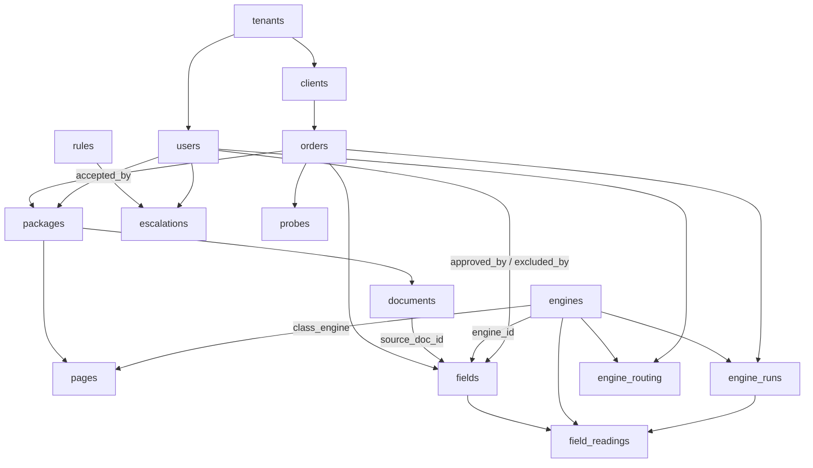

# Proposal C — evidence-first / pipeline-first data model (Plan 04)

> Design proposal, not a ruling. Scope: the schema Plan 04 ships
> (`BACKEND-MASTER-PLAN.md:141-159`). Everything asserted here is cited to a
> file:line in this repo; where nothing could be cited, it says so and is
> listed as open.

---

## 0. Thesis

**Order the schema by what cannot be retrofitted.**

A field's *value* can be recomputed at any time: rerun the pipeline. A field's
*citation* cannot, because the evidence that produced it — which engine read
it, off which page, quoting what, at what cost and latency, disagreeing with
whom — exists only at the moment of the read. If the first population run does
not write the envelope, the envelope for that run is gone permanently. No later
migration recovers it, because the source of truth was a model call that has
already been billed and discarded.

The contract already states this as product, not as a nicety:

> "The provenance envelope **is the product**. A field whose value is non-null
> but whose `source_*` members are null is the exact failure shape the
> architecture exists to catch"
> — `packages/contract/src/entities.ts:96-101`

and the domain document makes the permanence explicit:

> "`field_readings` keeps per-engine values **before** merge, permanently.
> Disagreements stay inspectable forever."
> — `docs/CONTEXT.md:147`

Against that, the tables Proposal C **defers**: `reports`, `deliveries`,
`blind_entries`, `bugs`, `golden_fields`, `reconciliations`, `complaints`,
`leaderboard`. Every one of them is a *derived or workflow* record whose inputs
survive elsewhere. A report is a render of fields; a delivery is a transmission
of a report; a reconciliation is a ruling over blind entries. Losing one costs
a rerun. Losing the reading that produced `$220,224.00` costs the claim that we
can cite it, and `SCHEMA-GAP-2026-09-01.md:74-86` already identifies `fields`
(+17) and `field_readings` (+6) as the concentrated gap for exactly this
reason.

Two of the deferred four (`golden_fields`, `reconciliations`, `complaints`,
`leaderboard`) back screens deleted in `7f04340` and are gated on the same
unruled boundary question (`SCHEMA-GAP-2026-09-01.md:41-44`) — deferring them
is not a preference, it is the absence of a ruling.

**Consequence for sequencing:** Plan 04 ships the evidence spine
(`clients`, `users`, `orders`, `packages`, `pages`, `documents`, `engines`,
`engine_runs`, `field_readings`, `fields`, `escalations`, `probes`,
`engine_routing`) and stops. Ordering, counting, chain termination, report
shape and delivery state are Plan 06+ concerns and consume this spine without
altering it.

---

## 1. What the existing skeleton forces on every table here

Three properties of `0001`/`0002` are constraints, not suggestions:

1. **Primary key is `(tenant_id, id)` on every tenant table**, not `(id)` —
   "a single-column `id` key is a cross-tenant existence oracle under `0002`'s
   forced RLS" (`0001_skeleton.py:9-12`). Therefore **every foreign key in this
   proposal is composite: `(tenant_id, parent_id) REFERENCES parent (tenant_id,
   id)`.** This is a feature, not overhead: a composite FK to a composite PK
   makes a cross-tenant reference *structurally* unrepresentable, so tenant
   isolation is enforced by the referential graph as well as by RLS. A
   single-column FK would permit an order in tenant A to point at a package in
   tenant B and RLS would merely hide the row, not refuse the write.

2. **The skeleton has no FKs by owner ruling** (`0001_skeleton.py:7`). Plan 04
   is where they land (`BACKEND-MASTER-PLAN.md:150`). Adding them is a data
   migration in the sense that matters — it validates existing rows — so §5
   applies.

3. **`na_reason` already exists as a Postgres ENUM with four labels** and is
   settled, owner-ratified 2026-07-26 (`BACKEND-MASTER-PLAN.md:92-95`),
   matching `packages/contract/src/enums.ts:35-41`
   (`NOT_PRESENT`, `NOT_FOUND`, `NOT_STATED`, `PRESENT_UNREADABLE`). This
   proposal does **not** touch that type. `SCHEMA-GAP-2026-09-01.md:92-99`
   treats it as open; the master plan is the later ruling and wins.

---

## 2. Exact DDL

Written as SQL for reviewability; the Alembic revision transliterates it
statement for statement, one `op.execute`/`op.create_table` per object, per
`0001_skeleton.py:44-48` ("each object gets one reviewable line, and a review
or an injection that removes one is a one-line diff").

Conventions: `id uuid NOT NULL DEFAULT gen_random_uuid()`, `created_at
timestamptz NOT NULL DEFAULT now()`, `updated_at timestamptz NOT NULL DEFAULT
now()` on every table (`docs/CONTEXT.md:103`); `PRIMARY KEY (tenant_id, id)`;
every FK composite on `tenant_id`.

### 2.1 New enum types

```sql
-- Created and dropped EXPLICITLY. DROP TABLE does not drop a type, and a
-- downgrade that only drops tables kills the NEXT upgrade with
-- `type ... already exists` (0001_skeleton.py:50-56).
CREATE TYPE field_state AS ENUM (
  'pending','auto_confirmed','needs_review','confirmed','corrected','escalated');
  -- packages/contract/src/enums.ts:8-16

CREATE TYPE engine_kind AS ENUM ('vlm_image','ocr_text','hybrid');
  -- packages/contract/src/enums.ts:73

CREATE TYPE segmentation_state AS ENUM ('unsegmented','provisional','confirmed','conflicted');
  -- ⚠ UNCITED. docs/CONTEXT.md:118 names the column and R24 as its rule but
  -- states no label set, and R24's text is in docs/spec.md, which is not on
  -- this host (BACKEND-MASTER-PLAN.md:66, gate G2). See §7 open questions.
  -- DO NOT SHIP THIS TYPE UNTIL RULED — see the na_reason precedent
  -- (SCHEMA-GAP-2026-09-01.md:92-99): once a live ENUM exists, changing it is
  -- a migration on a type rather than an edit.
```

`order_status` is deliberately **not** an enum: the contract declares
`OrderStatus = z.string()` (`packages/contract/src/enums.ts:98`), i.e. the
label set is not closed. `orders.status` is `text NOT NULL` with a `CHECK`
deferred until the set is ruled.

### 2.2 Identity and client tables

```sql
CREATE TABLE clients (
  id            uuid NOT NULL DEFAULT gen_random_uuid(),
  tenant_id     uuid NOT NULL,
  created_at    timestamptz NOT NULL DEFAULT now(),
  updated_at    timestamptz NOT NULL DEFAULT now(),
  name          text NOT NULL,
  delivery_method text NOT NULL,
  delivery_config jsonb NOT NULL DEFAULT '{}'::jsonb,
  report_shape  text NOT NULL,
  template_ref  text,
  PRIMARY KEY (tenant_id, id),
  FOREIGN KEY (tenant_id) REFERENCES tenants (id)
);   -- docs/CONTEXT.md:107

CREATE TABLE users (
  id            uuid NOT NULL DEFAULT gen_random_uuid(),
  tenant_id     uuid NOT NULL,
  created_at    timestamptz NOT NULL DEFAULT now(),
  updated_at    timestamptz NOT NULL DEFAULT now(),
  email         citext NOT NULL,
  role          text NOT NULL,
  workos_user_id text UNIQUE,      -- NOT clerk_id: ADR-0001, and
                                   -- BACKEND-MASTER-PLAN.md:97-98 marks
                                   -- CONTEXT §15/§6's `clerk_id` stale.
  PRIMARY KEY (tenant_id, id),
  FOREIGN KEY (tenant_id) REFERENCES tenants (id),
  UNIQUE (tenant_id, email)
);
```

`citext` needs `CREATE EXTENSION citext`, which needs a privileged role. If
that is unavailable, use `text` plus `UNIQUE (tenant_id, lower(email))`. Note
by contrast that `gen_random_uuid()` needs no extension on PG13+
(`0001_skeleton.py:119-120`).

Ownership of `users` is Plan 03's, not Plan 04's; it is declared here only
because `fields.approved_by` needs something to point at. If Plan 03 ships it,
Plan 04 drops this block and keeps the FK.

### 2.3 Order and package

```sql
ALTER TABLE orders
  ADD COLUMN updated_at    timestamptz NOT NULL DEFAULT now(),
  ADD COLUMN client_id     uuid,
  ADD COLUMN external_ref  text NOT NULL DEFAULT '',
  ADD COLUMN jurisdiction  text NOT NULL DEFAULT '',
  ADD COLUMN state         text NOT NULL DEFAULT '',
  ADD COLUMN county        text NOT NULL DEFAULT '',
  ADD COLUMN product       text,          -- nullable: an order that failed
  ADD COLUMN period_label  text,          -- validation has no resolved product
  ADD COLUMN page_count    integer,       -- `0` would assert somebody counted
  ADD COLUMN status        text NOT NULL DEFAULT 'arrived',
  ADD COLUMN arrived_at    timestamptz NOT NULL DEFAULT now(),
  ADD COLUMN accepted_at   timestamptz,
  ADD COLUMN delivered_at  timestamptz;
-- shape and the nullability reasoning: entities.ts:56-78 (esp. 63-72)

ALTER TABLE orders
  ADD CONSTRAINT orders_client_fk
  FOREIGN KEY (tenant_id, client_id) REFERENCES clients (tenant_id, id);

-- Invariant 47: acceptance is explicit; an upload alone never queues an order
-- (BACKEND-MASTER-PLAN.md:168-169). Encoded, not merely asserted in a test:
ALTER TABLE orders
  ADD CONSTRAINT orders_delivered_implies_accepted
  CHECK (delivered_at IS NULL OR accepted_at IS NOT NULL);

ALTER TABLE packages
  ADD COLUMN updated_at  timestamptz NOT NULL DEFAULT now(),
  ADD COLUMN order_id    uuid NOT NULL,
  ADD COLUMN storage_key text NOT NULL,        -- absolute path OUTSIDE the
                                               -- working tree; /data/ is the
                                               -- gitignored dev default.
                                               -- CONTEXT §19, the 644 MB
                                               -- incident (CONTEXT.md:150)
  ADD COLUMN page_count  integer,
  ADD COLUMN sha256      char(64) NOT NULL,    -- duplicate detection,
                                               -- CONTEXT.md:68
  ADD COLUMN accepted_by uuid,
  ADD CONSTRAINT packages_order_fk
      FOREIGN KEY (tenant_id, order_id) REFERENCES orders (tenant_id, id),
  ADD CONSTRAINT packages_accepted_by_fk
      FOREIGN KEY (tenant_id, accepted_by) REFERENCES users (tenant_id, id);

-- Duplicate detection is a uniqueness claim; make the database hold it.
CREATE UNIQUE INDEX packages_tenant_sha256_uq ON packages (tenant_id, sha256);
```

⚠ The `sha256` unique index is a **design choice with a consequence**: it makes
a re-upload an error at the door rather than a row plus a notice. Invariant 48
says the server surfaces a "sha256-match notice"
(`BACKEND-MASTER-PLAN.md:169-170`), which the unique violation supports (catch
`23505`, emit the notice) but does not by itself decide. If the product wants
duplicate packages *stored* and merely flagged, this becomes a non-unique
index. Open, §7.

### 2.4 Pages — the evidence substrate

```sql
ALTER TABLE pages
  ADD COLUMN updated_at       timestamptz NOT NULL DEFAULT now(),
  ADD COLUMN package_id       uuid NOT NULL,
  ADD COLUMN page_no          integer NOT NULL,
  ADD COLUMN has_text_layer   boolean NOT NULL,
  ADD COLUMN class            text,        -- triage classifier output
  ADD COLUMN class_engine     uuid,
  ADD COLUMN class_confidence numeric(6,5),
  ADD COLUMN read_in_full     boolean NOT NULL DEFAULT false,  -- endpoints.ts:630
  ADD COLUMN kind             text,                            -- endpoints.ts:632
  ADD COLUMN degraded         boolean NOT NULL DEFAULT false,  -- endpoints.ts:634-635
  ADD CONSTRAINT pages_package_fk
      FOREIGN KEY (tenant_id, package_id) REFERENCES packages (tenant_id, id),
  ADD CONSTRAINT pages_class_engine_fk
      FOREIGN KEY (tenant_id, class_engine) REFERENCES engines (tenant_id, id),
  ADD CONSTRAINT pages_page_no_positive CHECK (page_no >= 1);

CREATE UNIQUE INDEX pages_package_page_no_uq ON pages (tenant_id, package_id, page_no);
```

`read_in_full`, `kind` and `degraded` are on the table because
`endpoints.ts:627-636` documents each as **server-authored and never inferred
client-side**; a column is the only place a server-authored value can be
authored once.

`pages.lines` (`endpoints.ts:633`) is deliberately **not** a column. Page text
is per-engine evidence, not a page property — two readers produce two line
sets, and collapsing them onto the page would be exactly the pre-merge erasure
`CONTEXT.md:147` forbids. It is materialised from the reader-of-record's
`engine_runs` output at read time. This is the one place this proposal
knowingly diverges from a contract field's most obvious storage.

### 2.5 Documents — R24 instrument boundaries

```sql
CREATE TABLE documents (
  id                 uuid NOT NULL DEFAULT gen_random_uuid(),
  tenant_id          uuid NOT NULL,
  created_at         timestamptz NOT NULL DEFAULT now(),
  updated_at         timestamptz NOT NULL DEFAULT now(),
  package_id         uuid NOT NULL,
  doc_type           text NOT NULL,
  label              text NOT NULL,          -- endpoints.ts:650-651, server-authored
  page_start         integer NOT NULL,
  page_end           integer NOT NULL,       -- inclusive, endpoints.ts:644-645
  recording_no       text,
  book_page          text,
  recorded_ref       text,                   -- endpoints.ts:645-647; null is an
                                             -- ordinary state, not a missing lookup
  recorded_date      date,
  dated_date         date,
  segmentation_state segmentation_state NOT NULL,
  PRIMARY KEY (tenant_id, id),
  FOREIGN KEY (tenant_id, package_id) REFERENCES packages (tenant_id, id),
  CHECK (page_end >= page_start),
  CHECK (page_start >= 1)
);
-- docs/CONTEXT.md:117-118; "assemble cannot run without it"
-- (PIPELINE-RESEARCH-2026-09-01.md:109-110)
```

`documents` is in the evidence tier, not the workflow tier, because it is what
`fields.source_doc_id` points at. A citation naming a page but no instrument
does not survive the assemble stage's relational reasoning
(`CONTEXT.md:74-76`).

### 2.6 Engines and the cost ledger

```sql
CREATE TABLE engines (
  id              uuid NOT NULL DEFAULT gen_random_uuid(),
  tenant_id       uuid NOT NULL,
  created_at      timestamptz NOT NULL DEFAULT now(),
  updated_at      timestamptz NOT NULL DEFAULT now(),
  slug            text NOT NULL,             -- 'gemini-2.5-flash', 'llmwhisperer-hq'
  kind            engine_kind NOT NULL,
  enabled         boolean NOT NULL DEFAULT true,
  config          jsonb NOT NULL DEFAULT '{}'::jsonb,
  adapter_version text NOT NULL,
  -- "Missing capabilities (no confidence, no boxes) are DECLARED, not faked"
  -- (docs/CONTEXT.md:227 / PIPELINE-RESEARCH-2026-09-01.md:60). Declared here
  -- means a column, so a NULL confidence can be read as "this engine has none"
  -- rather than "this call lost one".
  reports_confidence  boolean NOT NULL,
  reports_line_coords boolean NOT NULL,
  PRIMARY KEY (tenant_id, id),
  UNIQUE (tenant_id, slug)
);

CREATE TABLE engine_runs (
  id          uuid NOT NULL DEFAULT gen_random_uuid(),
  tenant_id   uuid NOT NULL,
  created_at  timestamptz NOT NULL DEFAULT now(),
  updated_at  timestamptz NOT NULL DEFAULT now(),
  engine_id   uuid NOT NULL,
  order_id    uuid NOT NULL,
  pages       integer NOT NULL,
  cost_usd    numeric(12,6) NOT NULL,
  latency_ms  integer NOT NULL,
  error       text,
  PRIMARY KEY (tenant_id, id),
  FOREIGN KEY (tenant_id, engine_id) REFERENCES engines (tenant_id, id),
  FOREIGN KEY (tenant_id, order_id)  REFERENCES orders  (tenant_id, id),
  CHECK (cost_usd >= 0), CHECK (latency_ms >= 0)
);
-- docs/CONTEXT.md:130; "cost and latency recorded per call, attributed to
-- engine + order + tenant" (CONTEXT.md:224). The three-way attribution is
-- exactly (engine_id, order_id, tenant_id) — the composite PK supplies the
-- third, so this satisfies the adapter rule structurally.

CREATE TABLE engine_routing (
  id           uuid NOT NULL DEFAULT gen_random_uuid(),
  tenant_id    uuid NOT NULL,
  created_at   timestamptz NOT NULL DEFAULT now(),
  updated_at   timestamptz NOT NULL DEFAULT now(),
  jurisdiction text NOT NULL,
  section      text NOT NULL,
  seat         text NOT NULL,              -- reader_a | reader_b | second_opinion | ...
  engine_id    uuid NOT NULL,
  approved_by  uuid,
  approved_at  timestamptz,
  evidence_url text,
  PRIMARY KEY (tenant_id, id),
  FOREIGN KEY (tenant_id, engine_id)   REFERENCES engines (tenant_id, id),
  FOREIGN KEY (tenant_id, approved_by) REFERENCES users   (tenant_id, id),
  CHECK ((approved_by IS NULL) = (approved_at IS NULL)),
  UNIQUE (tenant_id, jurisdiction, section, seat)
);
-- docs/CONTEXT.md:129
```

`numeric(12,6)` for `cost_usd`, never `float`: a per-call cost is summed across
an order for the <$0.25/order metric (`CONTEXT.md:59`), and binary float
accumulates error over thousands of rows.

### 2.7 `field_readings` — the permanent pre-merge record

```sql
ALTER TABLE field_readings
  ADD COLUMN updated_at     timestamptz NOT NULL DEFAULT now(),
  ADD COLUMN field_id       uuid NOT NULL,
  ADD COLUMN engine_id      uuid NOT NULL,
  ADD COLUMN engine_run_id  uuid NOT NULL,
  ADD COLUMN value          text,            -- nullable: entities.ts:85
  ADD COLUMN page           integer,         -- nullable: entities.ts:86
  ADD COLUMN snippet        text,            -- nullable: entities.ts:87
  ADD COLUMN confidence_raw numeric(6,5),    -- nullable: entities.ts:88-89
  ADD COLUMN cost_usd       numeric(12,6) NOT NULL,   -- NOT NULL: entities.ts:90
  ADD COLUMN latency_ms     integer NOT NULL,         -- NOT NULL: entities.ts:91
  ADD CONSTRAINT field_readings_field_fk
      FOREIGN KEY (tenant_id, field_id) REFERENCES fields (tenant_id, id),
  ADD CONSTRAINT field_readings_engine_fk
      FOREIGN KEY (tenant_id, engine_id) REFERENCES engines (tenant_id, id),
  ADD CONSTRAINT field_readings_run_fk
      FOREIGN KEY (tenant_id, engine_run_id) REFERENCES engine_runs (tenant_id, id),
  ADD CONSTRAINT field_readings_cost_nonneg CHECK (cost_usd >= 0),
  ADD CONSTRAINT field_readings_latency_nonneg CHECK (latency_ms >= 0);
```

`line_coords` already exists as one of the two real typed columns in the
skeleton (`0001_skeleton.py:283-297`, per
`SCHEMA-GAP-2026-09-01.md:48-51`). Its shape is `LineCoords`
(`entities.ts:29-35`): `{page,x,y,w,h}`, every member normalized 0-1, null
meaning "this engine recorded no position" and **never** position zero
(`entities.ts:26-27`). A `CHECK` pins the normalisation so a pixel value cannot
enter:

```sql
ALTER TABLE field_readings ADD CONSTRAINT field_readings_line_coords_normalized CHECK (
  line_coords IS NULL OR (
       (line_coords->>'x')::numeric BETWEEN 0 AND 1
   AND (line_coords->>'y')::numeric BETWEEN 0 AND 1
   AND (line_coords->>'w')::numeric BETWEEN 0 AND 1
   AND (line_coords->>'h')::numeric BETWEEN 0 AND 1
   AND jsonb_typeof(line_coords->'page') = 'number'));
```

The engine's declared capability and the reading must agree — this is what
"declared, not faked" buys, and it is checkable only as a trigger (a CHECK
cannot join). One statement-level constraint trigger on `field_readings`:

```sql
-- Refuses a reading carrying confidence_raw from an engine whose
-- reports_confidence is false, or coords from one whose reports_line_coords
-- is false. Statement-level, matching 0001's append-only trigger, and for the
-- same reason: a FOR EACH ROW trigger does not fire when a statement affects
-- zero rows, which under forced RLS is exactly the cross-tenant case
-- (0001_skeleton.py:58-64).
```

### 2.8 `fields` — the provenance envelope

```sql
ALTER TABLE fields
  ADD COLUMN updated_at            timestamptz NOT NULL DEFAULT now(),
  ADD COLUMN order_id              uuid NOT NULL,
  ADD COLUMN path                  text NOT NULL,
  ADD COLUMN value                 text,
  ADD COLUMN state                 field_state NOT NULL DEFAULT 'pending',
  -- the envelope. entities.ts:109-112
  ADD COLUMN source_doc_id         uuid,
  ADD COLUMN source_page           integer,
  ADD COLUMN source_snippet        text,
  ADD COLUMN source_line_coords    jsonb,
  -- the excerpt, split at the ENGINE's offsets. entities.ts:38-54, 144-150.
  -- ABSENT vs null is a real distinction, so it is its own nullable column and
  -- is NEVER reconstructed from source_snippet.
  ADD COLUMN source_excerpt        jsonb,
  -- engine attribution. entities.ts:113-114
  ADD COLUMN engine_id             uuid,
  ADD COLUMN engine_confidence_raw numeric(6,5),
  -- the rulebook link. entities.ts:115
  ADD COLUMN rule_refs             text[] NOT NULL DEFAULT '{}',
  -- approval record. entities.ts:116-117
  ADD COLUMN approved_by           uuid,
  ADD COLUMN approved_at           timestamptz,
  -- R13/R15 suppression audit. entities.ts:120-127, endpoints.ts:672-680
  ADD COLUMN excluded_reason       text,
  ADD COLUMN excluded_by           uuid,
  ADD COLUMN excluded_at           timestamptz,
  -- server-authored review question. entities.ts:128-143
  ADD COLUMN asking                text,
  ADD COLUMN why                   text,
  ADD COLUMN consequence           text;

ALTER TABLE fields
  ADD CONSTRAINT fields_order_fk
      FOREIGN KEY (tenant_id, order_id) REFERENCES orders (tenant_id, id),
  ADD CONSTRAINT fields_source_doc_fk
      FOREIGN KEY (tenant_id, source_doc_id) REFERENCES documents (tenant_id, id),
  ADD CONSTRAINT fields_engine_fk
      FOREIGN KEY (tenant_id, engine_id) REFERENCES engines (tenant_id, id),
  ADD CONSTRAINT fields_approved_by_fk
      FOREIGN KEY (tenant_id, approved_by) REFERENCES users (tenant_id, id),
  ADD CONSTRAINT fields_excluded_by_fk
      FOREIGN KEY (tenant_id, excluded_by) REFERENCES users (tenant_id, id);

CREATE UNIQUE INDEX fields_order_path_uq ON fields (tenant_id, order_id, path);
```

#### The four constraints that make this proposal what it is

```sql
-- C1. THE SUPPRESSION AUDIT. `reason` is z.string().min(1) on the write
-- (endpoints.ts:672-680: "The reason is required: a suppressed row is
-- invisible on the delivered sheet, so the record of why is the only thing
-- auditable later"). A zod min(1) validates ONE endpoint; this validates the
-- table, so an internal write, a batch job or a future endpoint cannot
-- suppress a row silently. Note it is orthogonal to `state`, not a member of
-- it (entities.ts:120-123) — hence three columns, not a state label.
ALTER TABLE fields ADD CONSTRAINT fields_exclusion_is_complete CHECK (
  num_nonnulls(excluded_reason, excluded_by, excluded_at) IN (0, 3));
ALTER TABLE fields ADD CONSTRAINT fields_exclusion_reason_nonempty CHECK (
  excluded_reason IS NULL OR length(btrim(excluded_reason)) > 0);

-- C2. THE TWO NA STATES ARE NEVER DERIVED FROM value IS NULL.
-- CLAUDE.md: "never derive needs_review from value === null". A value and an
-- na_reason are mutually exclusive; a field with neither is `pending`, and
-- that is the ONLY state in which both may be null.
ALTER TABLE fields ADD CONSTRAINT fields_value_xor_na CHECK (
  NOT (value IS NOT NULL AND na_reason IS NOT NULL));
ALTER TABLE fields ADD CONSTRAINT fields_settled_has_an_answer CHECK (
  state = 'pending' OR value IS NOT NULL OR na_reason IS NOT NULL);

-- C3. APPROVAL IS ATTRIBUTED OR IT DID NOT HAPPEN.
ALTER TABLE fields ADD CONSTRAINT fields_approval_is_complete CHECK (
  (approved_by IS NULL) = (approved_at IS NULL));
ALTER TABLE fields ADD CONSTRAINT fields_confirmed_is_approved CHECK (
  state NOT IN ('confirmed','corrected') OR approved_by IS NOT NULL);
-- "Judgments never auto-confirm in v1" and "engine self-confidence never gates
-- auto-confirm" (CLAUDE.md; CONTEXT.md:260) are ROUTING rules, not storage
-- rules; they belong to the ensemble router and its tests, not to a CHECK.
-- A CHECK here would need `path`-parsing, which is assemble's job.

-- C4. THE CITATION CONSTRAINT — the one that encodes principle 6.
-- A field that AUTO_CONFIRMED without a citation must be impossible, not
-- merely routed. entities.ts:96-101 says a non-null value with null source_*
-- is "the exact failure shape the architecture exists to catch"; the contract
-- has the server ROUTE it to review, so a blanket NOT NULL would be wrong —
-- the shape must be REPRESENTABLE in `needs_review` so it can be reviewed.
-- The constraint therefore bites exactly where no human will look again:
ALTER TABLE fields ADD CONSTRAINT fields_autoconfirmed_must_cite CHECK (
  state <> 'auto_confirmed'
  OR value IS NULL
  OR (source_doc_id IS NOT NULL AND source_page IS NOT NULL
      AND source_snippet IS NOT NULL AND engine_id IS NOT NULL));
```

C4 is the heart of the proposal and its scope is deliberate: **an
uncited value may exist; an uncited value nobody will ever look at may not.**
That is the six-times-in-prototyping failure (CLAUDE.md principle 6) expressed
as a constraint rather than as a convention.

`source_excerpt`'s own integrity claim — "`pre + hit + post` must equal
`source_snippet` character for character" (`entities.ts:41-42`) — is
checkable in SQL and should be:

```sql
ALTER TABLE fields ADD CONSTRAINT fields_excerpt_reconstructs_snippet CHECK (
  source_excerpt IS NULL OR source_snippet IS NULL OR
  (source_excerpt->>'pre') || (source_excerpt->>'hit') || (source_excerpt->>'post')
    = source_snippet);
```

### 2.9 Escalations and probes

```sql
CREATE TABLE escalations (
  id                 uuid NOT NULL DEFAULT gen_random_uuid(),
  tenant_id          uuid NOT NULL,
  created_at         timestamptz NOT NULL DEFAULT now(),
  updated_at         timestamptz NOT NULL DEFAULT now(),
  field_path_cluster text NOT NULL,
  order_ids          uuid[] NOT NULL DEFAULT '{}',
  question           text NOT NULL,
  resolution         text,
  rule_id            uuid,
  resolved_by        uuid,
  raised_by          uuid,
  age                text,          -- a finished LABEL, never a timestamp:
                                    -- "the client must not tick" (entities.ts:177-179)
  context            text,
  excerpt            jsonb,         -- SourceExcerpt, entities.ts:181
  identity           jsonb,         -- entities.ts:191-198
  qc_owner           text,
  PRIMARY KEY (tenant_id, id),
  FOREIGN KEY (tenant_id, rule_id)     REFERENCES rules (tenant_id, id),
  FOREIGN KEY (tenant_id, resolved_by) REFERENCES users (tenant_id, id),
  FOREIGN KEY (tenant_id, raised_by)   REFERENCES users (tenant_id, id),
  -- D1, unchanged (BACKEND-MASTER-PLAN.md:96): resolution requires a rule.
  -- "Escalation resolution is refused without a rule" (CLAUDE.md).
  CONSTRAINT escalation_resolution_requires_a_rule
    CHECK (resolution IS NULL OR rule_id IS NOT NULL)
);
```

⚠ D1's second half — "PENDING rules cannot affect the pipeline until
engineer-confirmed" (CLAUDE.md) — is **not** expressible as a CHECK, because it
constrains `rules.status` on the far side of the FK. It is a trigger or an
application invariant. Flagged rather than silently dropped.

`escalations.order_ids` is an array per `CONTEXT.md:135` and
`entities.ts:170`, so it takes no FK. That is a real weakness of the contract
shape and is noted, not fixed here: an array of order ids cannot be referentially
checked, so a deleted order leaves a dangling id. A junction table
`escalation_orders(tenant_id, escalation_id, order_id)` would fix it at the cost
of diverging from the documented model. Open, §7.

```sql
CREATE TABLE probes (
  id              uuid NOT NULL DEFAULT gen_random_uuid(),
  tenant_id       uuid NOT NULL,
  created_at      timestamptz NOT NULL DEFAULT now(),
  updated_at      timestamptz NOT NULL DEFAULT now(),
  order_id        uuid NOT NULL,
  field_path      text NOT NULL,
  planted_value   text NOT NULL,
  caught          boolean,
  reviewer_action text,
  PRIMARY KEY (tenant_id, id),
  FOREIGN KEY (tenant_id, order_id) REFERENCES orders (tenant_id, id)
);
-- docs/CONTEXT.md:139. THE TABLE EXISTS; THE SURFACE MUST NOT.
-- "probes gets a table and NO UI surface — probe visibility is a named
-- anti-pattern" (BACKEND-MASTER-PLAN.md:158-159), and the contract omits a
-- Probe schema deliberately (entities.ts:16-19). No serializer, no route.
```

---

## 3. The FK graph



Every edge is composite on `tenant_id`, so **no edge in this graph can cross a
tenant boundary** — the FK refuses it before RLS ever filters it
(`0001_skeleton.py:9-12` is the reason the key shape allows this).

Two edges deserve comment:

- **`documents → fields` (`source_doc_id`) is the load-bearing edge.** It is
  the difference between "the value came from page 44" and "the value came from
  the 2008 deed of trust", and it is the edge assemble's relational reasoning
  runs on (`CONTEXT.md:74-76`).
- **`engine_runs → field_readings` is not in `CONTEXT.md:127-130`; this
  proposal adds it.** Without it, a reading's `cost_usd` and the run's
  `cost_usd` are two unrelated numbers and neither reconciles against the
  other. With it, per-order extraction cost is checkable two ways, which is
  what makes the <$0.25/order metric (`CONTEXT.md:59`) an audit rather than a
  claim.

`audit_log` (`CONTEXT.md:143`) takes **no** FKs: it is append-only by trigger
(`0001_skeleton.py:304+`) and must outlive the rows it describes. An FK would
make it deletable-by-cascade, which is the one thing an audit log must not be.
Correspondingly **no FK in this proposal carries `ON DELETE CASCADE`.**
`RESTRICT` (the default) is the right behaviour for evidence: deleting an order
that has cited fields should fail.

---

## 4. Indexes, driven by the review UI's actual lookups

Every index below names the query it serves. An index with no named query is
not in this list.

```sql
-- (a) Load one order's review sheet. The single hottest path.
CREATE INDEX fields_order_state_idx ON fields (tenant_id, order_id, state);

-- (b) The pre-merge disagreement panel: "review UI shows A and B values side
--     by side" (CONTEXT.md:253, entities.ts:118-119). One field -> all its
--     readings, ordered by engine.
CREATE INDEX field_readings_field_idx ON field_readings (tenant_id, field_id, engine_id);

-- (c) CLICK-TO-SOURCE, the provenance lookup proper. The reviewer clicks a
--     value and the UI must open the cited page with the box drawn on it
--     (CONTEXT.md:253, "B's line coordinates for click-to-source"). The lookup
--     is (source_doc_id, source_page) -> page row.
CREATE INDEX fields_source_idx ON fields (tenant_id, source_doc_id, source_page)
  WHERE source_doc_id IS NOT NULL;
CREATE INDEX documents_package_range_idx ON documents (tenant_id, package_id, page_start, page_end);
-- pages is already covered by pages_package_page_no_uq (2.4).

-- (d) THE INVERSE PROVENANCE LOOKUP, and it is the one a schema usually
--     forgets: "what else did we cite off this page?" A reviewer who finds one
--     bad read on a page needs every other field that cited it, because a
--     misread page poisons all of them. Served by (c) only if the query keys
--     on doc+page in that order, which it does.

-- (e) The uncited-value sweep — the audit query principle 6 exists for.
--     Partial, so it indexes only the rows that are a defect.
CREATE INDEX fields_uncited_idx ON fields (tenant_id, order_id)
  WHERE value IS NOT NULL AND source_doc_id IS NULL;

-- (f) The suppression audit: every excluded row and why (R13/R15).
CREATE INDEX fields_excluded_idx ON fields (tenant_id, order_id, excluded_at)
  WHERE excluded_reason IS NOT NULL;

-- (g) Rulebook impact: which fields does rule R15 touch? rule_refs is an
--     array, so GIN.
CREATE INDEX fields_rule_refs_gin ON fields USING gin (rule_refs);

-- (h) Cost ledger rollups: per order, per engine.
CREATE INDEX engine_runs_order_idx  ON engine_runs (tenant_id, order_id);
CREATE INDEX engine_runs_engine_idx ON engine_runs (tenant_id, engine_id, created_at);

-- (i) Every FK's child side needs its own index; Postgres does not create one.
--     Absent these, deleting a parent scans the child table.
CREATE INDEX packages_order_idx    ON packages (tenant_id, order_id);
CREATE INDEX documents_package_idx ON documents (tenant_id, package_id);
CREATE INDEX probes_order_idx      ON probes (tenant_id, order_id);
```

**A note on RLS and index selectivity that is easy to miss:** every policy is
`tenant_id`-keyed, so every query carries an implicit `tenant_id = ...`
predicate. An index that does not lead with `tenant_id` is therefore usable
only as a filter, not as a seek. That is why every composite index above leads
with it. This is not measured on this host; it is a consequence of `0002`'s
policy shape and should be confirmed with `EXPLAIN` before Plan 04 closes.

---

## 5. Forced RLS: how this migration avoids reporting success while doing nothing

**The measurement, restated because it is the trap that eats this plan.**
`FORCE ROW LEVEL SECURITY` removes the *owner's* exemption, and
`migrations/env.py` runs as `titlepipe_owner`. Measured 2026-08-05 against
postgres:18.4 (`0001_skeleton.py:22-40`, recipe at `0002_forced_rls_and_grants.py:28-70`):

```
UPDATE orders SET tenant_id = tenant_id;   ->  UPDATE 0
SELECT count(*) FROM orders;               ->  0
```

No error, no warning, exit 0.

The remedy is **two** statements, and the reason it is two is the whole point
(`0002_forced_rls_and_grants.py:44-62`): `SET LOCAL row_security = off` does not *permit* the
write, it **refuses** it (`42501 query would be affected by row-level security
policy`) — it converts silence into noise. `ALTER TABLE ... NO FORCE` is what
permits it. Omit the first and you get a silent no-op; omit the second and you
get a loud failure that names its own fix. **The failure mode of the correct
pattern is loud; the failure mode of forgetting half of it is silent. Always
write the guard first.**

### 5.1 The pattern every Plan 04 data migration uses

```python
from contextlib import contextmanager

@contextmanager
def writable(conn, *tables: str) -> Iterator[None]:
    """The 0002 recipe, once, so no migration re-derives it.

    Order matters: `SET LOCAL row_security = off` FIRST. If a later bug drops
    the NO FORCE, this raises 42501 rather than writing nothing.
    `SET LOCAL` (not `SET`) because env.py reuses one connection for the whole
    upgrade (0002_forced_rls_and_grants.py:63-65) and a session-level setting would leak into every
    later revision.
    """
    conn.execute(sa.text("SET LOCAL row_security = off"))
    for t in tables:
        conn.execute(sa.text(f"ALTER TABLE {t} NO FORCE ROW LEVEL SECURITY"))
    try:
        yield
    finally:
        for t in tables:
            conn.execute(sa.text(f"ALTER TABLE {t} FORCE ROW LEVEL SECURITY"))
```

The `ALTER TABLE` is DDL inside the migration's transaction, so it rolls back
with everything else, and it takes `ACCESS EXCLUSIVE` — no other session reads
the table unfiltered during the window (`0002_forced_rls_and_grants.py:66-70`).

**REJECTED, and it was already rejected once** (`0002_forced_rls_and_grants.py:72-79`): a policy
that lets the owner through on a custom GUC. Any role can `SET` its own custom
GUC — measured, `titlepipe_app` sets `app.current_tenant` freely — so that
policy is a bypass switch available to the one role it must never be available
to.

### 5.2 Which Plan 04 statements are affected, and which are not

This distinction is not in any existing document and is where a careful plan
still gets caught:

| statement | needs the guard? | why |
|---|---|---|
| `CREATE TABLE`, `CREATE INDEX`, `CREATE TYPE` | no | DDL on empty/new objects; RLS filters DML |
| `ADD COLUMN ... NULL` | no | no row rewrite |
| `ADD COLUMN ... NOT NULL DEFAULT` | **not for the fill, but see below** | PG11+ stores the default in the catalog rather than rewriting rows, so it does not go through RLS. It also therefore does not *prove* anything |
| **`UPDATE` to backfill** | **YES** | the measured silent no-op |
| **`ALTER TABLE ... VALIDATE CONSTRAINT` / adding an FK to a populated table** | **YES, and this one is the trap inside the trap** | validation reads existing rows as the owner. Under `FORCE`, it sees zero rows and **validates successfully against nothing** |
| `ALTER TABLE ... SET NOT NULL` on a populated column | **YES** | same: the existence scan sees nothing |

The FK row is the sharpest finding in this section. Plan 04's headline
deliverable is "FKs and indexes throughout"
(`BACKEND-MASTER-PLAN.md:150`), and **adding an FK is exactly the shape of
statement that silently succeeds under forced RLS while checking nothing.** A
plan that guards only its `UPDATE`s and not its `ADD CONSTRAINT`s ships a
referential graph nobody verified.

⚠ **This row is reasoned, not measured.** It follows from the same mechanism
(constraint validation is a scan performed as the owner, and the owner sees
zero rows under `FORCE`), but no test on this host pins it —
`test_forced_rls_and_grants.py` pins the `UPDATE` and the `42501`, not
constraint validation. **Measuring it is task 1 of Plan 04**, before any FK is
written. If it turns out Postgres validates constraints with RLS bypassed, the
row is wrong and should be struck; either way the plan should know rather than
assume.

---

## 6. The anti-vacuity injection (per `00-HOW-TO-EXECUTE.md §1.1`)

The rule: "for every proof you write, ask what a broken-in-the-obvious-way
system would score on it. If the answer is 'full marks', you have written a
denial test and called it an isolation test"
(`00-HOW-TO-EXECUTE.md:52-57`). Three of Plan 01's nine assertions passed with
the tenant mechanism entirely removed, because all three were satisfied by a
database that denies everybody everything (`00-HOW-TO-EXECUTE.md:30-45`).

The master plan states Plan 04's injection as: remove `SET LOCAL row_security =
off` from a data migration; a test must fail
(`BACKEND-MASTER-PLAN.md:155-157`). **That injection is necessary and is not
sufficient**, and this proposal's contribution is saying why: a test that
asserts "the migration raised an error" passes against a migration that raises
for any reason at all, including a typo. Four injections, each paired with the
positive control that distinguishes *worked* from *broke*.

### I1 — the silent no-op (the master plan's, with its control)

- **Injection:** delete `SET LOCAL row_security = off` from the backfill
  migration, keeping the `NO FORCE`.
- **Negative:** the run must not be reported as successful.
- **⚠ Positive control, and this is the one that is easy to get wrong:** assert
  the backfilled rows are **present and correct** after the *unmodified*
  migration — `SELECT count(*) WHERE <backfilled column> IS NOT NULL` equals
  the seeded count, read as a **tenant-scoped app role**, not as the owner.
  Without it, a migration that silently writes nothing and a migration that
  writes correctly both score full marks on "no error raised".
- **Second injection, for the other half:** delete the `ALTER TABLE ... NO
  FORCE` and keep the guard. The migration must fail with `42501`
  specifically — assert the SQLSTATE, not that an exception occurred.

### I2 — the citation constraint C4

- **Injection:** drop `fields_autoconfirmed_must_cite`, then insert an
  `auto_confirmed` field with a non-null `value` and null `source_doc_id`.
- **Negative:** with the constraint, the insert must be refused (`23514`).
- **Positive control:** the same row with a full envelope must **insert
  successfully**, and a `needs_review` row with a null envelope must **also
  insert successfully** — because that shape is the one the architecture exists
  to *catch and route*, not to forbid (`entities.ts:96-101`). A constraint that
  refused both would be a schema that refuses everything, and the negative test
  alone cannot tell the two apart.

### I3 — the suppression audit

- **Injection:** drop `fields_exclusion_reason_nonempty` and exclude a field
  with `reason = ""`.
- **Negative:** refused with the constraint in place.
- **Positive control:** an exclusion with a real reason succeeds **and the
  reason is readable back through the API's own read path** — the audit trail
  is worthless if the column is written and never surfaced. Note the endpoint's
  `z.string().min(1)` (`endpoints.ts:678`) does not cover this: it validates one
  HTTP body, and the injection must be applied at the **database**, which is
  the only layer every writer passes through.

### I4 — pre-merge preservation (§4 below, tested)

- **Injection:** make the merge step `DELETE FROM field_readings WHERE field_id
  = $1` for the losing engines after adopting a winner — the plausible
  "cleanup" a future contributor writes.
- **Negative:** a test asserting both readings survive must fail.
- **Positive control:** after a normal merge of two *disagreeing* readings, the
  count of readings for that field is **2, with two distinct values**, and the
  field's adopted `value` equals exactly one of them. A test asserting only
  `count > 0` passes against a table that kept the winner and dropped the
  loser, which is precisely the erasure `CONTEXT.md:147` forbids.

**The vacuity check applied to this whole set:** a schema with every constraint
dropped and every table empty passes every negative assertion above. Only the
positive controls fail. That is the test.

---

## 7. How `field_readings` preserves disagreement permanently

`CONTEXT.md:147` requires per-engine values kept before merge, permanently, and
`entities.ts:80` repeats it: "Kept permanently so disagreements stay
inspectable." This is a *storage* claim, and storage claims need mechanism, not
intent. Four mechanisms:

1. **Merge never writes to `field_readings`.** The router writes the adopted
   value to `fields.value` and leaves every reading untouched. `fields` and
   `field_readings` are not two representations of one fact — `fields` holds
   the *decision*, `field_readings` holds the *observations*, and a decision
   never edits its own evidence.

2. **No `ON DELETE CASCADE` anywhere on the path.** `field_readings →
   fields → orders` are all `RESTRICT`. Deleting an order with readings fails.

3. **Readings are append-only at the database, by the trigger shape `0001`
   already established.** `audit_log` accepts INSERT and nothing else via a
   `FOR EACH STATEMENT` trigger (`0001_skeleton.py:304+`), and the reason it is
   statement-level is directly reusable here: "a row trigger fires once per
   affected row, so it does not fire at all when a statement affects none — and
   under `0002`'s RLS a cross-tenant `UPDATE` matches exactly zero rows.
   `FOR EACH ROW` would therefore be SILENT for the one case the trigger exists
   to refuse" (`0001_skeleton.py:58-64`). The identical argument applies to a
   trigger protecting `field_readings`, so it is identically statement-level.

   ⚠ It is **not** identical in one respect: `audit_log` refuses UPDATE
   outright, and `field_readings` may legitimately need none either — a reading
   is a record of a call that already happened, so there is nothing to correct.
   This proposal recommends INSERT-only. If a later stage needs to annotate a
   reading, the annotation is a new table, not an UPDATE.

4. **The `engine_run_id` FK anchors each reading to a billed call.** A reading
   cannot be fabricated after the fact without also fabricating a run with a
   cost and a latency, which the cost ledger would then have to reconcile.
   Independence is what makes disagreement meaningful (`CONTEXT.md:225`), and
   an unanchored reading is indistinguishable from a copy of another engine's.

**What this buys, concretely:** `agree(A,B)` (`CONTEXT.md:246-252`) is computed
from readings, so the auto-confirm decision is reconstructible years later from
stored rows rather than from logs. When a complaint arrives about a shipped
value, the question "did the engines agree, or did one get overruled?" has an
answer in the database. Without permanent readings it has an answer only in
whatever observability retention happened to cover that week.

**The cost, stated plainly:** readings are the largest table in the system by
row count — engines × fields × orders — and they never shrink. That is the
deliberate trade. Partitioning by `created_at` is available later and changes
nothing above.

---

## 8. Open questions this proposal cannot close

1. **`segmentation_state`'s labels** (§2.1). Named at `CONTEXT.md:118`, ruled
   nowhere on this host; R24's text is in `docs/spec.md`, gated on G2
   (`BACKEND-MASTER-PLAN.md:66`). The `na_reason` precedent
   (`SCHEMA-GAP-2026-09-01.md:92-99`) says the cost of guessing is a migration
   on a live type. **Do not ship this enum until ruled**; ship the column as
   `text` with no CHECK, or do not ship `documents` at all. Per CLAUDE.md, "do
   not build past `OPEN`".
2. **Duplicate packages: unique index or flag?** (§2.3). Invariant 48 says the
   server surfaces a sha256-match notice; it does not say whether the second
   upload is stored.
3. **`escalations.order_ids` as an array forgoes referential integrity**
   (§2.9). A junction table fixes it and diverges from `CONTEXT.md:135`.
4. **D1's PENDING-rule half is not a CHECK** (§2.9). Needs a trigger or an
   application invariant; naming which is a decision, not a derivation.
5. **Does constraint validation bypass forced RLS?** (§5.2). Reasoned, not
   measured. It gates the FK half of Plan 04 and is cheap to measure — a live
   `postgres:18.4` is on this host
   (`SCHEMA-GAP-2026-09-01.md:103-107`).
6. **`users` ownership** — Plan 03 or Plan 04 (§2.2). Sequencing, not design.
7. **Field-level envelope encryption for DOBs and bankruptcy details**
   (`CONTEXT.md:149`, `PIPELINE-RESEARCH-2026-09-01.md:120-122`) is "not yet
   honoured anywhere" and is **not** addressed by this proposal. It changes the
   column type of whatever it covers, so deferring it is a decision with a
   later migration cost. Flagged rather than quietly omitted.
